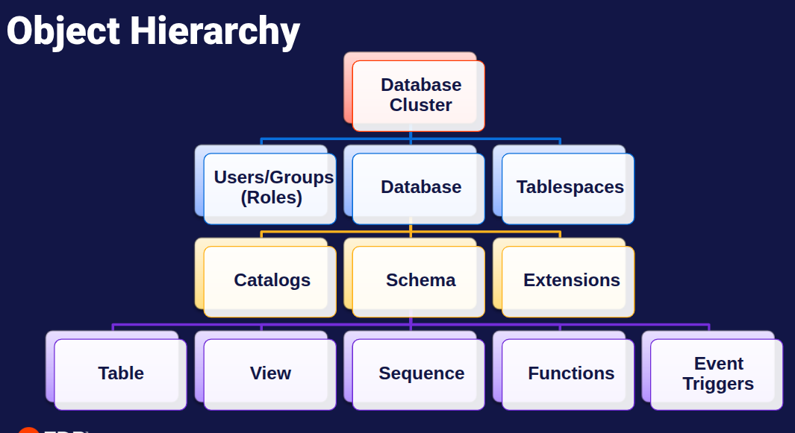

# 📘 Carpeta de Ayuda PostgreSQL

Este documento en formato **Markdown (.md)** funciona como una guía rápida y práctica para trabajar con PostgreSQL.  
La idea es que sea **transferible, autoexplicativa y modular**, con ejemplos claros que van desde consultas básicas (`SELECT`) hasta operaciones avanzadas como backups y upgrades de versión.  

---

## 🧭 Navegación Básica

- [🚀 Instalación y Configuración](#-instalación-de-postgresql-en-linux-debianubuntu)
- [💾 Backup y Restauración](#-backup-y-restauración-en-postgresql)
  - [1. Backup (`pg_dump`)](#1-backup-con-pg_dump)
  - [2. Backup de Tabla](#2-backup-de-tabla-específica)
  - [3. Backup Completo (`pg_dumpall`)](#3-backup-completo-del-servidor-con-pg_dumpall)
  - [4. Restauración (`pg_restore`)](#4-restauración-con-pg_restore)
- [🐚 Comandos Básicos (PSQL)](#-comandos-básicos-psql)
- [⚙️ Gestión del Servicio (pg_ctl)](#-gestión-del-servicio-pg_ctl)
- [🏛️ Jerarquía de Objetos](#-jerarquía-de-objetos-en-postgresql)
- [🗄️ Tablespaces](#-tablespaces-en-postgresql)
- [🛢️ Bases de Datos (Databases)](#-bases-de-datos-databases)
- [🛡️ Gestión de Permisos (GRANT)](#-gestión-de-permisos-grant)
- [🛑 Revocar Permisos (REVOKE)](#-revocar-permisos-revoke)
- [🔍 Search Path (Ruta de Búsqueda)](#-que-es-el-search_path)
- [👮‍♂️ Seguridad: Autenticación (pg_hba.conf)](#-seguridad-autenticación-pg_hba-conf)
- [🛡️ Seguridad: Políticas de Fila (RLS)](#-seguridad-row-level-security-rls-policies)
- [🖥️ pgAdmin 4: Interfaz Gráfica](#-pgadmin-4-interfaz-gráfica-para-postgresql)

---

## 🚀 Instalación de PostgreSQL en Linux (Debian/Ubuntu)

### 1. Instalación desde repositorio automático
```bash
sudo apt install -y postgresql-common
sudo /usr/share/postgresql-common/pgdg/apt.postgresql.org.sh

# Instalar la última versión disponible
sudo apt-get -y install postgresql postgresql-contrib
```

### 2. Instalación con configuración manual (recomendado si no se desea la última versión)
```bash
# Importar la llave de firma del repositorio
sudo apt install curl ca-certificates
sudo install -d /usr/share/postgresql-common/pgdg
sudo curl -o /usr/share/postgresql-common/pgdg/apt.postgresql.org.asc --fail https://www.postgresql.org/media/keys/ACCC4CF8.asc

# Crear archivo de configuración del repositorio
sudo sh -c 'echo "deb [signed-by=/usr/share/postgresql-common/pgdg/apt.postgresql.org.asc] https://apt.postgresql.org/pub/repos/apt $(lsb_release -cs)-pgdg main" > /etc/apt/sources.list.d/pgdg.list'

# Actualizar lista de paquetes
sudo apt update

# Instalar PostgreSQL (última versión o específica)
sudo apt -y install postgresql
# Ejemplo: sudo apt -y install postgresql-16
```
### 3. Configuración inicial de usuario
```bash
# Ingresar como usuario postgres
sudo su - postgres
psql

# Crear usuario y contraseña
create user kzambrano with password '123456';

# Dar permisos de superusuario
alter user kzambrano with superuser;
```

### 4. Upgrade de versión de PostgreSQL

```bash
# Instalar la nueva versión (ejemplo: PostgreSQL 16)
sudo apt -y install postgresql-16

# Ajustar binarios para apuntar a la nueva versión
pg_dumpall --version
sudo ln -s /usr/lib/postgresql/14/bin/pg_dumpall /usr/bin/pg_dumpall --force

pg_restore --version
sudo ln -s /usr/lib/postgresql/14/bin/pg_restore /usr/bin/pg_restore --force

pg_dump --version
sudo ln -s /usr/lib/postgresql/14/bin/pg_dump /usr/bin/pg_dump --force
```

### 5. Conexión local a PostgreSQL 16
```bash
# Revisar puerto en archivo de configuración
nano /etc/postgresql/16/main/postgresql.conf

# Conexión indicando puerto
psql -p 5433

# Verificar versión dentro de la base de datos
SELECT VERSION();

# Crear usuario en PostgreSQL 16
create user kzambrano with password '123456';
alter user kzambrano with superuser;
```

# 💾 Backup y Restauración en PostgreSQL

Esta sección explica cómo realizar **copias de seguridad (backups)** y cómo **restaurarlas** en PostgreSQL.  
Incluye ejemplos básicos y avanzados con parámetros detallados para distintos escenarios.

---

## 1. Backup con `pg_dump`

`pg_dump` permite exportar una sola base de datos o incluso tablas específicas.  
Ejemplo con parámetros completos:

```bash
# Parámetros explicados:
# --file: Nombre del archivo de salida
# --host: Host del servidor (generalmente localhost)
# --port: Puerto de conexión (por defecto 5432)
# --username: Usuario con permisos para realizar el backup
# --format=c: Formato custom (comprimido, permite restore selectivo)
# --blobs: Incluye objetos binarios (BLOBs)
# --verbose: Muestra detalle del proceso en pantalla

pg_dump \
  --file="nombre_del_backup.backup" \
  --host="localhost" \
  --port="5432" \
  --username="kzambrano" \
  --format=c \
  --blobs \
  --verbose \
  nombre_base_de_datos
```

### Ejemplo práctico 

```bash
pg_dump \
  --file="cc-productiondb_2025-10-21-0000.backup" \
  --host="localhost" \
  --port="5432" \
  --username="kzambrano" \
  --format=c \
  --blobs \
  --verbose \
  production_cc
```

## 2. Backup de tabla específica

También puedes respaldar solo una tabla dentro de una base de datos:

```bash
pg_dump \
  --file="tabla_especifica.backup" \
  --host="localhost" \
  --port="5432" \
  --username="kzambrano" \
  --format=c \
  --blobs \
  --verbose \
  --table="nombre_tabla_para_backup" \
  nombre_base_de_datos
```

## 3. Backup completo del servidor con pg_dumpall

`pg_dumpall` permite respaldar todo el servidor PostgreSQL, incluyendo roles y esquemas.

```bash
pg_dumpall \
  --file="nombre_del_backup.backup" \
  --host="localhost" \
  --port="5432" \
  --username="kzambrano" \
  --verbose
```

### Ejemplo práctico

```bash
pg_dumpall \
  --file="cc-productiondb_2025-10-21-0000.backup" \
  --host="localhost" \
  --port="5432" \
  --username="kzambrano" \
  --verbose
```

## 4. Restauración con `pg_restore`

`pg_restore` se utiliza para restaurar backups creados con `pg_dump` en formato **custom (`-F c`)**.  
Permite restaurar en una base de datos existente o crear una nueva.

---

## Restaurar en una base de datos existente

Ejemplo con parámetros completos:

```bash
# Parámetros explicados:
# --verbose: Muestra detalle del proceso
# --host: Host del servidor
# --username: Usuario de conexión
# --port: Puerto de conexión
# --format=c: Debe coincidir con el formato del backup (custom)
# --dbname: Base de datos donde se restaurará la información

pg_restore \
  --verbose \
  --host=localhost \
  --username=kzambrano \
  --port=5432 \
  --format=c \
  --dbname=cc_development \
  "/home/jsalge@chinchin.int/produccion_borrado.backup"
```

## Restaurar en una base de datos específica con nombre detallado

```bash
pg_restore \
  --verbose \
  --host=localhost \
  --username=kzambrano \
  --port=5432 \
  --format=c \
  --dbname=cc-productiondb_2025-10-21 \
  "/Backup/db_cc-productiondb_2025-10-21-0000/cc-productiondb_2025-10-21-0000.backup"
```
## Restaurar creando la base de datos desde el dump

Si el backup fue generado con --create, se puede restaurar directamente:

```bash
pg_restore \
  --verbose \
  --host=localhost \
  --username=kzambrano \
  --port=5432 \
  --format=c \
  --create \
  -d postgres \
  "/backups/produccion.backup"
```
👉 Aquí -d postgres indica que la conexión inicial se hace a la base principal, y desde allí se ejecuta la creación de la nueva base

---

## 🐚 Comandos Básicos (PSQL)

Esta sección es una **guía de supervivencia** para quienes están empezando a usar la terminal de PostgreSQL (`psql`). Aquí encontrarás los comandos que usarás el 90% del tiempo.

### ℹ️ Ayuda y Versión

Antes de intentar cualquier operación, es útil verificar la versión y las opciones disponibles:

```bash
# Ver la versión del cliente psql
psql --version

# Ver ayuda completa de argumentos de línea de comandos
psql --help
```
### 🔌 Conexión Detallada

Para conectarte a una base de datos específica con todos los parámetros controlados, usa la siguiente estructura:

```bash
# Parámetros explicados:
# --host | -h: Host del servidor (IP o dominio)
# --port | -p: Puerto de conexión (5432 es el default)
# --username | -U: Usuario de conexión
# --dbname | -d: Nombre de la base de datos a conectar
# --password | -W:  Solicita la contraseña explícitamente (opcional)

psql \
  --host=localhost \
  --port=5432 \
  --username=kzambrano \
  --dbname=cc_development
```

### 📜 Ejecución de Scripts (.sql)

Para ejecutar un archivo de comandos SQL desde la terminal (sin entrar a la consola interactiva), usa el flag `-f`:

```bash
# Ejecutar un archivo SQL en una base de datos específica
psql \
  --host=localhost \
  --username=kzambrano \
  --dbname=cc_development \
  -f archivo_script.sql
```

### 🧭 Navegación y Control

| Comando        | Descripción                                    | Ejemplo / Notas                                   |
| :------------- | :--------------------------------------------- | :------------------------------------------------ |
| `\l`           | **Listar** todas las bases de datos.           | Muestra nombres, dueños y codificación.           |
| `\c nombre_db` | **Conectarse** a una base de datos específica. | `\c mi_tienda` (Cambia el prompt a `mi_tienda=>`) |
| `\dt`          | **Listar tablas** de la base de datos actual.  | Solo muestra tablas públicas.                     |
| `\du`          | **Listar usuarios** (roles) y sus permisos.    | Útil para ver quién es superusuario.              |
| `\dn`          | **Listar esquemas** del sistema.               |                                                   |
| `\q`           | **Salir** de la consola psql.                  | Vuelve a la terminal de Linux.                    |

### 🧐 Inspección de Objetos

- **`\d nombre_tabla`**: Muestra la estructura básica de una tabla (columnas, tipos de dato).
- **`\d+ nombre_tabla`**: Muestra información detallada (comentarios, tamaño en disco, índices).

### 📝 Consultas SQL "De Bolsillo"

Una vez dentro de una base de datos, usas SQL estándar. **Nota importante:** Todas las sentencias SQL deben terminar con punto y coma (`;`).

#### Consultas de Datos
```sql
-- Ver todo el contenido de una tabla
SELECT * FROM usuarios;

-- Ver solo columnas específicas
SELECT nombre, email FROM usuarios;

-- Filtrar datos (Clause WHERE)
SELECT * FROM usuarios WHERE activo = true;

-- Ordenar resultados
SELECT * FROM productos ORDER BY precio DESC;
```

#### Gestión de Datos (DML)
```sql
-- Insertar un nuevo registro
INSERT INTO usuarios (nombre, email) VALUES ('Juan Perez', 'juan@example.com');

-- Actualizar un registro existente
UPDATE usuarios SET activo = false WHERE id = 5;

-- Eliminar un registro (¡Cuidado! Siempre usa WHERE)
DELETE FROM usuarios WHERE id = 10;
```

#### Gestión de Estructura (DDL)
```sql
-- Crear una base de datos nueva
CREATE DATABASE mi_nueva_db;

-- Crear una tabla simple
CREATE TABLE productos (
    id SERIAL PRIMARY KEY,
    nombre VARCHAR(100),
    precio DECIMAL(10,2)
);
```

### 🆘 Ayuda y Tips

- **`\?`**: Muestra la lista completa de comandos `\` (barra invertida) de psql.
- **`\h`**: Muestra ayuda sobre comandos SQL. Ejemplo: `\h SELECT` te explica cómo usar `SELECT`.
- **Limpiar pantalla**: En Linux, puedes usar `Ctrl + L` para limpiar la terminal de psql.
- **Historial**: Usa las flechas `Arriba` y `Abajo` para navegar por comandos anteriores.

---

## ⚙️ Gestión del Servicio (pg_ctl)

`pg_ctl` es una utilidad para inicializar, iniciar, detener o controlar el servidor de PostgreSQL. A diferencia de `systemctl` (que gestiona el servicio a nivel de sistema operativo), `pg_ctl` permite un control más directo sobre un directorio de datos específico.

### Estructura Básica

```bash
pg_ctl -D /ruta/al/directorio_data [accion]
```

### Acciones Comunes

| Acción      | Descripción                                                                                   | Comando Ejemplo                              |
| :---------- | :-------------------------------------------------------------------------------------------- | :------------------------------------------- |
| **start**   | Inicia el servidor.                                                                           | `pg_ctl -D /var/lib/postgresql/data start`   |
| **stop**    | Detiene el servidor.                                                                          | `pg_ctl -D /var/lib/postgresql/data stop`    |
| **restart** | Reinicia el servidor.                                                                         | `pg_ctl -D /var/lib/postgresql/data restart` |
| **status**  | Verifica si el servidor está corriendo.                                                       | `pg_ctl -D /var/lib/postgresql/data status`  |
| **reload**  | Recarga archivos de configuración (`pg_hba.conf`, `postgresql.conf`) sin detener el servicio. | `pg_ctl -D /var/lib/postgresql/data reload`  |

### Modos de Apagado (`-m`)

Al detener el servidor (`stop` o `restart`), puedes especificar cómo tratar las conexiones activas con el flag `-m`:

- **Smart** (`-m s`): Espera a que todos los clientes se desconecten y terminen sus transacciones. (Por defecto en backups).
- **Fast** (`-m f`): Interrumpe transacciones y desconecta clientes inmediatamente. (Recomendado para reinicios rápidos).
- **Immediate** (`-m i`): Aborta el proceso sin cerrar limpiamente. **No recomendado** (puede requerir recuperación al iniciar).

### Redirección de Logs (`-l`)

Es muy recomendable guardar la salida del servidor en un archivo de log. Usa el flag `-l`:

### Ejemplo Práctico

Reiniciar el servidor de forma rápida (fast) especificando el directorio de datos y archivo de log (Local):
```bash
pg_ctl -D /var/lib/postgres/data -l /var/log/postgresql/server.log -m fast restart
```

---

## 🏛️ Jerarquía de Objetos en PostgreSQL

Para entender cómo PostgreSQL organiza los datos, es fundamental comprender su jerarquía de objetos. A diferencia de otros gestores de base de datos, PostgreSQL estructura los objetos en varios niveles lógicos y físicos.



### Explicación de la Jerarquía

Esta estructura jerárquica permite un control granular y organizado de los datos:

1.  **Database Cluster (Clúster de Bases de Datos)**
    *   Es la instancia principal de PostgreSQL en ejecución (el servicio).
    *   No se refiere a múltiples servidores, sino a **una colección de bases de datos** gestionada por una única instancia.
    *   Administra recursos compartidos como la memoria y procesos de fondo.

2.  **Objetos Globales (Users/Groups, Tablespaces)**
    *   **Roles (Users/Groups):** Los usuarios se definen a nivel de clúster. Un mismo usuario puede tener acceso a múltiples bases de datos dentro del clúster si se le conceden los permisos.
    *   **Tablespaces:** Definen las ubicaciones físicas en el disco donde se almacenan los archivos. Son globales y pueden ser utilizados por cualquier base de datos para optimizar el almacenamiento (ej. guardar índices en un disco SSD rápido).

3.  **Database (Base de Datos)**
    *   Es un contenedor **aislado** de esquemas y datos.
    *   Los objetos de una base de datos no son visibles ni accesibles directamente desde otra base de datos.
    *   Cada base de datos tiene sus propios catálogos y configuraciones.

4.  **Objetos a Nivel de Base de Datos**
    *   **Catalogs:** Tablas del sistema que almacenan metadatos sobre la base de datos (tablas, columnas, tipos de datos).
    *   **Extensions:** Módulos que extienden la funcionalidad de PostgreSQL (como PostGIS para datos geográficos o pgcrypto).
    *   **Schema (Esquema):** Es un espacio de nombres lógico (*namespace*) dentro de la base de datos. Permite organizar objetos y evitar colisiones de nombres (ej. `ventas.usuarios` y `rrhh.usuarios`).

5.  **Objetos a Nivel de Esquema**
    *   Aquí residen los objetos que contienen o procesan los datos reales:
        *   **Table:** Almacena registros (filas).
        *   **View:** Consultas guardadas que actúan como tablas virtuales.
        *   **Sequence:** Generadores de números secuenciales (usados para IDs).
        *   **Functions:** Procedimientos almacenados y lógica de negocio.
        *   **Event Triggers:** Disparadores que reaccionan a eventos del sistema.

---

## 🗄️ Tablespaces en PostgreSQL

Un `TABLESPACE` es una ubicación en el sistema de archivos donde PostgreSQL almacena los archivos de datos que contienen las tablas e índices de la base de datos.

### ¿Para qué sirven?

1.  **Optimización de Rendimiento (I/O):** Puedes colocar tablas o índices con mucho acceso en discos SSD rápidos y datos históricos o de poco uso en discos HDD más lentos pero económicos.
2.  **Gestión de Espacio:** Si una partición de disco se llena, puedes crear un tablespace en otra partición y mover objetos allí sin detener el servicio.
3.  **Separación de Carga:** Separar índices de tablas en distintos discos físicos para reducir la contención de I/O.

### 🛠️ Pasos para crear y usar un Tablespace

#### 1. Crear el directorio físico (en el SO)

Primero, debes crear la carpeta en el sistema operativo y darle permisos al usuario `postgres`.

```bash
# Crear directorio
sudo mkdir -p /mnt/fast_ssd/pg_data

# Asignar propietario postgres
sudo chown -R postgres:postgres /mnt/fast_ssd/pg_data
```

#### 2. Crear el Tablespace (en PostgreSQL)

Conéctate a PostgreSQL y ejecuta:

```sql
CREATE TABLESPACE fast_tablespace OWNER kzambrano LOCATION '/mnt/fast_ssd/pg_data';
```

#### 3. Usar el Tablespace

**Opción A: Crear una tabla directamente en el tablespace**

```sql
CREATE TABLE pedidos_log (
    id SERIAL PRIMARY KEY,
    fecha TIMESTAMP DEFAULT NOW(),
    descripcion TEXT
) TABLESPACE fast_tablespace;
```

**Opción B: Mover una tabla existente al tablespace**

```sql
ALTER TABLE usuarios SET TABLESPACE fast_tablespace;
```

**Opción C: Mover un índice a otro tablespace**

```sql
ALTER INDEX idx_usuarios_email SET TABLESPACE fast_tablespace;
```

**Opción D: Asignar un tablespace por defecto a una base de datos**

```sql
CREATE DATABASE nueva_db TABLESPACE fast_tablespace;
```

Esto hará que todas las tablas creadas en `nueva_db` se guarden por defecto en `fast_tablespace`, a menos que se especifique lo contrario.

### 🔍 Consultar Tablespaces

Para ver los tablespaces existentes y su ubicación:
```
\db+
```
```sql
SELECT spcname, pg_tablespace_location(oid) FROM pg_tablespace;
```

### 🗑️ Eliminar un Tablespace

Para eliminar un tablespace, primero debes asegurarte de que no esté en uso. Es decir, no debe contener tablas, índices u otros objetos. Si contiene objetos, debes moverlos a otro tablespace antes de eliminarlo.

```sql
-- Eliminar un tablespace que no está en uso
DROP TABLESPACE fast_tablespace;
```

---

## 🛢️ Bases de Datos (Databases)

Una **Base de Datos** en PostgreSQL es un contenedor lógico que aísla esquemas, tablas, funciones y otros objetos.

### Características Principales

1.  **Aislamiento:** Un usuario conectado a una base de datos no puede ver ni consultar objetos de otra base de datos.
2.  **Configuración Propia:** Cada base de datos puede tener su propia configuración y dueño.
3.  **Backups Individuales:** Puedes restaurar o hacer backup de una base de datos sin afectar a las demás.

### 🛠️ Gestión de Bases de Datos

#### 1. Crear una Base de Datos

El comando básico es `CREATE DATABASE`.

```sql
-- Creación simple
CREATE DATABASE mi_tienda;

-- Creación con parámetros específicos
CREATE DATABASE mi_tienda
    WITH 
    OWNER = kzambrano
    ENCODING = 'UTF8'
    TABLESPACE = fast_tablespace
    CONNECTION LIMIT = -1;
```

Nota: Se recomienda revocar la conexión a public. De forma que solo puedan ingresar los usuarios con pirivilegios.

```sql
REVOKE CONNECT ON DATABASE mi_tienda FROM public;
```

#### 2. Modificar una Base de Datos

Puedes renombrar, cambiar el dueño o ajustar parámetros de configuración.

```sql
-- Renombrar la base de datos
ALTER DATABASE mi_tienda RENAME TO mi_tienda_v2;

-- Cambiar el propietario
ALTER DATABASE mi_tienda_v2 OWNER TO nuevo_usuario;

-- Configurar parámetros por defecto para esta base de datos
-- (Ejemplo: establecer la zona horaria por defecto)
ALTER DATABASE mi_tienda_v2 SET timezone TO 'America/Caracas';
```

#### 3. Eliminar una Base de Datos

**¡Cuidado!** Esta acción es irreversible.

```sql
DROP DATABASE mi_tienda_v2;
```

> **Nota:** No puedes borrar una base de datos si hay usuarios conectados a ella.

**Forzar desconexión y borrado (PostgreSQL 13+):**

```sql
DROP DATABASE mi_tienda_v2 WITH (FORCE); -- BETA
```

#### 4. Clonar una Base de Datos

Puedes crear una copia exacta de una base de datos existente usándola como `TEMPLATE`.

```sql
-- Crear 'tienda_test' como copia de 'tienda_prod'
-- Importante: Nadie puede estar conectado a 'tienda_prod' durante este proceso
CREATE DATABASE tienda_test TEMPLATE tienda_prod;
```

### 📏 Consultar Tamaño

Para ver cuánto espacio en disco ocupa una base de datos:

```sql
SELECT pg_size_pretty(pg_database_size('nombre_db'));
```

Ver el tamaño de todas las bases de datos:

```sql
SELECT datname, pg_size_pretty(pg_database_size(datname)) 
FROM pg_database 
ORDER BY pg_database_size(datname) DESC;
```

---

## 🛡️ Gestión de Permisos (GRANT)

En PostgreSQL, los permisos se gestionan en una jerarquía: **Instancia -> Base de Datos -> Esquema -> Objeto (Tabla, Vista, etc.)**.

Para que un usuario pueda hacer un `SELECT` en una tabla, debe tener permisos de `CONNECT` en la base de datos y `USAGE` en el esquema donde está la tabla.

### 1. Nivel Base de Datos

Permite al usuario conectarse a la base de datos.
Recuerda que, por defecto, `public` suele tener permiso de conexión, por lo que es buena práctica revocarlo si se busca seguridad estricta.

```sql
-- Permitir conexión
GRANT CONNECT ON DATABASE mi_tienda TO kzambrano;
```

### 2. Nivel Esquema

El permiso `USAGE` permite "entrar" al esquema y buscar objetos dentro de él. `CREATE` permite crear nuevos objetos (tablas, funciones, etc.).

```sql
-- Permitir uso del esquema public
GRANT USAGE ON SCHEMA public TO kzambrano;

-- Permitir crear tablas en el esquema public
GRANT CREATE ON SCHEMA public TO kzambrano;
```

### 3. Nivel Tablas y Objetos

Aquí se definen las acciones específicas sobre los datos.

```sql
-- Permiso de lectura
GRANT SELECT ON ALL TABLES IN SCHEMA public TO kzambrano;

-- Permisos de escritura (Insertar, Actualizar, Borrar)
GRANT INSERT, UPDATE, DELETE ON ALL TABLES IN SCHEMA public TO kzambrano;

-- Otorgar TODOS los permisos sobre una tabla específica
GRANT ALL PRIVILEGES ON TABLE usuarios TO kzambrano;
```

> **Nota:** `ON ALL TABLES` solo afecta las tablas que existen **en ese momento**. Para tablas futuras, debes usar `ALTER DEFAULT PRIVILEGES`.

### 4. Nivel Secuencias

Si tienes columnas `SERIAL` o `BIGSERIAL`, el usuario necesita permisos para usar la secuencia asociada al insertar datos.

```sql
GRANT USAGE, SELECT ON ALL SEQUENCES IN SCHEMA public TO kzambrano;
```

### 🧪 Ejemplos de Roles Comunes

#### Escenario A: Usuario de Solo Lectura (Reportes)

```sql
-- 1. Conexión
GRANT CONNECT ON DATABASE mi_tienda TO usuario_reportes;

-- 2. Uso del esquema
GRANT USAGE ON SCHEMA public TO usuario_reportes;

-- 3. Lectura de datos
GRANT SELECT ON ALL TABLES IN SCHEMA public TO usuario_reportes;

-- 4. Asegurar lectura para tablas futuras
ALTER DEFAULT PRIVILEGES IN SCHEMA public GRANT SELECT ON TABLES TO usuario_reportes;
```

#### Escenario B: Usuario de Aplicación (Lectura y Escritura)

```sql
-- 1. Conexión
GRANT CONNECT ON DATABASE mi_tienda TO app_user;

-- 2. Uso del esquema
GRANT USAGE ON SCHEMA public TO app_user;

-- 3. Lectura y Escritura de datos
GRANT SELECT, INSERT, UPDATE, DELETE ON ALL TABLES IN SCHEMA public TO app_user;

-- 4. Permisos sobre secuencias (para los IDs)
GRANT USAGE, SELECT ON ALL SEQUENCES IN SCHEMA public TO app_user;

-- 5. Asegurar permisos para tablas futuras
ALTER DEFAULT PRIVILEGES IN SCHEMA public GRANT SELECT, INSERT, UPDATE, DELETE ON TABLES TO app_user;
ALTER DEFAULT PRIVILEGES IN SCHEMA public GRANT USAGE, SELECT ON SEQUENCES TO app_user;
```

---

## 🛑 Revocar Permisos (REVOKE)

El comando `REVOKE` es lo opuesto a `GRANT`. Se utiliza para quitar privilegios previamente otorgados a un usuario o rol.

**Sintaxis General:**
`REVOKE [PERMISO] ON [OBJETO] FROM [USUARIO];`

### 1. Nivel Base de Datos

Quitar el permiso de conexión.

```sql
-- Revocar conexión a la base de datos
REVOKE CONNECT ON DATABASE mi_tienda FROM kzambrano;

-- Revocar conexión al rol público (Buena Práctica de Seguridad)
REVOKE CONNECT ON DATABASE mi_tienda FROM public;
```

### 2. Nivel Esquema

Quitar permisos de uso o creación.

```sql
-- Revocar uso del esquema
REVOKE USAGE ON SCHEMA public FROM kzambrano;

-- Revocar permiso de creación
REVOKE CREATE ON SCHEMA public FROM kzambrano;
```

### 3. Nivel Tablas y Objetos

Quitar permisos sobre datos.

```sql
-- Revocar permisos de lectura
REVOKE SELECT ON ALL TABLES IN SCHEMA public FROM kzambrano;

-- Revocar permisos de escritura
REVOKE INSERT, UPDATE, DELETE ON ALL TABLES IN SCHEMA public FROM kzambrano;

-- Revocar TODOS los privilegios sobre una tabla específica
REVOKE ALL PRIVILEGES ON TABLE usuarios FROM kzambrano;
```

### ⚠️ Uso de CASCADE y RESTRICT

Por defecto, `REVOKE` usa `RESTRICT`, lo que significa que fallará si otros privilegios dependen del que estás intentando revocar.

Si deseas revocar un privilegio y todos los que dependen de él (por ejemplo, si el usuario otorgó ese permiso a otros), usa `CASCADE`.

```sql
-- Revocar permiso y sus dependientes
REVOKE SELECT ON TABLE sensitiva FROM usuario_admin CASCADE;
```


---

## 🔍 ¿Qué es el `search_path`?

Imagina que estás en una biblioteca gigante (tu base de datos) y le pides al bibliotecario (PostgreSQL) el libro "Harry Potter".  
Si no le dices explícitamente en qué sección buscar (Fantasía, Infantil, Best Sellers), el bibliotecario tiene que tener un orden predefinido para buscar.  
Ese orden o "lista de lugares donde mirar" es el **`search_path`**.

En términos técnicos, el `search_path` es una lista ordenada de **esquemas** que PostgreSQL recorre cuando haces referencia a un objeto (tabla, vista, función) sin especificar su esquema completo.

### Ejemplo visual

Supongamos que tienes:
1.  Esquema **`ventas`** con una tabla llamada **`clientes`**.
2.  Esquema **`public`** TAMBIÉN con una tabla llamada **`clientes`**.

Y tu `search_path` está configurado como: `ventas, public`.

Cuando ejecutas:
```sql
SELECT * FROM clientes;
```

PostgreSQL hace lo siguiente:
1.  ¿Existe `clientes` en el esquema `ventas`? **¡SÍ!** -> Usa esa tabla y **se detiene**.
2.  Ignora totalmente la tabla `clientes` que está en `public`.

### 🕵️‍♀️ ¿Cómo ver tu `search_path` actual?

Por defecto, PostgreSQL viene configurado así: `"$user", public`.

*   `"$user"`: Busca primero en un esquema que se llame **igual que tu usuario actual**. Si tu usuario es `kzambrano`, busca un esquema `kzambrano`.
*   `public`: Si no lo encuentra antes, busca en el esquema `public` (donde suele estar todo por defecto).

Para verlo en tu consola, ejecuta:

```sql
SHOW search_path;
```

### 🛠️ ¿Cómo cambiar el `search_path`?

Tienes 3 niveles para cambiarlo, del más temporal al más permanente:

#### 1. Solo para esta sesión (Temporal)
Si cierras la terminal o te desconectas, se pierde la configuración. Útil para pruebas rápidas.

```sql
-- Ahora buscará primero en 'ventas', luego en 'public'
SET search_path TO ventas, public;
```

#### 2. Para un usuario específico (Persistente)
Cada vez que ese usuario se conecte, tendrá ese camino de búsqueda predefinido. Ideal para usuarios de aplicaciones.

```sql
ALTER ROLE kzambrano SET search_path TO ventas, public;
```

#### 3. Para toda la base de datos (Global)
Afecta a **todos** los que se conecten a esa base de datos (a menos que tengan su propia configuración de usuario, que tiene prioridad).

```sql
ALTER DATABASE mi_tienda SET search_path TO ventas, public;
```

### 💡 ¿Por qué es esto tan útil?

1.  **Limpieza y Organización:** Puedes tener tus tablas en esquemas organizados (`facturacion`, `rrhh`, `logistica`) y solo añadir al `search_path` lo que necesites en ese momento. Te ahorras escribir `SELECT * FROM facturacion.facturas` y solo escribes `SELECT * FROM facturas`.
    
2.  **Seguridad:** Puedes "ocultar" tablas de sistemas o versiones antiguas simplemente sacándolas del path.
    
3.  **Multitenancy (SaaS):** Este es el "superpoder" del search path.
    *   Imagina que tienes una aplicación para varios clientes.
    *   Creas un esquema `cliente_A` y otro `cliente_B` con las **mismas tablas** (facturas, usuarios).
    *   Cuando se conecta el Cliente A, configuras: `SET search_path TO cliente_A`.
    *   La aplicación ejecuta `SELECT * FROM facturas` y automáticamente trae las de A.
    *   ¡El código de la aplicación es el mismo para todos! Solo cambia el `search_path`.

---

## 👮‍♂️ Seguridad: Autenticación (pg_hba.conf)

El **`pg_hba.conf`** es el "portero de la discoteca" de tu base de datos. Controla **QUIÉN** puede conectarse, **DESDE DÓNDE** y **CÓMO**.
HBA significa **Host-Based Authentication**.

### ¿Dónde encontrarlo?
Su ubicación depende de la instalación, pero puedes preguntárselo a Postgres:

```sql
SHOW hba_file;
```

### Estructura del Archivo

Cada línea es una regla. Postgres lee el archivo de arriba a abajo y **se detiene en la primera coincidencia**.

```
# TYPE  DATABASE        USER            ADDRESS                 METHOD
local   all             all                                     peer
host    all             all             127.0.0.1/32            scram-sha-256
host    mi_app_db       app_user        192.168.1.0/24          md5
host    all             all             0.0.0.0/0               reject
```

#### Explicación de Columnas:

1.  **TYPE:**
    *   `local`: Conexiones a través de socket Unix (en la misma máquina).
    *   `host`: Conexiones TCP/IP (incluyendo localHost y remotas).
    *   `hostssl`: Solo conexiones TCP/IP encriptadas con SSL.

2.  **DATABASE:**
    *   `all`: Todas las bases de datos.
    *   `nombre_db`: Una base de datos específica.
    *   `replication`: Para conexiones de replicación.

3.  **USER:**
    *   `all`: Cualquier usuario.
    *   `nombre_usuario`: Un usuario específico.
    *   `+nombre_grupo`: Miembros de un grupo.

4.  **ADDRESS:**
    *   La IP o rango de IPs desde donde se permite la conexión (CIDR).
    *   `127.0.0.1/32`: Solo localhost IPv4.
    *   `::1/128`: Solo localhost IPv6.
    *   `0.0.0.0/0`: Desde CUALQUIER lugar (⚠️ Peligroso si es `trust`).

5.  **METHOD:**
    *   `trust`: **¡PELIGRO!** Permite entrar sin contraseña. Solo úsalo en entornos de desarrollo muy controlados.
    *   `peer`: Usa el nombre del usuario del sistema operativo (común en Linux para usuario `postgres`).
    *   `md5`: Contraseña con hash MD5 (antiguo estándar).
    *   `scram-sha-256`: Contraseña con hash SHA-256 (estándar moderno y seguro).
    *   `reject`: Rechaza la conexión explícitamente.

### 🔄 Aplicar Cambios

Después de editar el archivo, **NO necesitas reiniciar** la base de datos, solo recargar la configuración:

Desde SQL:
```sql
SELECT pg_reload_conf();
```

Desde Terminal:
```bash
pg_ctl reload
# O en sistemas systemd:
sudo systemctl reload postgresql
```

---

## 🛡️ Seguridad: Row Level Security (RLS) Policies

Los permisos normales (`GRANT SELECT`) te dejan ver **toda** la tabla o nada.
Las **Policies (RLS)** te permiten definir reglas para ver **solo ciertas filas**.

Imagina una tabla `nominas`.
*   El jefe puede ver TODAS las filas.
*   El empleado solo puede ver SU PROPIA fila.

### 1. Activar RLS en la Tabla

Por defecto, RLS está desactivado. Debes activarlo explícitamente:

```sql
ALTER TABLE nominas ENABLE ROW LEVEL SECURITY;
```

🔴 **Importante:** Una vez activado, por defecto **NADIE (excepto el dueño de la tabla y superusuarios)** puede ver nada hasta que crees una política. (Principio de "Deny by Default").

### 2. Crear una Política (POLICY)

#### Ejemplo A: El usuario solo ve sus propios datos

Asumimos que la tabla `nominas` tiene una columna `usuario` que coincide con el `current_user` de la base de datos.

```sql
CREATE POLICY ver_propia_nomina ON nominas
    FOR SELECT                           -- Solo aplica a consultas SELECT
    TO public                            -- Aplica a todos los roles
    USING (usuario = current_user);      -- Condición: columna 'usuario' == usuario conectado
```

#### Ejemplo B: El Administrador ve todo

```sql
CREATE POLICY admin_ve_todo ON nominas
    FOR ALL                              -- Aplica a SELECT, INSERT, UPDATE, DELETE
    TO rol_administrador                 -- Solo aplica a este rol
    USING (true);                        -- Siempre verdadero (ve todo)
```

### 3. Casos de Uso Comunes

*   **Multi-tenant por fila:** Varios clientes en la misma tabla, cada uno solo ve sus datos (`organization_id = current_setting('app.current_org')::int`).
*   **Soft Deletes:** Ocultar filas marcadas como borradas (`deleted_at IS NULL`) para todos los usuarios normales.

### 🔍 Verificar Políticas

Para ver qué políticas existen en una tabla:

```sql
\d nominas
```
Al final de la salida verás la sección "Policies".

---

## 🖥️ pgAdmin 4: Interfaz Gráfica para PostgreSQL

### ¿Qué es pgAdmin 4?

Hasta ahora hemos trabajado con **`psql`**, que es la terminal de línea de comandos de PostgreSQL.  
**pgAdmin 4** es la herramienta gráfica oficial y gratuita para administrar PostgreSQL.

Piénsalo así:
- `psql` es como conducir un automóvil con palanca — potente y preciso, pero requiere práctica.
- `pgAdmin 4` es como conducir un automóvil automático — más visual e intuitivo para el día a día.

> **¿Cuándo usar cada uno?**  
> Usa `psql` para automatizaciones, scripts y cuando estés en un servidor remoto sin interfaz gráfica.  
> Usa `pgAdmin 4` cuando quieras explorar datos visualmente, crear objetos con asistentes, o simplemente prefieras ver todo en pantalla.

---

### 💿 Instalación de pgAdmin 4

pgAdmin 4 puede instalarse de tres maneras según tu sistema operativo:

#### 🐧 En Linux (Debian/Ubuntu)

```bash
# 1. Instalar el repositorio de pgAdmin
curl -fsS https://www.pgadmin.org/static/packages_pgadmin_org.pub | sudo gpg --dearmor -o /usr/share/keyrings/packages-pgadmin-org.gpg

sudo sh -c 'echo "deb [signed-by=/usr/share/keyrings/packages-pgadmin-org.gpg] https://ftp.postgresql.org/pub/pgadmin/pgadmin4/apt/$(lsb_release -cs) pgadmin4 main" > /etc/apt/sources.list.d/pgadmin4.list'

# 2. Actualizar e instalar
sudo apt update

# Instalar versión de escritorio (GUI local)
sudo apt install pgadmin4-desktop

# O instalar versión web (se accede desde el navegador)
sudo apt install pgadmin4-web

# Si instalas la versión web, configúrala con:
sudo /usr/pgadmin4/bin/setup-web.sh
```

> ℹ️ **¿Cuál elegir?**  
> - `pgadmin4-desktop`: Se abre como una aplicación normal de escritorio.  
> - `pgadmin4-web`: Se accede desde tu navegador en `http://localhost/pgadmin4`. Útil en servidores.

#### 🪟 En Windows

1. Ve a la página oficial: [https://www.pgadmin.org/download/pgadmin-4-windows/](https://www.pgadmin.org/download/pgadmin-4-windows/)
2. Descarga el instalador `.exe` de la última versión.
3. Ejecútalo y sigue el asistente (Siguiente → Siguiente → Instalar).
4. Al finalizar, pgAdmin 4 aparecerá en tu menú de inicio.

> **Nota:** Si instalaste PostgreSQL desde el instalador oficial de [postgresql.org](https://www.postgresql.org/download/windows/), pgAdmin 4 probablemente ya vino incluido y ya está instalado en tu máquina.

#### 🍎 En macOS

1. Ve a: [https://www.pgadmin.org/download/pgadmin-4-macos/](https://www.pgadmin.org/download/pgadmin-4-macos/)
2. Descarga el archivo `.dmg`.
3. Arrástralo a tu carpeta de **Aplicaciones**.

---

### 🔌 Primera Conexión a un Servidor PostgreSQL

Una vez que abres pgAdmin 4 por primera vez, verás un panel en blanco. Debes **registrar un servidor** (es decir, decirle a pgAdmin a qué instancia de PostgreSQL debe conectarse).

#### Paso a Paso

**Paso 1:** En el panel izquierdo ("Browser"), haz clic derecho en **"Servers"** → **"Register"** → **"Server..."**

```
Panel izquierdo  →  Servers  →  (clic derecho)  →  Register  →  Server...
```

**Paso 2:** Se abre una ventana con dos pestañas principales. Completa la pestaña **"General"**:

| Campo    | Valor de ejemplo      | Descripción                                                    |
| :------- | :-------------------- | :------------------------------------------------------------- |
| **Name** | `Mi PostgreSQL Local` | Un alias que TÚ le pones (solo para identificarlo en pgAdmin). |

**Paso 3:** Ve a la pestaña **"Connection"** y completa los datos de conexión:

| Campo                    | Valor típico              | Descripción                                                                               |
| :----------------------- | :------------------------ | :---------------------------------------------------------------------------------------- |
| **Host name/address**    | `localhost` o `127.0.0.1` | IP del servidor. Si está en tu misma máquina, es `localhost`.                             |
| **Port**                 | `5432`                    | Puerto por defecto de PostgreSQL.                                                         |
| **Maintenance database** | `postgres`                | La base de datos a la que pgAdmin se conecta inicialmente (la `postgres` siempre existe). |
| **Username**             | `kzambrano`               | Tu usuario de PostgreSQL.                                                                 |
| **Password**             | `tu_contraseña`           | La contraseña del usuario.                                                                |

**Paso 4:** Opcionalmente, activa **"Save password"** para no tener que escribirla cada vez.

**Paso 5:** Haz clic en **"Save"**. Si los datos son correctos, verás el servidor aparecer en el árbol de la izquierda con un ícono de toma de corriente ✅.

> 🔴 **Error común:** Si ves `Connection refused` o `could not connect to server`, verifica:
> 1. Que el servicio de PostgreSQL esté corriendo: `sudo systemctl status postgresql`
> 2. Que el host y puerto sean correctos.
> 3. Que el usuario y contraseña sean válidos.

---

### 🗺️ Navegando pgAdmin 4: La Interfaz Explicada

```
📁 Servers
 └── 📡 Mi PostgreSQL Local
      └── 🗄️ Databases
           └── 📦 mi_tienda        ← aquí están tus datos
                ├── 📏 Schemas
                │    └── 🧩 public
                │         ├── 📊 Tables      ← tus tablas
                │         ├── 👁️ Views
                │         └── 🔢 Sequences
                ├── 🏛️ Extensions
                └── ⚙️ Functions
```

- **Para ver tablas:** Expande `Databases` → tu_base_de_datos → `Schemas` → `public` → `Tables`.
- **Para ver columnas de una tabla:** Haz clic en la tabla → verás su estructura en el panel derecho.

---

### 🛠️ Tips Más Útiles del Día a Día

#### 1. 📝 Query Tool: Tu consola SQL visual

El **Query Tool** es el equivalente visual al `psql`. Aquí escribes y ejecutas tus consultas SQL.

**Cómo abrirlo:**
- Haz clic derecho sobre una base de datos → **"Query Tool"**
- O usa el menú superior: `Tools` → `Query Tool`

**Atajos de teclado clave dentro del Query Tool:**

| Atajo          | Acción                                            |
| :------------- | :------------------------------------------------ |
| `F5`           | Ejecutar la consulta completa                     |
| `Shift + F5`   | Ejecutar SOLO la consulta donde está el cursor    |
| `Ctrl + /`     | Comentar/descomentar la línea seleccionada        |
| `Ctrl + Space` | Autocompletar (nombres de tablas, columnas, etc.) |
| `Ctrl + S`     | Guardar el script `.sql` en un archivo            |

> 💡 **Tip:** Si seleccionas solo una parte del SQL y presionas `F5`, ejecutará únicamente lo seleccionado. Muy útil para probar partes de una consulta larga.

#### 2. 📊 Ver el contenido de una tabla rápidamente

No necesitas escribir `SELECT * FROM tabla`. Puedes hacerlo visualmente:

1. En el árbol izquierdo, haz clic derecho en cualquier tabla.
2. Selecciona **"View/Edit Data"** → **"All Rows"**.
3. Se abrirá el Query Tool con los datos ya cargados.

#### 3. 📤 Exportar datos a CSV o Excel

¿Necesitas compartir datos con alguien que no usa PostgreSQL? pgAdmin permite exportar resultados fácilmente.

1. Ejecuta tu consulta en el Query Tool.
2. En la barra de resultados, haz clic en el ícono de **descarga** (o el botón **"Download as CSV"**).
3. Se genera un archivo `.csv` que puedes abrir en Excel o Google Sheets.

#### 4. 🔎 Inspeccionar la estructura de una tabla (DDL)

¿Quieres ver cómo fue creada una tabla? pgAdmin puede mostrarte el SQL exacto.

1. Haz clic derecho en la tabla.
2. Selecciona **"Properties..."** para ver columnas, tipos de datos, restricciones, índices, etc.
3. O selecciona **"Scripts"** → **"CREATE Script"** para ver el `CREATE TABLE` completo.

#### 5. 🔒 Verificar permisos de un usuario fácilmente

En el Query Tool, puedes ejecutar:
```sql
-- Ver todos los permisos sobre las tablas del esquema public
SELECT grantee, table_name, privilege_type
FROM information_schema.role_table_grants
WHERE table_schema = 'public'
ORDER BY grantee, table_name;
```

#### 6. 📈 Ver el tamaño de tablas y búsqueda de tablas pesadas

```sql
-- Ver las tablas más grandes de la base de datos actual
SELECT
    schemaname AS esquema,
    tablename AS tabla,
    pg_size_pretty(pg_total_relation_size(schemaname || '.' || tablename)) AS tamaño_total,
    pg_size_pretty(pg_relation_size(schemaname || '.' || tablename)) AS tamaño_datos,
    pg_size_pretty(pg_indexes_size(schemaname || '.' || tablename)) AS tamaño_indices
FROM pg_tables
WHERE schemaname NOT IN ('pg_catalog', 'information_schema')
ORDER BY pg_total_relation_size(schemaname || '.' || tablename) DESC
LIMIT 20;
```

#### 7. 🐢 Identificar consultas lentas en tiempo real

```sql
-- Ver las consultas que están corriendo ahora mismo
SELECT
    pid,
    now() - pg_stat_activity.query_start AS duracion,
    query,
    state
FROM pg_stat_activity
WHERE state = 'active'
  AND query_start < now() - interval '5 seconds'
ORDER BY duracion DESC;
```

> 💡 Si ves una consulta con mucho tiempo, puedes terminarla con:
> ```sql
> SELECT pg_terminate_backend(pid);  -- Reemplaza pid con el número real
> ```

---

### ✅ Resumen: Qué Puedes Hacer con pgAdmin 4

| Tarea                   | Cómo                                         |
| :---------------------- | :------------------------------------------- |
| Ejecutar SQL            | Query Tool (`F5`)                            |
| Ver tablas y columnas   | Árbol izquierdo → Tables                     |
| Ver datos de una tabla  | Clic derecho en tabla → View/Edit Data       |
| Exportar datos a CSV    | Query Tool → botón descarga                  |
| Ver el DDL de un objeto | Clic derecho → Scripts → CREATE Script       |
| Crear una base de datos | Clic derecho en Databases → Create           |
| Crear un usuario        | Clic derecho en Login/Group Roles → Create   |
| Hacer un backup         | Clic derecho en la base de datos → Backup... |
| Ver roles y permisos    | Object → Properties → Security               |
