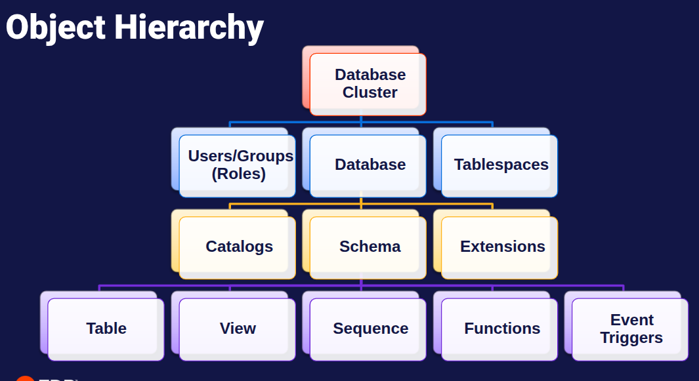

# 📘 Carpeta de Ayuda PostgreSQL

Este documento en formato **Markdown (.md)** funciona como una guía rápida y práctica para trabajar con PostgreSQL.  
La idea es que sea **transferible, autoexplicativa y modular**, con ejemplos claros que van desde consultas básicas (`SELECT`) hasta operaciones avanzadas como backups y upgrades de versión.  

---

## 🧭 Navegación Básica

- [🚀 Instalación y Configuración](#-instalación-de-postgresql-en-linux-debianubuntu)
- [💾 Backup y Restauración](#-backup-y-restauración-en-postgresql)
  - [1. Backup (`pg_dump`)](#1-backup-con-pg_dump)
  - [2. Backup de Tabla](#2-backup-de-tabla-específica)
  - [3. Backup Completo (`pg_dumpall`)](#3-backup-completo-del-servidor-con-pg_dumpall)
  - [4. Restauración (`pg_restore`)](#4-restauración-con-pg_restore)
  - [5. Backup Físico (`pg_basebackup`)](#5-pg_basebackup--backup-físico-del-servidor)
  - [6. Verificar Backup (`pg_verifybackup`)](#6-pg_verifybackup--verificar-la-integridad-del-backup)
- [🐚 Comandos Básicos (PSQL)](#-comandos-básicos-psql)
- [⚙️ Gestión del Servicio (pg_ctl)](#-gestión-del-servicio-pg_ctl)
- [🏛️ Jerarquía de Objetos](#-jerarquía-de-objetos-en-postgresql)
- [🗄️ Tablespaces](#-tablespaces-en-postgresql)
- [🛢️ Bases de Datos (Databases)](#-bases-de-datos-databases)
- [🛡️ Gestión de Permisos (GRANT)](#-gestión-de-permisos-grant)
- [🛑 Revocar Permisos (REVOKE)](#-revocar-permisos-revoke)
- [🔍 Search Path (Ruta de Búsqueda)](#-que-es-el-search_path)
- [👮‍♂️ Seguridad: Autenticación (pg_hba.conf)](#-seguridad-autenticación-pg_hba-conf)
- [🛡️ Seguridad: Políticas de Fila (RLS)](#-seguridad-row-level-security-rls-policies)
- [🖥️ pgAdmin 4: Interfaz Gráfica](#-pgadmin-4-interfaz-gráfica-para-postgresql)
- [📚 Introducción a SQL](#-introducción-a-sql)
  - [🔢 Tipos de Datos](#-tipos-de-datos-en-postgresql)
  - [🏗️ Estructura del Lenguaje SQL (DDL, DML, DCL, TCL)](#-estructura-del-lenguaje-sql)
  - [📋 Tablas](#-tablas-tables)
  - [🔒 Tipos de Constraints](#-tipos-de-constraints-restricciones)
  - [👁️ Vistas (Views)](#-vistas-views)
  - [🔢 Secuencias (Sequences)](#-secuencias-sequences)
  - [🏷️ Domains](#-domains-dominios)
  - [🔗 Tipos de JOINs](#-tipos-de-joins)
- [🧰 Temas Avanzados de SQL](#-temas-avanzados-de-sql)
  - [⚡ Funciones SQL Útiles](#-funciones-sql-útiles)
  - [🖨️ FORMAT() — Formateo de Texto](#-format--formateo-de-texto-en-sql)
  - [🔬 Plan de Ejecución (EXPLAIN)](#-plan-de-ejecución-explain--explain-analyze)
  - [🔤 Quoting en PostgreSQL](#-quoting-en-postgresql)
  - [📇 Índices (Indexes)](#-índices-indexes)
- [🔧 Mantenimiento de PostgreSQL](#-mantenimiento-de-postgresql)
  - [📊 Actualización de Estadísticas (ANALYZE)](#-actualización-de-estadísticas-analyze)
  - [🧹 Fragmentación y Bloat (VACUUM)](#-fragmentación-y-bloat-vacuum)
    - [VACUUM Normal vs VACUUM FULL](#vacuum-normal-vs-vacuum-full)
    - [AUTOVACUUM](#autovacuum)
    - [VACUUM FREEZE](#vacuum-freeze)
  - [🔁 Reconstrucción de Índices (REINDEX)](#-reconstrucción-de-índices-reindex)
- [📂 COPY — Carga y Exportación Masiva de Datos](#-copy--carga-y-exportación-masiva-de-datos)
  - [📥 Importar CSV a una Tabla (COPY FROM)](#-importar-un-archivo-csv-a-una-tabla-copy-from)
  - [📤 Exportar una Tabla a CSV (COPY TO)](#-exportar-una-tabla-a-un-archivo-csv-copy-to)
  - [🔧 Opciones Avanzadas de COPY](#-opciones-avanzadas-de-copy)
  - [🏗️ Crear Tabla y Cargar Datos en un Flujo](#-crear-tabla-y-cargar-datos-en-un-flujo)
  - [\copy — COPY desde el Cliente (psql)](#copy--copy-desde-el-cliente-psql)
  - [⚠️ Errores Comunes con COPY](#-errores-comunes-con-copy)
- [🔁 Replicación y Alta Disponibilidad](#-replicación-y-alta-disponibilidad)
  - [🤔 ¿Qué es la Replicación de Datos?](#-qué-es-la-replicación-de-datos)
  - [🏗️ Streaming Replication: Arquitectura](#-streaming-replication-arquitectura)
  - [⚡ Tipos de Replicación](#-tipos-de-replicación)
    - [Replicación Asíncrona](#replicación-asíncrona-el-modo-por-defecto)
    - [Replicación Síncrona](#replicación-síncrona-cero-pérdida-de-datos)
    - [Replicación en Cascada](#replicación-en-cascada-réplica-de-réplica)
    - [📊 Monitoreo de la Replicación](#-monitoreo-de-la-replicación)
      - [1. Consultas en el Maestro (Primary)](#1-consultas-en-el-maestro-primary)
      - [2. Consultas en la Réplica (Standby)](#2-consultas-en-la-réplica-standby)
      - [⚠️ Solución a errores de WAL en Réplicas](#️-solución-a-errores-de-wal-en-réplicas)
  - [🛠️ Configuración de Streaming Replication (Paso a Paso)](#-configuración-de-streaming-replication-paso-a-paso)
  - [🌐 Arquitectura Global de Replicación](#-arquitectura-global-de-replicación)
  - [🚨 Failover y Promoción de Réplica](#-failover-y-promoción-de-réplica)

---

## 🚀 Instalación de PostgreSQL en Linux (Debian/Ubuntu)

### 1. Instalación desde repositorio automático
```bash
sudo apt install -y postgresql-common
sudo /usr/share/postgresql-common/pgdg/apt.postgresql.org.sh

# Instalar la última versión disponible
sudo apt-get -y install postgresql postgresql-contrib
```

### 2. Instalación con configuración manual (recomendado si no se desea la última versión)
```bash
# Importar la llave de firma del repositorio
sudo apt install curl ca-certificates
sudo install -d /usr/share/postgresql-common/pgdg
sudo curl -o /usr/share/postgresql-common/pgdg/apt.postgresql.org.asc --fail https://www.postgresql.org/media/keys/ACCC4CF8.asc

# Crear archivo de configuración del repositorio
sudo sh -c 'echo "deb [signed-by=/usr/share/postgresql-common/pgdg/apt.postgresql.org.asc] https://apt.postgresql.org/pub/repos/apt $(lsb_release -cs)-pgdg main" > /etc/apt/sources.list.d/pgdg.list'

# Actualizar lista de paquetes
sudo apt update

# Instalar PostgreSQL (última versión o específica)
sudo apt -y install postgresql
# Ejemplo: sudo apt -y install postgresql-16
```
### 3. Configuración inicial de usuario
```bash
# Ingresar como usuario postgres
sudo su - postgres
psql

# Crear usuario y contraseña
create user kzambrano with password '123456';

# Dar permisos de superusuario
alter user kzambrano with superuser;
```

### 4. Upgrade de versión de PostgreSQL

```bash
# Instalar la nueva versión (ejemplo: PostgreSQL 16)
sudo apt -y install postgresql-16

# Ajustar binarios para apuntar a la nueva versión
pg_dumpall --version
sudo ln -s /usr/lib/postgresql/14/bin/pg_dumpall /usr/bin/pg_dumpall --force

pg_restore --version
sudo ln -s /usr/lib/postgresql/14/bin/pg_restore /usr/bin/pg_restore --force

pg_dump --version
sudo ln -s /usr/lib/postgresql/14/bin/pg_dump /usr/bin/pg_dump --force
```

### 5. Conexión local a PostgreSQL 16
```bash
# Revisar puerto en archivo de configuración
nano /etc/postgresql/16/main/postgresql.conf

# Conexión indicando puerto
psql -p 5433

# Verificar versión dentro de la base de datos
SELECT VERSION();

# Crear usuario en PostgreSQL 16
create user kzambrano with password '123456';
alter user kzambrano with superuser;
```

# 💾 Backup y Restauración en PostgreSQL

## 🤔 ¿Por qué es tan importante hacer un Backup?

Imagina que tienes una tienda y llevas todos tus registros en un cuaderno. Un día, ese cuaderno se quema. Sin una copia, **pierdes todo**.

En el mundo de las bases de datos, un **backup (copia de seguridad)** es exactamente eso: una fotografía del estado de tu base de datos en un momento específico. Si algo sale mal (un error humano, un disco que falla, un servidor caído), puedes usar esa copia para **restaurar** todo como estaba.

> **Regla de oro:** No importa cuán estable sea tu sistema. Si no tienes backups, es cuestión de tiempo antes de perder datos importantes.

---

## 🛠️ Herramientas de Backup en PostgreSQL

PostgreSQL ofrece dos herramientas principales. ¿Cuándo usar cada una?

| Herramienta  | ¿Qué respalda?                                                              | ¿Cuándo usar?                                              |
| :----------- | :-------------------------------------------------------------------------- | :--------------------------------------------------------- |
| `pg_dump`    | **Una sola base de datos** (o incluso una tabla)                            | Cuando solo necesitas respaldar una aplicación específica. |
| `pg_dumpall` | **Todo el servidor** (todas las bases de datos, usuarios y configuraciones) | Cuando quieres mover o clonar un servidor completo.        |

> 💡 **Analogía:** `pg_dump` es como fotocopiar un solo libro de tu biblioteca. `pg_dumpall` es como empacar **toda la biblioteca**.

---

## 📦 Formatos de Backup

Cuando usas `pg_dump`, puedes elegir el **formato** del archivo de salida. Esto es importante porque define qué puedes hacer después con ese archivo.

| Formato         | Flag         | Extensión recomendada | Descripción                                                                             |
| :-------------- | :----------- | :-------------------- | :-------------------------------------------------------------------------------------- |
| **Custom**      | `--format=c` | `.backup`             | Comprimido y flexible. Permite restaurar objetos seleccionados. **El más recomendado.** |
| **Plain (SQL)** | `--format=p` | `.sql`                | Archivo de texto SQL puro. Puedes abrirlo con cualquier editor, pero es más lento.      |
| **Directory**   | `--format=d` | (carpeta)             | Genera una carpeta con archivos separados. Útil para bases de datos muy grandes.        |

> ⚠️ **Importante:** `pg_restore` **solo funciona** con los formatos `custom` y `directory`. Si generas un backup en formato `plain` (SQL), debes restaurarlo con `psql`, no con `pg_restore`.

---

## 1. Backup con `pg_dump`

`pg_dump` exporta **una sola base de datos**. Es la herramienta que usarás el 90% de las veces.

```bash
# Parámetros explicados:
# --file     : Nombre y ruta del archivo de backup que se va a generar.
# --host     : Dirección del servidor (localhost = en la misma máquina).
# --port     : Puerto de conexión (5432 es el puerto por defecto de PostgreSQL).
# --username : Usuario con permisos de lectura en la base de datos a respaldar.
# --format=c : Formato "custom" (comprimido y flexible). El más recomendado.
# --blobs    : Incluye objetos binarios grandes (imágenes, archivos, etc.) si los hay.
# --verbose  : Muestra en pantalla el progreso detallado del proceso.
# al final   : El último argumento (sin flag) es el nombre de la base de datos a respaldar.

pg_dump \
  --file="nombre_del_backup.backup" \
  --host="localhost" \
  --port="5432" \
  --username="kzambrano" \
  --format=c \
  --blobs \
  --verbose \
  nombre_base_de_datos
```

### Ejemplo práctico

```bash
# Backup de la base de datos 'production_cc', guardado con la fecha en el nombre
pg_dump \
  --file="cc-productiondb_2025-10-21-0000.backup" \
  --host="localhost" \
  --port="5432" \
  --username="kzambrano" \
  --format=c \
  --blobs \
  --verbose \
  production_cc
```

> **Buena práctica:** Incluye la fecha en el nombre del archivo de backup (ej. `mi_db_2025-10-21.backup`). Así siempre sabrás a qué momento corresponde cada copia.

---

## 2. Backup de Tabla Específica

Si solo necesitas respaldar **una tabla** dentro de tu base de datos (por ejemplo, antes de hacer una modificación masiva), usa el flag `--table`:

```bash
# El flag --table indica qué tabla específica se va a respaldar
pg_dump \
  --file="tabla_especifica.backup" \
  --host="localhost" \
  --port="5432" \
  --username="kzambrano" \
  --format=c \
  --blobs \
  --verbose \
  --table="nombre_tabla_para_backup" \
  nombre_base_de_datos
```

> 💡 Esto es útil antes de ejecutar un `UPDATE` o `DELETE` masivo. Si algo sale mal, restauras solo esa tabla.

---

## 3. Backup Completo del Servidor con `pg_dumpall`

`pg_dumpall` respalda **todo el servidor PostgreSQL**: todas las bases de datos, todos los usuarios (roles) y todas las configuraciones globales.

> ⚠️ **Nota:** `pg_dumpall` genera siempre un archivo de texto SQL plano (`--format=p`). Por eso, para restaurarlo debes usar `psql`, no `pg_restore`.

```bash
# Parámetros:
# --file     : Nombre del archivo de backup.
# --host     : Host del servidor.
# --port     : Puerto de conexión.
# --username : Debe ser un superusuario para poder acceder a todas las bases de datos.
# --verbose  : Muestra el progreso en pantalla.

pg_dumpall \
  --file="backup_servidor_completo_2025-10-21.sql" \
  --host="localhost" \
  --port="5432" \
  --username="kzambrano" \
  --verbose
```

### Ejemplo práctico

```bash
pg_dumpall \
  --file="cc-servidor-completo_2025-10-21.sql" \
  --host="localhost" \
  --port="5432" \
  --username="kzambrano" \
  --verbose
```

---

## 4. Restauración con `pg_restore`

`pg_restore` se utiliza para restaurar backups creados con `pg_dump` en formato **custom** (`--format=c`).

### ⚠️ Antes de restaurar, ten en cuenta:

1. **La base de datos de destino debe existir.** `pg_restore` no crea la base de datos automáticamente (a menos que uses `--create`).
2. **Si la base de datos ya tiene datos**, la restauración puede generar errores de duplicados (objetos o registros que ya existen). Es más seguro restaurar en una base de datos vacía o recién creada.
3. **El usuario debe tener permisos** suficientes en la base de datos de destino.

---

### Opción A: Restaurar en una base de datos existente

Este es el caso más común. Primero creas una base de datos vacía y luego restauras el backup allí.

```bash
# Paso 1: Crear la base de datos vacía (ejecutar dentro de psql)
# CREATE DATABASE cc_development;

# Paso 2: Restaurar el backup en esa base de datos
# Parámetros:
# --verbose : Muestra detalle del proceso en pantalla.
# --host    : Host del servidor de destino.
# --username: Usuario con permisos en la base de datos de destino.
# --port    : Puerto de conexión.
# --format=c: Debe indicar el mismo formato con el que se generó el backup (custom).
# --dbname  : Nombre de la base de datos donde se va a restaurar.
# al final  : La ruta al archivo .backup.

pg_restore \
  --verbose \
  --host=localhost \
  --username=kzambrano \
  --port=5432 \
  --format=c \
  --dbname=cc_development \
  "/home/kzambrano/backups/produccion_borrado.backup"
```

---

### Opción B: Restaurar con nombre de base de datos detallado

```bash
pg_restore \
  --verbose \
  --host=localhost \
  --username=kzambrano \
  --port=5432 \
  --format=c \
  --dbname=cc-productiondb_2025-10-21 \
  "/Backup/db_cc-productiondb_2025-10-21-0000/cc-productiondb_2025-10-21-0000.backup"
```

---

### Opción C: Restaurar creando la base de datos automáticamente

Si el backup fue generado con la opción `--create`, puedes pedirle a `pg_restore` que cree la base de datos automáticamente durante la restauración.

```bash
# --create : Le indica a pg_restore que cree la base de datos (definida en el backup).
# -d postgres: La conexión inicial se hace a la base 'postgres' (que siempre existe),
#              y desde allí se ejecuta el CREATE DATABASE automáticamente.

pg_restore \
  --verbose \
  --host=localhost \
  --username=kzambrano \
  --port=5432 \
  --format=c \
  --create \
  -d postgres \
  "/backups/produccion.backup"
```

---

## 🔄 Flujo Completo: Del Backup a la Restauración

Para que quede 100% claro, aquí va un ejemplo de principio a fin con un escenario real:

**Escenario:** Tienes la base de datos `tienda_prod` en producción. Quieres llevarla a tu entorno de pruebas como `tienda_test`.

```bash
# ── PASO 1: Generar el backup en el servidor de producción ──────────────────
pg_dump \
  --file="/backups/tienda_prod_2025-10-21.backup" \
  --host="servidor-produccion" \
  --port="5432" \
  --username="admin" \
  --format=c \
  --blobs \
  --verbose \
  tienda_prod

# ── PASO 2: Copiar el archivo al servidor de pruebas (si son máquinas distintas)
# scp /backups/tienda_prod_2025-10-21.backup usuario@servidor-pruebas:/backups/

# ── PASO 3: Crear la base de datos vacía en el entorno de pruebas ───────────
# (Ejecutar dentro de psql en el servidor de pruebas)
# CREATE DATABASE tienda_test;

# ── PASO 4: Restaurar el backup en la nueva base de datos ──────────────────
pg_restore \
  --verbose \
  --host=localhost \
  --username=kzambrano \
  --port=5432 \
  --format=c \
  --dbname=tienda_test \
  "/backups/tienda_prod_2025-10-21.backup"

# ✅ ¡Listo! 'tienda_test' ahora es una copia exacta de 'tienda_prod'.
```

---

## 5. `pg_basebackup` — Backup Físico del Servidor

### 🤔 ¿Qué es diferente a `pg_dump`?

Hasta ahora hemos visto **backups lógicos**: `pg_dump` exporta los datos como instrucciones SQL (sentencias `CREATE TABLE`, `INSERT`, etc.). Es como tomar un dictado de tu base de datos.

`pg_basebackup` hace algo completamente diferente: crea un **backup físico**. En lugar de exportar instrucciones SQL, **copia directamente los archivos binarios del disco** que PostgreSQL usa internamente para guardar los datos. Es como hacer una fotografía exacta del disco duro.

> 💡 **Analogía:** `pg_dump` es como escribir en papel la receta de un pastel. `pg_basebackup` es como meter el pastel ya hecho en una caja y sellarlo. Si necesitas el pastel urgente, la caja es más rápida. Pero si quieres llevarte solo una porción, necesitas la receta.

---

### 📊 ¿Cuándo uso cada herramienta?

| Característica                     | `pg_dump` (Lógico)                     | `pg_basebackup` (Físico)                      |
| :--------------------------------- | :------------------------------------- | :-------------------------------------------- |
| **¿Qué copia?**                    | Datos como instrucciones SQL           | Archivos binarios del servidor                |
| **Velocidad en DBs grandes**       | Más lento (procesa fila por fila)      | Más rápido (copia archivos directamente)      |
| **¿Restaurar a otra versión PG?**  | ✅ Sí (flexible)                        | ❌ No (misma versión mayor)                    |
| **¿Restaurar una sola tabla?**     | ✅ Sí                                   | ❌ No (es todo o nada)                         |
| **¿Sirve para replicación?**       | ❌ No                                   | ✅ Sí (es la base de la replicación streaming) |
| **¿Recuperación punto en tiempo?** | ❌ No (solo el momento del backup)      | ✅ Sí (con WAL archiving, PITR)                |
| **Uso típico**                     | Migraciones, copias de una DB, pruebas | Replicación, DR, servidores de alto volumen   |

> ⚠️ **Regla práctica:** Para el día a día (copia de una BD, migrar a otro servidor), usa `pg_dump`. Para configurar un servidor espejo (réplica) o recuperación ante desastres en producción seria, usa `pg_basebackup`.

---

### 🛠️ Uso de `pg_basebackup`

`pg_basebackup` se conecta al servidor PostgreSQL en ejecución y copia todos sus archivos de datos.

> **Requisito previo:** El servidor debe tener `wal_level = replica` o superior en `postgresql.conf`. En instalaciones modernas de PostgreSQL esto ya viene configurado por defecto.

```bash
# Parámetros explicados:
# -h / --host     : Host del servidor PostgreSQL a respaldar.
# -p / --port     : Puerto de conexión (5432 por defecto).
# -U / --username : Usuario con rol de REPLICATION (o superusuario).
# -D / --pgdata   : Directorio donde se guardarán los archivos del backup.
# -F t            : Formato "tar" (.tar). Alternativa: -F p (plain, copia directa de archivos).
# -z              : Comprime el resultado en gzip (.tar.gz).
# -P / --progress : Muestra el progreso en pantalla (% completado).
# -Xs / --wal-method=stream : Incluye los WAL (Write-Ahead Logs) necesarios para
#                             que el backup sea consistente en el momento de la restauración.
#                             Es la opción recomendada.
# --checkpoint=fast : Inicia el checkpoint de forma rápida para comenzar antes.

pg_basebackup \
  --host=localhost \
  --port=5432 \
  --username=kzambrano \
  --pgdata=/backups/base/backup_fisico_2025-10-21 \
  --format=t \
  --gzip \
  --progress \
  --wal-method=stream \
  --checkpoint=fast \
  --verbose
```

### 📁 ¿Qué genera `pg_basebackup`?

Después de ejecutar el comando anterior, encontrarás en la carpeta de destino:

```
/backups/base/backup_fisico_2025-10-21/
├── base.tar.gz      ← Archivos de datos del servidor (tablas, índices, etc.)
└── pg_wal.tar.gz    ← Archivos WAL necesarios para la consistencia del backup
```

> 💡 **¿Qué son los WAL?** Los WAL (Write-Ahead Logs) son como un diario de borrador donde PostgreSQL anota cada cambio *antes* de aplicarlo a los archivos reales. Son esenciales para garantizar que el backup sea consistente (sin datos corruptos a medio escribir).

### Ejemplo: Backup como copia directa de archivos (para restaurar directo)

Si prefieres una copia sin comprimir lista para usar directamente (útil para levantar una réplica):

```bash
pg_basebackup \
  --host=localhost \
  --port=5432 \
  --username=kzambrano \
  --pgdata=/var/lib/postgresql/replica_data \
  --format=p \
  --wal-method=stream \
  --progress \
  --verbose
```

### 🔁 ¿Cómo se restaura un `pg_basebackup`?

A diferencia de `pg_restore`, **no hay un comando específico para restaurar** un `pg_basebackup`. El proceso es:

```bash
# Paso 1: Detener PostgreSQL en el servidor de destino
sudo systemctl stop postgresql

# Paso 2: Limpiar (o mover) el directorio de datos actual
sudo mv /var/lib/postgresql/16/main /var/lib/postgresql/16/main_old

# Paso 3: Crear el directorio de destino y descomprimir el backup
sudo mkdir -p /var/lib/postgresql/16/main
sudo tar -xzf /backups/base/backup_fisico_2025-10-21/base.tar.gz \
     -C /var/lib/postgresql/16/main

# Paso 4: Descomprimir los WAL en el directorio correcto
sudo tar -xzf /backups/base/backup_fisico_2025-10-21/pg_wal.tar.gz \
     -C /var/lib/postgresql/16/main/pg_wal

# Paso 5: Ajustar permisos
sudo chown -R postgres:postgres /var/lib/postgresql/16/main
sudo chmod 700 /var/lib/postgresql/16/main

# Paso 6: Iniciar PostgreSQL
sudo systemctl start postgresql
```

> ⚠️ **Importante:** La restauración de un `pg_basebackup` reemplaza **todo el servidor**, no una base de datos individual. Úsalo cuando necesites recuperar el servidor completo.

---

## 6. `pg_verifybackup` — Verificar la Integridad del Backup

### 🤔 ¿Para qué sirve?

Tener un backup no sirve de nada si está corrupto. `pg_verifybackup` verifica que un backup creado con `pg_basebackup` esté **completo e íntegro**, checando que todos los archivos están presentes y no fueron modificados o dañados.

> 💡 **Analogía:** Es como abrir la caja del pastel antes de guardarlo para confirmar que llegó entero y sin moho. Solo porque lo empaquetaste no significa que llegó bien.

Esta herramienta está disponible desde **PostgreSQL 13**.

---

### 🛠️ Uso básico

```bash
# Verifica que el backup en el directorio especificado sea válido e íntegro.
# El directorio debe ser un backup creado con pg_basebackup en formato plain (-F p).

pg_verifybackup /backups/base/backup_fisico_2025-10-21
```

**Resultado esperado si todo está bien:**
```
backup successfully verified
```

**Resultado si hay un problema:**
```
pg_verifybackup: error: "base/pg_authid" has size 8192, but expected 16384
```
En este caso, el archivo está dañado o incompleto y el backup **no es confiable**.

---

### 🛠️ Opciones útiles

```bash
# --no-parse-wal : Omite la verificación de los archivos WAL (más rápido,
#                  pero menos exhaustivo).
pg_verifybackup --no-parse-wal /backups/base/backup_fisico_2025-10-21

# --ignore=ruta  : Ignora un archivo o directorio específico durante la verificación.
pg_verifybackup --ignore=pg_wal /backups/base/backup_fisico_2025-10-21
```

---

### 🔄 Flujo recomendado: Backup físico + Verificación

Siempre que hagas un `pg_basebackup`, verifica inmediatamente después:

```bash
# ── PASO 1: Hacer el backup físico ─────────────────────────────────────────
pg_basebackup \
  --host=localhost \
  --port=5432 \
  --username=kzambrano \
  --pgdata=/backups/base/backup_2025-10-21 \
  --format=p \
  --wal-method=stream \
  --progress \
  --checkpoint=fast \
  --verbose

# ── PASO 2: Verificar inmediatamente que el backup es válido ────────────────
pg_verifybackup /backups/base/backup_2025-10-21

# Si devuelve "backup successfully verified" → ✅ El backup es confiable.
# Si devuelve errores                        → ❌ Repite el backup, algo falló.
```

---

### 📋 Resumen: ¿Qué herramienta uso para cada situación?

| Situación                                          | Herramienta recomendada  |
| :------------------------------------------------- | :----------------------- |
| Copiar una sola base de datos                      | `pg_dump`                |
| Copiar solo una tabla                              | `pg_dump --table`        |
| Copiar todo el servidor (usuarios + todas las DBs) | `pg_dumpall`             |
| Configurar una réplica de streaming                | `pg_basebackup`          |
| Backup rápido de un servidor grande en producción  | `pg_basebackup`          |
| Verificar que un backup físico es íntegro          | `pg_verifybackup`        |
| Migrar a una versión diferente de PostgreSQL       | `pg_dump` + `pg_restore` |

---

## 🐚 Comandos Básicos (PSQL)

Esta sección es una **guía de supervivencia** para quienes están empezando a usar la terminal de PostgreSQL (`psql`). Aquí encontrarás los comandos que usarás el 90% del tiempo.

### ℹ️ Ayuda y Versión

Antes de intentar cualquier operación, es útil verificar la versión y las opciones disponibles:

```bash
# Ver la versión del cliente psql
psql --version

# Ver ayuda completa de argumentos de línea de comandos
psql --help
```
### 🔌 Conexión Detallada

Para conectarte a una base de datos específica con todos los parámetros controlados, usa la siguiente estructura:

```bash
# Parámetros explicados:
# --host | -h: Host del servidor (IP o dominio)
# --port | -p: Puerto de conexión (5432 es el default)
# --username | -U: Usuario de conexión
# --dbname | -d: Nombre de la base de datos a conectar
# --password | -W:  Solicita la contraseña explícitamente (opcional)

psql \
  --host=localhost \
  --port=5432 \
  --username=kzambrano \
  --dbname=cc_development
```

### 📜 Ejecución de Scripts (.sql)

Para ejecutar un archivo de comandos SQL desde la terminal (sin entrar a la consola interactiva), usa el flag `-f`:

```bash
# Ejecutar un archivo SQL en una base de datos específica
psql \
  --host=localhost \
  --username=kzambrano \
  --dbname=cc_development \
  -f archivo_script.sql
```

### 🧭 Navegación y Control

| Comando        | Descripción                                    | Ejemplo / Notas                                   |
| :------------- | :--------------------------------------------- | :------------------------------------------------ |
| `\l`           | **Listar** todas las bases de datos.           | Muestra nombres, dueños y codificación.           |
| `\c nombre_db` | **Conectarse** a una base de datos específica. | `\c mi_tienda` (Cambia el prompt a `mi_tienda=>`) |
| `\dt`          | **Listar tablas** de la base de datos actual.  | Solo muestra tablas públicas.                     |
| `\du`          | **Listar usuarios** (roles) y sus permisos.    | Útil para ver quién es superusuario.              |
| `\dn`          | **Listar esquemas** del sistema.               |                                                   |
| `\q`           | **Salir** de la consola psql.                  | Vuelve a la terminal de Linux.                    |

### 🧐 Inspección de Objetos

- **`\d nombre_tabla`**: Muestra la estructura básica de una tabla (columnas, tipos de dato).
- **`\d+ nombre_tabla`**: Muestra información detallada (comentarios, tamaño en disco, índices).

### 📝 Consultas SQL "De Bolsillo"

Una vez dentro de una base de datos, usas SQL estándar. **Nota importante:** Todas las sentencias SQL deben terminar con punto y coma (`;`).

#### Consultas de Datos
```sql
-- Ver todo el contenido de una tabla
SELECT * FROM usuarios;

-- Ver solo columnas específicas
SELECT nombre, email FROM usuarios;

-- Filtrar datos (Clause WHERE)
SELECT * FROM usuarios WHERE activo = true;

-- Ordenar resultados
SELECT * FROM productos ORDER BY precio DESC;
```

#### Gestión de Datos (DML)
```sql
-- Insertar un nuevo registro
INSERT INTO usuarios (nombre, email) VALUES ('Juan Perez', 'juan@example.com');

-- Actualizar un registro existente
UPDATE usuarios SET activo = false WHERE id = 5;

-- Eliminar un registro (¡Cuidado! Siempre usa WHERE)
DELETE FROM usuarios WHERE id = 10;
```

#### Gestión de Estructura (DDL)
```sql
-- Crear una base de datos nueva
CREATE DATABASE mi_nueva_db;

-- Crear una tabla simple
CREATE TABLE productos (
    id SERIAL PRIMARY KEY,
    nombre VARCHAR(100),
    precio DECIMAL(10,2)
);
```

### 🆘 Ayuda y Tips

- **`\?`**: Muestra la lista completa de comandos `\` (barra invertida) de psql.
- **`\h`**: Muestra ayuda sobre comandos SQL. Ejemplo: `\h SELECT` te explica cómo usar `SELECT`.
- **Limpiar pantalla**: En Linux, puedes usar `Ctrl + L` para limpiar la terminal de psql.
- **Historial**: Usa las flechas `Arriba` y `Abajo` para navegar por comandos anteriores.

---

## ⚙️ Gestión del Servicio (pg_ctl)

`pg_ctl` es una utilidad para inicializar, iniciar, detener o controlar el servidor de PostgreSQL. A diferencia de `systemctl` (que gestiona el servicio a nivel de sistema operativo), `pg_ctl` permite un control más directo sobre un directorio de datos específico.

### Estructura Básica

```bash
pg_ctl -D /ruta/al/directorio_data [accion]
```

### Acciones Comunes

| Acción      | Descripción                                                                                   | Comando Ejemplo                              |
| :---------- | :-------------------------------------------------------------------------------------------- | :------------------------------------------- |
| **start**   | Inicia el servidor.                                                                           | `pg_ctl -D /var/lib/postgresql/data start`   |
| **stop**    | Detiene el servidor.                                                                          | `pg_ctl -D /var/lib/postgresql/data stop`    |
| **restart** | Reinicia el servidor.                                                                         | `pg_ctl -D /var/lib/postgresql/data restart` |
| **status**  | Verifica si el servidor está corriendo.                                                       | `pg_ctl -D /var/lib/postgresql/data status`  |
| **reload**  | Recarga archivos de configuración (`pg_hba.conf`, `postgresql.conf`) sin detener el servicio. | `pg_ctl -D /var/lib/postgresql/data reload`  |

### Modos de Apagado (`-m`)

Al detener el servidor (`stop` o `restart`), puedes especificar cómo tratar las conexiones activas con el flag `-m`:

- **Smart** (`-m s`): Espera a que todos los clientes se desconecten y terminen sus transacciones. (Por defecto en backups).
- **Fast** (`-m f`): Interrumpe transacciones y desconecta clientes inmediatamente. (Recomendado para reinicios rápidos).
- **Immediate** (`-m i`): Aborta el proceso sin cerrar limpiamente. **No recomendado** (puede requerir recuperación al iniciar).

### Redirección de Logs (`-l`)

Es muy recomendable guardar la salida del servidor en un archivo de log. Usa el flag `-l`:

### Ejemplo Práctico

Reiniciar el servidor de forma rápida (fast) especificando el directorio de datos y archivo de log (Local):
```bash
pg_ctl -D /var/lib/postgres/data -l /var/log/postgresql/server.log -m fast restart
```

---

## 🏛️ Jerarquía de Objetos en PostgreSQL

Para entender cómo PostgreSQL organiza los datos, es fundamental comprender su jerarquía de objetos. A diferencia de otros gestores de base de datos, PostgreSQL estructura los objetos en varios niveles lógicos y físicos.



### Explicación de la Jerarquía

Esta estructura jerárquica permite un control granular y organizado de los datos:

1.  **Database Cluster (Clúster de Bases de Datos)**
    *   Es la instancia principal de PostgreSQL en ejecución (el servicio).
    *   No se refiere a múltiples servidores, sino a **una colección de bases de datos** gestionada por una única instancia.
    *   Administra recursos compartidos como la memoria y procesos de fondo.

2.  **Objetos Globales (Users/Groups, Tablespaces)**
    *   **Roles (Users/Groups):** Los usuarios se definen a nivel de clúster. Un mismo usuario puede tener acceso a múltiples bases de datos dentro del clúster si se le conceden los permisos.
    *   **Tablespaces:** Definen las ubicaciones físicas en el disco donde se almacenan los archivos. Son globales y pueden ser utilizados por cualquier base de datos para optimizar el almacenamiento (ej. guardar índices en un disco SSD rápido).

3.  **Database (Base de Datos)**
    *   Es un contenedor **aislado** de esquemas y datos.
    *   Los objetos de una base de datos no son visibles ni accesibles directamente desde otra base de datos.
    *   Cada base de datos tiene sus propios catálogos y configuraciones.

4.  **Objetos a Nivel de Base de Datos**
    *   **Catalogs:** Tablas del sistema que almacenan metadatos sobre la base de datos (tablas, columnas, tipos de datos).
    *   **Extensions:** Módulos que extienden la funcionalidad de PostgreSQL (como PostGIS para datos geográficos o pgcrypto).
    *   **Schema (Esquema):** Es un espacio de nombres lógico (*namespace*) dentro de la base de datos. Permite organizar objetos y evitar colisiones de nombres (ej. `ventas.usuarios` y `rrhh.usuarios`).

5.  **Objetos a Nivel de Esquema**
    *   Aquí residen los objetos que contienen o procesan los datos reales:
        *   **Table:** Almacena registros (filas).
        *   **View:** Consultas guardadas que actúan como tablas virtuales.
        *   **Sequence:** Generadores de números secuenciales (usados para IDs).
        *   **Functions:** Procedimientos almacenados y lógica de negocio.
        *   **Event Triggers:** Disparadores que reaccionan a eventos del sistema.

---

## 🗄️ Tablespaces en PostgreSQL

Un `TABLESPACE` es una ubicación en el sistema de archivos donde PostgreSQL almacena los archivos de datos que contienen las tablas e índices de la base de datos.

### ¿Para qué sirven?

1.  **Optimización de Rendimiento (I/O):** Puedes colocar tablas o índices con mucho acceso en discos SSD rápidos y datos históricos o de poco uso en discos HDD más lentos pero económicos.
2.  **Gestión de Espacio:** Si una partición de disco se llena, puedes crear un tablespace en otra partición y mover objetos allí sin detener el servicio.
3.  **Separación de Carga:** Separar índices de tablas en distintos discos físicos para reducir la contención de I/O.

### 🛠️ Pasos para crear y usar un Tablespace

#### 1. Crear el directorio físico (en el SO)

Primero, debes crear la carpeta en el sistema operativo y darle permisos al usuario `postgres`.

```bash
# Crear directorio
sudo mkdir -p /mnt/fast_ssd/pg_data

# Asignar propietario postgres
sudo chown -R postgres:postgres /mnt/fast_ssd/pg_data
```

#### 2. Crear el Tablespace (en PostgreSQL)

Conéctate a PostgreSQL y ejecuta:

```sql
CREATE TABLESPACE fast_tablespace OWNER kzambrano LOCATION '/mnt/fast_ssd/pg_data';
```

#### 3. Usar el Tablespace

**Opción A: Crear una tabla directamente en el tablespace**

```sql
CREATE TABLE pedidos_log (
    id SERIAL PRIMARY KEY,
    fecha TIMESTAMP DEFAULT NOW(),
    descripcion TEXT
) TABLESPACE fast_tablespace;
```

**Opción B: Mover una tabla existente al tablespace**

```sql
ALTER TABLE usuarios SET TABLESPACE fast_tablespace;
```

**Opción C: Mover un índice a otro tablespace**

```sql
ALTER INDEX idx_usuarios_email SET TABLESPACE fast_tablespace;
```

**Opción D: Asignar un tablespace por defecto a una base de datos**

```sql
CREATE DATABASE nueva_db TABLESPACE fast_tablespace;
```

Esto hará que todas las tablas creadas en `nueva_db` se guarden por defecto en `fast_tablespace`, a menos que se especifique lo contrario.

### 🔍 Consultar Tablespaces

Para ver los tablespaces existentes y su ubicación:
```
\db+
```
```sql
SELECT spcname, pg_tablespace_location(oid) FROM pg_tablespace;
```

### 🗑️ Eliminar un Tablespace

Para eliminar un tablespace, primero debes asegurarte de que no esté en uso. Es decir, no debe contener tablas, índices u otros objetos. Si contiene objetos, debes moverlos a otro tablespace antes de eliminarlo.

```sql
-- Eliminar un tablespace que no está en uso
DROP TABLESPACE fast_tablespace;
```

---

## 🛢️ Bases de Datos (Databases)

Una **Base de Datos** en PostgreSQL es un contenedor lógico que aísla esquemas, tablas, funciones y otros objetos.

### Características Principales

1.  **Aislamiento:** Un usuario conectado a una base de datos no puede ver ni consultar objetos de otra base de datos.
2.  **Configuración Propia:** Cada base de datos puede tener su propia configuración y dueño.
3.  **Backups Individuales:** Puedes restaurar o hacer backup de una base de datos sin afectar a las demás.

### 🛠️ Gestión de Bases de Datos

#### 1. Crear una Base de Datos

El comando básico es `CREATE DATABASE`.

```sql
-- Creación simple
CREATE DATABASE mi_tienda;

-- Creación con parámetros específicos
CREATE DATABASE mi_tienda
    WITH 
    OWNER = kzambrano
    ENCODING = 'UTF8'
    TABLESPACE = fast_tablespace
    CONNECTION LIMIT = -1;
```

Nota: Se recomienda revocar la conexión a public. De forma que solo puedan ingresar los usuarios con pirivilegios.

```sql
REVOKE CONNECT ON DATABASE mi_tienda FROM public;
```

#### 2. Modificar una Base de Datos

Puedes renombrar, cambiar el dueño o ajustar parámetros de configuración.

```sql
-- Renombrar la base de datos
ALTER DATABASE mi_tienda RENAME TO mi_tienda_v2;

-- Cambiar el propietario
ALTER DATABASE mi_tienda_v2 OWNER TO nuevo_usuario;

-- Configurar parámetros por defecto para esta base de datos
-- (Ejemplo: establecer la zona horaria por defecto)
ALTER DATABASE mi_tienda_v2 SET timezone TO 'America/Caracas';
```

#### 3. Eliminar una Base de Datos

**¡Cuidado!** Esta acción es irreversible.

```sql
DROP DATABASE mi_tienda_v2;
```

> **Nota:** No puedes borrar una base de datos si hay usuarios conectados a ella.

**Forzar desconexión y borrado (PostgreSQL 13+):**

```sql
DROP DATABASE mi_tienda_v2 WITH (FORCE); -- BETA
```

#### 4. Clonar una Base de Datos

Puedes crear una copia exacta de una base de datos existente usándola como `TEMPLATE`.

```sql
-- Crear 'tienda_test' como copia de 'tienda_prod'
-- Importante: Nadie puede estar conectado a 'tienda_prod' durante este proceso
CREATE DATABASE tienda_test TEMPLATE tienda_prod;
```

### 📏 Consultar Tamaño

Para ver cuánto espacio en disco ocupa una base de datos:

```sql
SELECT pg_size_pretty(pg_database_size('nombre_db'));
```

Ver el tamaño de todas las bases de datos:

```sql
SELECT datname, pg_size_pretty(pg_database_size(datname)) 
FROM pg_database 
ORDER BY pg_database_size(datname) DESC;
```

---

## 🛡️ Gestión de Permisos (GRANT)

En PostgreSQL, los permisos se gestionan en una jerarquía: **Instancia -> Base de Datos -> Esquema -> Objeto (Tabla, Vista, etc.)**.

Para que un usuario pueda hacer un `SELECT` en una tabla, debe tener permisos de `CONNECT` en la base de datos y `USAGE` en el esquema donde está la tabla.

### 1. Nivel Base de Datos

Permite al usuario conectarse a la base de datos.
Recuerda que, por defecto, `public` suele tener permiso de conexión, por lo que es buena práctica revocarlo si se busca seguridad estricta.

```sql
-- Permitir conexión
GRANT CONNECT ON DATABASE mi_tienda TO kzambrano;
```

### 2. Nivel Esquema

El permiso `USAGE` permite "entrar" al esquema y buscar objetos dentro de él. `CREATE` permite crear nuevos objetos (tablas, funciones, etc.).

```sql
-- Permitir uso del esquema public
GRANT USAGE ON SCHEMA public TO kzambrano;

-- Permitir crear tablas en el esquema public
GRANT CREATE ON SCHEMA public TO kzambrano;
```

### 3. Nivel Tablas y Objetos

Aquí se definen las acciones específicas sobre los datos.

```sql
-- Permiso de lectura
GRANT SELECT ON ALL TABLES IN SCHEMA public TO kzambrano;

-- Permisos de escritura (Insertar, Actualizar, Borrar)
GRANT INSERT, UPDATE, DELETE ON ALL TABLES IN SCHEMA public TO kzambrano;

-- Otorgar TODOS los permisos sobre una tabla específica
GRANT ALL PRIVILEGES ON TABLE usuarios TO kzambrano;
```

> **Nota:** `ON ALL TABLES` solo afecta las tablas que existen **en ese momento**. Para tablas futuras, debes usar `ALTER DEFAULT PRIVILEGES`.

### 4. Nivel Secuencias

Si tienes columnas `SERIAL` o `BIGSERIAL`, el usuario necesita permisos para usar la secuencia asociada al insertar datos.

```sql
GRANT USAGE, SELECT ON ALL SEQUENCES IN SCHEMA public TO kzambrano;
```

### 🧪 Ejemplos de Roles Comunes

#### Escenario A: Usuario de Solo Lectura (Reportes)

```sql
-- 1. Conexión
GRANT CONNECT ON DATABASE mi_tienda TO usuario_reportes;

-- 2. Uso del esquema
GRANT USAGE ON SCHEMA public TO usuario_reportes;

-- 3. Lectura de datos
GRANT SELECT ON ALL TABLES IN SCHEMA public TO usuario_reportes;

-- 4. Asegurar lectura para tablas futuras
ALTER DEFAULT PRIVILEGES IN SCHEMA public GRANT SELECT ON TABLES TO usuario_reportes;
```

#### Escenario B: Usuario de Aplicación (Lectura y Escritura)

```sql
-- 1. Conexión
GRANT CONNECT ON DATABASE mi_tienda TO app_user;

-- 2. Uso del esquema
GRANT USAGE ON SCHEMA public TO app_user;

-- 3. Lectura y Escritura de datos
GRANT SELECT, INSERT, UPDATE, DELETE ON ALL TABLES IN SCHEMA public TO app_user;

-- 4. Permisos sobre secuencias (para los IDs)
GRANT USAGE, SELECT ON ALL SEQUENCES IN SCHEMA public TO app_user;

-- 5. Asegurar permisos para tablas futuras
ALTER DEFAULT PRIVILEGES IN SCHEMA public GRANT SELECT, INSERT, UPDATE, DELETE ON TABLES TO app_user;
ALTER DEFAULT PRIVILEGES IN SCHEMA public GRANT USAGE, SELECT ON SEQUENCES TO app_user;
```

---

## 🛑 Revocar Permisos (REVOKE)

El comando `REVOKE` es lo opuesto a `GRANT`. Se utiliza para quitar privilegios previamente otorgados a un usuario o rol.

**Sintaxis General:**
`REVOKE [PERMISO] ON [OBJETO] FROM [USUARIO];`

### 1. Nivel Base de Datos

Quitar el permiso de conexión.

```sql
-- Revocar conexión a la base de datos
REVOKE CONNECT ON DATABASE mi_tienda FROM kzambrano;

-- Revocar conexión al rol público (Buena Práctica de Seguridad)
REVOKE CONNECT ON DATABASE mi_tienda FROM public;
```

### 2. Nivel Esquema

Quitar permisos de uso o creación.

```sql
-- Revocar uso del esquema
REVOKE USAGE ON SCHEMA public FROM kzambrano;

-- Revocar permiso de creación
REVOKE CREATE ON SCHEMA public FROM kzambrano;
```

### 3. Nivel Tablas y Objetos

Quitar permisos sobre datos.

```sql
-- Revocar permisos de lectura
REVOKE SELECT ON ALL TABLES IN SCHEMA public FROM kzambrano;

-- Revocar permisos de escritura
REVOKE INSERT, UPDATE, DELETE ON ALL TABLES IN SCHEMA public FROM kzambrano;

-- Revocar TODOS los privilegios sobre una tabla específica
REVOKE ALL PRIVILEGES ON TABLE usuarios FROM kzambrano;
```

### ⚠️ Uso de CASCADE y RESTRICT

Por defecto, `REVOKE` usa `RESTRICT`, lo que significa que fallará si otros privilegios dependen del que estás intentando revocar.

Si deseas revocar un privilegio y todos los que dependen de él (por ejemplo, si el usuario otorgó ese permiso a otros), usa `CASCADE`.

```sql
-- Revocar permiso y sus dependientes
REVOKE SELECT ON TABLE sensitiva FROM usuario_admin CASCADE;
```


---

## 🔍 ¿Qué es el `search_path`?

Imagina que estás en una biblioteca gigante (tu base de datos) y le pides al bibliotecario (PostgreSQL) el libro "Harry Potter".  
Si no le dices explícitamente en qué sección buscar (Fantasía, Infantil, Best Sellers), el bibliotecario tiene que tener un orden predefinido para buscar.  
Ese orden o "lista de lugares donde mirar" es el **`search_path`**.

En términos técnicos, el `search_path` es una lista ordenada de **esquemas** que PostgreSQL recorre cuando haces referencia a un objeto (tabla, vista, función) sin especificar su esquema completo.

### Ejemplo visual

Supongamos que tienes:
1.  Esquema **`ventas`** con una tabla llamada **`clientes`**.
2.  Esquema **`public`** TAMBIÉN con una tabla llamada **`clientes`**.

Y tu `search_path` está configurado como: `ventas, public`.

Cuando ejecutas:
```sql
SELECT * FROM clientes;
```

PostgreSQL hace lo siguiente:
1.  ¿Existe `clientes` en el esquema `ventas`? **¡SÍ!** -> Usa esa tabla y **se detiene**.
2.  Ignora totalmente la tabla `clientes` que está en `public`.

### 🕵️‍♀️ ¿Cómo ver tu `search_path` actual?

Por defecto, PostgreSQL viene configurado así: `"$user", public`.

*   `"$user"`: Busca primero en un esquema que se llame **igual que tu usuario actual**. Si tu usuario es `kzambrano`, busca un esquema `kzambrano`.
*   `public`: Si no lo encuentra antes, busca en el esquema `public` (donde suele estar todo por defecto).

Para verlo en tu consola, ejecuta:

```sql
SHOW search_path;
```

### 🛠️ ¿Cómo cambiar el `search_path`?

Tienes 3 niveles para cambiarlo, del más temporal al más permanente:

#### 1. Solo para esta sesión (Temporal)
Si cierras la terminal o te desconectas, se pierde la configuración. Útil para pruebas rápidas.

```sql
-- Ahora buscará primero en 'ventas', luego en 'public'
SET search_path TO ventas, public;
```

#### 2. Para un usuario específico (Persistente)
Cada vez que ese usuario se conecte, tendrá ese camino de búsqueda predefinido. Ideal para usuarios de aplicaciones.

```sql
ALTER ROLE kzambrano SET search_path TO ventas, public;
```

#### 3. Para toda la base de datos (Global)
Afecta a **todos** los que se conecten a esa base de datos (a menos que tengan su propia configuración de usuario, que tiene prioridad).

```sql
ALTER DATABASE mi_tienda SET search_path TO ventas, public;
```

### 💡 ¿Por qué es esto tan útil?

1.  **Limpieza y Organización:** Puedes tener tus tablas en esquemas organizados (`facturacion`, `rrhh`, `logistica`) y solo añadir al `search_path` lo que necesites en ese momento. Te ahorras escribir `SELECT * FROM facturacion.facturas` y solo escribes `SELECT * FROM facturas`.
    
2.  **Seguridad:** Puedes "ocultar" tablas de sistemas o versiones antiguas simplemente sacándolas del path.
    
3.  **Multitenancy (SaaS):** Este es el "superpoder" del search path.
    *   Imagina que tienes una aplicación para varios clientes.
    *   Creas un esquema `cliente_A` y otro `cliente_B` con las **mismas tablas** (facturas, usuarios).
    *   Cuando se conecta el Cliente A, configuras: `SET search_path TO cliente_A`.
    *   La aplicación ejecuta `SELECT * FROM facturas` y automáticamente trae las de A.
    *   ¡El código de la aplicación es el mismo para todos! Solo cambia el `search_path`.

---

## 👮‍♂️ Seguridad: Autenticación (pg_hba.conf)

El **`pg_hba.conf`** es el "portero de la discoteca" de tu base de datos. Controla **QUIÉN** puede conectarse, **DESDE DÓNDE** y **CÓMO**.
HBA significa **Host-Based Authentication**.

### ¿Dónde encontrarlo?
Su ubicación depende de la instalación, pero puedes preguntárselo a Postgres:

```sql
SHOW hba_file;
```

### Estructura del Archivo

Cada línea es una regla. Postgres lee el archivo de arriba a abajo y **se detiene en la primera coincidencia**.

```
# TYPE  DATABASE        USER            ADDRESS                 METHOD
local   all             all                                     peer
host    all             all             127.0.0.1/32            scram-sha-256
host    mi_app_db       app_user        192.168.1.0/24          md5
host    all             all             0.0.0.0/0               reject
```

#### Explicación de Columnas:

1.  **TYPE:**
    *   `local`: Conexiones a través de socket Unix (en la misma máquina).
    *   `host`: Conexiones TCP/IP (incluyendo localHost y remotas).
    *   `hostssl`: Solo conexiones TCP/IP encriptadas con SSL.

2.  **DATABASE:**
    *   `all`: Todas las bases de datos.
    *   `nombre_db`: Una base de datos específica.
    *   `replication`: Para conexiones de replicación.

3.  **USER:**
    *   `all`: Cualquier usuario.
    *   `nombre_usuario`: Un usuario específico.
    *   `+nombre_grupo`: Miembros de un grupo.

4.  **ADDRESS:**
    *   La IP o rango de IPs desde donde se permite la conexión (CIDR).
    *   `127.0.0.1/32`: Solo localhost IPv4.
    *   `::1/128`: Solo localhost IPv6.
    *   `0.0.0.0/0`: Desde CUALQUIER lugar (⚠️ Peligroso si es `trust`).

5.  **METHOD:**
    *   `trust`: **¡PELIGRO!** Permite entrar sin contraseña. Solo úsalo en entornos de desarrollo muy controlados.
    *   `peer`: Usa el nombre del usuario del sistema operativo (común en Linux para usuario `postgres`).
    *   `md5`: Contraseña con hash MD5 (antiguo estándar).
    *   `scram-sha-256`: Contraseña con hash SHA-256 (estándar moderno y seguro).
    *   `reject`: Rechaza la conexión explícitamente.

### 🔄 Aplicar Cambios

Después de editar el archivo, **NO necesitas reiniciar** la base de datos, solo recargar la configuración:

Desde SQL:
```sql
SELECT pg_reload_conf();
```

Desde Terminal:
```bash
pg_ctl reload
# O en sistemas systemd:
sudo systemctl reload postgresql
```

---

## 🛡️ Seguridad: Row Level Security (RLS) Policies

Los permisos normales (`GRANT SELECT`) te dejan ver **toda** la tabla o nada.
Las **Policies (RLS)** te permiten definir reglas para ver **solo ciertas filas**.

Imagina una tabla `nominas`.
*   El jefe puede ver TODAS las filas.
*   El empleado solo puede ver SU PROPIA fila.

### 1. Activar RLS en la Tabla

Por defecto, RLS está desactivado. Debes activarlo explícitamente:

```sql
ALTER TABLE nominas ENABLE ROW LEVEL SECURITY;
```

🔴 **Importante:** Una vez activado, por defecto **NADIE (excepto el dueño de la tabla y superusuarios)** puede ver nada hasta que crees una política. (Principio de "Deny by Default").

### 2. Crear una Política (POLICY)

#### Ejemplo A: El usuario solo ve sus propios datos

Asumimos que la tabla `nominas` tiene una columna `usuario` que coincide con el `current_user` de la base de datos.

```sql
CREATE POLICY ver_propia_nomina ON nominas
    FOR SELECT                           -- Solo aplica a consultas SELECT
    TO public                            -- Aplica a todos los roles
    USING (usuario = current_user);      -- Condición: columna 'usuario' == usuario conectado
```

#### Ejemplo B: El Administrador ve todo

```sql
CREATE POLICY admin_ve_todo ON nominas
    FOR ALL                              -- Aplica a SELECT, INSERT, UPDATE, DELETE
    TO rol_administrador                 -- Solo aplica a este rol
    USING (true);                        -- Siempre verdadero (ve todo)
```

### 3. Casos de Uso Comunes

*   **Multi-tenant por fila:** Varios clientes en la misma tabla, cada uno solo ve sus datos (`organization_id = current_setting('app.current_org')::int`).
*   **Soft Deletes:** Ocultar filas marcadas como borradas (`deleted_at IS NULL`) para todos los usuarios normales.

### 🔍 Verificar Políticas

Para ver qué políticas existen en una tabla:

```sql
\d nominas
```
Al final de la salida verás la sección "Policies".

---

## 🖥️ pgAdmin 4: Interfaz Gráfica para PostgreSQL

### ¿Qué es pgAdmin 4?

Hasta ahora hemos trabajado con **`psql`**, que es la terminal de línea de comandos de PostgreSQL.  
**pgAdmin 4** es la herramienta gráfica oficial y gratuita para administrar PostgreSQL.

Piénsalo así:
- `psql` es como conducir un automóvil con palanca — potente y preciso, pero requiere práctica.
- `pgAdmin 4` es como conducir un automóvil automático — más visual e intuitivo para el día a día.

> **¿Cuándo usar cada uno?**  
> Usa `psql` para automatizaciones, scripts y cuando estés en un servidor remoto sin interfaz gráfica.  
> Usa `pgAdmin 4` cuando quieras explorar datos visualmente, crear objetos con asistentes, o simplemente prefieras ver todo en pantalla.

---

### 💿 Instalación de pgAdmin 4

pgAdmin 4 puede instalarse de tres maneras según tu sistema operativo:

#### 🐧 En Linux (Debian/Ubuntu)

```bash
# 1. Instalar el repositorio de pgAdmin
curl -fsS https://www.pgadmin.org/static/packages_pgadmin_org.pub | sudo gpg --dearmor -o /usr/share/keyrings/packages-pgadmin-org.gpg

sudo sh -c 'echo "deb [signed-by=/usr/share/keyrings/packages-pgadmin-org.gpg] https://ftp.postgresql.org/pub/pgadmin/pgadmin4/apt/$(lsb_release -cs) pgadmin4 main" > /etc/apt/sources.list.d/pgadmin4.list'

# 2. Actualizar e instalar
sudo apt update

# Instalar versión de escritorio (GUI local)
sudo apt install pgadmin4-desktop

# O instalar versión web (se accede desde el navegador)
sudo apt install pgadmin4-web

# Si instalas la versión web, configúrala con:
sudo /usr/pgadmin4/bin/setup-web.sh
```

> ℹ️ **¿Cuál elegir?**  
> - `pgadmin4-desktop`: Se abre como una aplicación normal de escritorio.  
> - `pgadmin4-web`: Se accede desde tu navegador en `http://localhost/pgadmin4`. Útil en servidores.

#### 🪟 En Windows

1. Ve a la página oficial: [https://www.pgadmin.org/download/pgadmin-4-windows/](https://www.pgadmin.org/download/pgadmin-4-windows/)
2. Descarga el instalador `.exe` de la última versión.
3. Ejecútalo y sigue el asistente (Siguiente → Siguiente → Instalar).
4. Al finalizar, pgAdmin 4 aparecerá en tu menú de inicio.

> **Nota:** Si instalaste PostgreSQL desde el instalador oficial de [postgresql.org](https://www.postgresql.org/download/windows/), pgAdmin 4 probablemente ya vino incluido y ya está instalado en tu máquina.

#### 🍎 En macOS

1. Ve a: [https://www.pgadmin.org/download/pgadmin-4-macos/](https://www.pgadmin.org/download/pgadmin-4-macos/)
2. Descarga el archivo `.dmg`.
3. Arrástralo a tu carpeta de **Aplicaciones**.

---

### 🔌 Primera Conexión a un Servidor PostgreSQL

Una vez que abres pgAdmin 4 por primera vez, verás un panel en blanco. Debes **registrar un servidor** (es decir, decirle a pgAdmin a qué instancia de PostgreSQL debe conectarse).

#### Paso a Paso

**Paso 1:** En el panel izquierdo ("Browser"), haz clic derecho en **"Servers"** → **"Register"** → **"Server..."**

```
Panel izquierdo  →  Servers  →  (clic derecho)  →  Register  →  Server...
```

**Paso 2:** Se abre una ventana con dos pestañas principales. Completa la pestaña **"General"**:

| Campo    | Valor de ejemplo      | Descripción                                                    |
| :------- | :-------------------- | :------------------------------------------------------------- |
| **Name** | `Mi PostgreSQL Local` | Un alias que TÚ le pones (solo para identificarlo en pgAdmin). |

**Paso 3:** Ve a la pestaña **"Connection"** y completa los datos de conexión:

| Campo                    | Valor típico              | Descripción                                                                               |
| :----------------------- | :------------------------ | :---------------------------------------------------------------------------------------- |
| **Host name/address**    | `localhost` o `127.0.0.1` | IP del servidor. Si está en tu misma máquina, es `localhost`.                             |
| **Port**                 | `5432`                    | Puerto por defecto de PostgreSQL.                                                         |
| **Maintenance database** | `postgres`                | La base de datos a la que pgAdmin se conecta inicialmente (la `postgres` siempre existe). |
| **Username**             | `kzambrano`               | Tu usuario de PostgreSQL.                                                                 |
| **Password**             | `tu_contraseña`           | La contraseña del usuario.                                                                |

**Paso 4:** Opcionalmente, activa **"Save password"** para no tener que escribirla cada vez.

**Paso 5:** Haz clic en **"Save"**. Si los datos son correctos, verás el servidor aparecer en el árbol de la izquierda con un ícono de toma de corriente ✅.

> 🔴 **Error común:** Si ves `Connection refused` o `could not connect to server`, verifica:
> 1. Que el servicio de PostgreSQL esté corriendo: `sudo systemctl status postgresql`
> 2. Que el host y puerto sean correctos.
> 3. Que el usuario y contraseña sean válidos.

---

### 🗺️ Navegando pgAdmin 4: La Interfaz Explicada

```
📁 Servers
 └── 📡 Mi PostgreSQL Local
      └── 🗄️ Databases
           └── 📦 mi_tienda        ← aquí están tus datos
                ├── 📏 Schemas
                │    └── 🧩 public
                │         ├── 📊 Tables      ← tus tablas
                │         ├── 👁️ Views
                │         └── 🔢 Sequences
                ├── 🏛️ Extensions
                └── ⚙️ Functions
```

- **Para ver tablas:** Expande `Databases` → tu_base_de_datos → `Schemas` → `public` → `Tables`.
- **Para ver columnas de una tabla:** Haz clic en la tabla → verás su estructura en el panel derecho.

---

### 🛠️ Tips Más Útiles del Día a Día

#### 1. 📝 Query Tool: Tu consola SQL visual

El **Query Tool** es el equivalente visual al `psql`. Aquí escribes y ejecutas tus consultas SQL.

**Cómo abrirlo:**
- Haz clic derecho sobre una base de datos → **"Query Tool"**
- O usa el menú superior: `Tools` → `Query Tool`

**Atajos de teclado clave dentro del Query Tool:**

| Atajo          | Acción                                            |
| :------------- | :------------------------------------------------ |
| `F5`           | Ejecutar la consulta completa                     |
| `Shift + F5`   | Ejecutar SOLO la consulta donde está el cursor    |
| `Ctrl + /`     | Comentar/descomentar la línea seleccionada        |
| `Ctrl + Space` | Autocompletar (nombres de tablas, columnas, etc.) |
| `Ctrl + S`     | Guardar el script `.sql` en un archivo            |

> 💡 **Tip:** Si seleccionas solo una parte del SQL y presionas `F5`, ejecutará únicamente lo seleccionado. Muy útil para probar partes de una consulta larga.

#### 2. 📊 Ver el contenido de una tabla rápidamente

No necesitas escribir `SELECT * FROM tabla`. Puedes hacerlo visualmente:

1. En el árbol izquierdo, haz clic derecho en cualquier tabla.
2. Selecciona **"View/Edit Data"** → **"All Rows"**.
3. Se abrirá el Query Tool con los datos ya cargados.

#### 3. 📤 Exportar datos a CSV o Excel

¿Necesitas compartir datos con alguien que no usa PostgreSQL? pgAdmin permite exportar resultados fácilmente.

1. Ejecuta tu consulta en el Query Tool.
2. En la barra de resultados, haz clic en el ícono de **descarga** (o el botón **"Download as CSV"**).
3. Se genera un archivo `.csv` que puedes abrir en Excel o Google Sheets.

#### 4. 🔎 Inspeccionar la estructura de una tabla (DDL)

¿Quieres ver cómo fue creada una tabla? pgAdmin puede mostrarte el SQL exacto.

1. Haz clic derecho en la tabla.
2. Selecciona **"Properties..."** para ver columnas, tipos de datos, restricciones, índices, etc.
3. O selecciona **"Scripts"** → **"CREATE Script"** para ver el `CREATE TABLE` completo.

#### 5. 🔒 Verificar permisos de un usuario fácilmente

En el Query Tool, puedes ejecutar:
```sql
-- Ver todos los permisos sobre las tablas del esquema public
SELECT grantee, table_name, privilege_type
FROM information_schema.role_table_grants
WHERE table_schema = 'public'
ORDER BY grantee, table_name;
```

#### 6. 📈 Ver el tamaño de tablas y búsqueda de tablas pesadas

```sql
-- Ver las tablas más grandes de la base de datos actual
SELECT
    schemaname AS esquema,
    tablename AS tabla,
    pg_size_pretty(pg_total_relation_size(schemaname || '.' || tablename)) AS tamaño_total,
    pg_size_pretty(pg_relation_size(schemaname || '.' || tablename)) AS tamaño_datos,
    pg_size_pretty(pg_indexes_size(schemaname || '.' || tablename)) AS tamaño_indices
FROM pg_tables
WHERE schemaname NOT IN ('pg_catalog', 'information_schema')
ORDER BY pg_total_relation_size(schemaname || '.' || tablename) DESC
LIMIT 20;
```

#### 7. 🐢 Identificar consultas lentas en tiempo real

```sql
-- Ver las consultas que están corriendo ahora mismo
SELECT
    pid,
    now() - pg_stat_activity.query_start AS duracion,
    query,
    state
FROM pg_stat_activity
WHERE state = 'active'
  AND query_start < now() - interval '5 seconds'
ORDER BY duracion DESC;
```

> 💡 Si ves una consulta con mucho tiempo, puedes terminarla con:
> ```sql
> SELECT pg_terminate_backend(pid);  -- Reemplaza pid con el número real
> ```

---

### ✅ Resumen: Qué Puedes Hacer con pgAdmin 4

| Tarea                   | Cómo                                         |
| :---------------------- | :------------------------------------------- |
| Ejecutar SQL            | Query Tool (`F5`)                            |
| Ver tablas y columnas   | Árbol izquierdo → Tables                     |
| Ver datos de una tabla  | Clic derecho en tabla → View/Edit Data       |
| Exportar datos a CSV    | Query Tool → botón descarga                  |
| Ver el DDL de un objeto | Clic derecho → Scripts → CREATE Script       |
| Crear una base de datos | Clic derecho en Databases → Create           |
| Crear un usuario        | Clic derecho en Login/Group Roles → Create   |
| Hacer un backup         | Clic derecho en la base de datos → Backup... |
| Ver roles y permisos    | Object → Properties → Security               |

---

# 📚 Introducción a SQL

SQL (**Structured Query Language**) es el idioma universal para comunicarse con bases de datos relacionales.  
No importa si usas PostgreSQL, MySQL, SQL Server u Oracle — el núcleo del lenguaje es el mismo.

> **¿Qué significa "relacional"?**  
> Que los datos se guardan en **tablas** (como hojas de cálculo), y esas tablas pueden estar **relacionadas** entre sí. Por ejemplo, una tabla de `pedidos` puede relacionarse con una tabla de `clientes`.

---

## 🔢 Tipos de Datos en PostgreSQL

Antes de crear cualquier tabla, necesitas saber **qué tipos de información** puede guardar PostgreSQL.  
Elegir el tipo correcto es como elegir el recipiente correcto: no pondrías agua en una bolsa de papel.

### 📐 Numéricos

| Tipo                            |  Tamaño  | Rango / Descripción             | Cuándo Usarlo                                                              |
| :------------------------------ | :------: | :------------------------------ | :------------------------------------------------------------------------- |
| `SMALLINT`                      | 2 bytes  | -32,768 a 32,767                | Contadores pequeños, códigos de estado                                     |
| `INTEGER` / `INT`               | 4 bytes  | -2,147,483,648 a 2,147,483,647  | IDs, cantidades, el más común                                              |
| `BIGINT`                        | 8 bytes  | -9.2 × 10¹⁸ a 9.2 × 10¹⁸        | IDs de sistemas con millones de registros                                  |
| `NUMERIC(p,s)` / `DECIMAL(p,s)` | Variable | Precisión exacta                | **Dinero, precios, cálculos financieros** ❗ Nunca uses `FLOAT` para dinero |
| `REAL`                          | 4 bytes  | 6 dígitos de precisión          | Datos científicos, coordenadas aproximadas                                 |
| `DOUBLE PRECISION`              | 8 bytes  | 15 dígitos de precisión         | Mediciones de mayor precisión                                              |
| `SERIAL`                        | 4 bytes  | Autoincremental (1, 2, 3...)    | IDs autogenerados (atajo para INTEGER + SEQUENCE)                          |
| `BIGSERIAL`                     | 8 bytes  | Autoincremental (entero grande) | IDs en tablas muy grandes                                                  |

```sql
-- Ejemplo: NUMERIC(10, 2) significa máximo 10 dígitos en total, 2 de ellos decimales
-- Válido: 99999999.99  → 9 enteros + 2 decimales = 11... error
-- Válido: 9999999.99   → 7 enteros + 2 decimales = 9 total ✅
precio NUMERIC(10, 2)
```

### 🔤 Cadenas de Texto (Character)

| Tipo         | Descripción                                              | Cuándo Usarlo                                                     |
| :----------- | :------------------------------------------------------- | :---------------------------------------------------------------- |
| `CHAR(n)`    | Longitud **fija**. Rellena con espacios si es más corto. | Códigos de longitud siempre igual (ej. código de país 'VE', 'US') |
| `VARCHAR(n)` | Longitud **variable**, máximo `n` caracteres.            | Nombres, emails, textos cortos con límite definido                |
| `TEXT`       | Longitud **ilimitada**.                                  | Descripciones largas, contenido de artículos, HTML                |

```sql
-- Ejemplo comparativo
codigo_pais  CHAR(2),        -- Siempre 2 letras: 'VE', 'US', 'BR'
nombre       VARCHAR(100),   -- Máximo 100 caracteres, puede ser menos
descripcion  TEXT            -- Sin límite de tamaño
```

> 💡 **Tip PostgreSQL:** En PostgreSQL, `TEXT` y `VARCHAR` tienen el mismo rendimiento. Usa `VARCHAR(n)` cuando quieras imponer un límite de negocio, y `TEXT` cuando no haya límite natural.

### 📅 Fechas y Tiempo (Temporal)

| Tipo          | Descripción                                                              | Ejemplo                         |
| :------------ | :----------------------------------------------------------------------- | :------------------------------ |
| `DATE`        | Solo la fecha (año, mes, día).                                           | `'2025-12-31'`                  |
| `TIME`        | Solo la hora (sin zona horaria).                                         | `'14:30:00'`                    |
| `TIMETZ`      | Hora con zona horaria.                                                   | `'14:30:00-04:00'`              |
| `TIMESTAMP`   | Fecha y hora combinadas (sin zona horaria).                              | `'2025-12-31 14:30:00'`         |
| `TIMESTAMPTZ` | Fecha y hora con zona horaria. **El más recomendado para aplicaciones.** | `'2025-12-31 14:30:00-04:00'`   |
| `INTERVAL`    | Una duración de tiempo.                                                  | `'3 days 4 hours'`, `'1 month'` |

```sql
-- Funciones de fecha más útiles
SELECT NOW();                          -- Fecha y hora actual con zona horaria
SELECT CURRENT_DATE;                   -- Solo la fecha de hoy
SELECT CURRENT_TIME;                   -- Solo la hora actual
SELECT NOW() - INTERVAL '7 days';     -- Hace 7 días
SELECT EXTRACT(YEAR FROM NOW());       -- Extraer el año
SELECT DATE_TRUNC('month', NOW());     -- Primer día del mes actual
```

### 🗂️ Otros Tipos Importantes

| Tipo      | Descripción                                                        | Caso de Uso                       |
| :-------- | :----------------------------------------------------------------- | :-------------------------------- |
| `BOOLEAN` | `true` / `false` / `NULL`                                          | Banderas, estados activo/inactivo |
| `UUID`    | Identificador único universal (128 bits)                           | IDs distribuidos, APIs REST       |
| `JSON`    | Texto JSON (sin validación de estructura interna)                  | Datos semiestructurados           |
| `JSONB`   | JSON binario, **indexable y eficiente**. Recomendado sobre `JSON`. | Datos dinámicos, configuraciones  |
| `ARRAY`   | Un arreglo de cualquier tipo                                       | Etiquetas, listas de opciones     |
| `INET`    | Dirección IP (IPv4 o IPv6)                                         | Logs de acceso, redes             |
| `BYTEA`   | Datos binarios (imágenes, archivos)                                | Almacenar archivos pequeños       |

```sql
-- Ejemplos de uso
activo       BOOLEAN DEFAULT true,
user_id      UUID DEFAULT gen_random_uuid(),
config       JSONB,
etiquetas    TEXT[],                     -- Array de texto
ip_origen    INET
```

---

## 🏗️ Estructura del Lenguaje SQL

SQL no es un solo tipo de comando — se divide en **4 categorías** según lo que hacen:

```
SQL
├── DDL  → Define la estructura (crea, modifica, elimina objetos)
├── DML  → Manipula los datos (inserta, actualiza, borra)
├── DCL  → Controla los accesos y permisos
└── TCL  → Gestiona las transacciones
```

### 📐 DDL — Data Definition Language

Define la **estructura** de la base de datos. Los cambios son automáticamente permanentes.

| Comando    | Qué hace                                            |
| :--------- | :-------------------------------------------------- |
| `CREATE`   | Crea un objeto (tabla, vista, índice, etc.)         |
| `ALTER`    | Modifica la estructura de un objeto                 |
| `DROP`     | Elimina un objeto **permanentemente**               |
| `TRUNCATE` | Vacía una tabla (borra todos los datos, muy rápido) |

```sql
CREATE TABLE productos (...);       -- Crear
ALTER TABLE productos ADD COLUMN descuento NUMERIC(5,2);  -- Modificar
DROP TABLE productos;               -- Eliminar
TRUNCATE TABLE logs;                -- Vaciar (más rápido que DELETE)
```

### ✏️ DML — Data Manipulation Language

Trabaja con los **datos** dentro de los objetos. Puede deshacerse con `ROLLBACK`.

| Comando  | Qué hace                      |
| :------- | :---------------------------- |
| `SELECT` | Lee/consulta datos            |
| `INSERT` | Agrega nuevos registros       |
| `UPDATE` | Modifica registros existentes |
| `DELETE` | Elimina registros específicos |

```sql
SELECT nombre FROM clientes WHERE activo = true;
INSERT INTO clientes (nombre, email) VALUES ('Ana', 'ana@mail.com');
UPDATE clientes SET activo = false WHERE id = 5;
DELETE FROM clientes WHERE id = 5;
```

### 🔑 DCL — Data Control Language

Controla **quién puede hacer qué** en la base de datos.

| Comando  | Qué hace                           |
| :------- | :--------------------------------- |
| `GRANT`  | Otorga permisos a un usuario o rol |
| `REVOKE` | Quita permisos a un usuario o rol  |

```sql
GRANT SELECT ON TABLE clientes TO usuario_reportes;
REVOKE INSERT ON TABLE clientes FROM usuario_reportes;
```

> 📖 Ver sección completa: [Gestión de Permisos (GRANT)](#-gestión-de-permisos-grant)

### 🔄 TCL — Transaction Control Language

Gestiona **transacciones**: grupos de operaciones que deben ejecutarse todas o ninguna.

> **Analogía:** Es como una transferencia bancaria. O se descuenta de tu cuenta Y se acredita en la otra, o no pasa nada. No puede pasar "a medias".

| Comando     | Qué hace                                   |
| :---------- | :----------------------------------------- |
| `BEGIN`     | Inicia una transacción                     |
| `COMMIT`    | Confirma y guarda todos los cambios        |
| `ROLLBACK`  | Deshace todos los cambios desde el `BEGIN` |
| `SAVEPOINT` | Crea un punto de restauración intermedio   |

```sql
BEGIN;
    UPDATE cuentas SET saldo = saldo - 500 WHERE id = 1;  -- Débito
    UPDATE cuentas SET saldo = saldo + 500 WHERE id = 2;  -- Crédito
COMMIT;  -- Solo se guarda si ambos UPDATE fueron exitosos
```

```sql
-- Ejemplo con ROLLBACK ante un error
BEGIN;
    DELETE FROM pedidos WHERE cliente_id = 99;
    -- ¡Ups! Me equivoqué, no era ese cliente
ROLLBACK;  -- Deshace el DELETE, los datos están intactos
```

---

## 📋 Tablas (Tables)

Una **tabla** es la unidad básica de almacenamiento en SQL. Piénsala como una hoja de cálculo donde:
- Las **columnas** definen qué datos se guardan (nombre, precio, fecha...).
- Las **filas** son los registros individuales (cada producto, cada cliente...).

### Crear una Tabla

```sql
CREATE TABLE productos (
    -- Columna       Tipo de Dato      Restricción
    id               SERIAL            PRIMARY KEY,
    nombre           VARCHAR(150)      NOT NULL,
    descripcion      TEXT,
    precio           NUMERIC(10, 2)    NOT NULL DEFAULT 0.00,
    stock            INTEGER           NOT NULL DEFAULT 0,
    activo           BOOLEAN           NOT NULL DEFAULT true,
    creado_en        TIMESTAMPTZ       NOT NULL DEFAULT NOW()
);
```

### Modificar una Tabla (ALTER TABLE)

```sql
-- Agregar una columna nueva
ALTER TABLE productos ADD COLUMN categoria VARCHAR(50);

-- Eliminar una columna
ALTER TABLE productos DROP COLUMN categoria;

-- Cambiar el tipo de dato de una columna
ALTER TABLE productos ALTER COLUMN descripcion TYPE VARCHAR(500);

-- Renombrar una columna
ALTER TABLE productos RENAME COLUMN nombre TO nombre_producto;

-- Renombrar la tabla
ALTER TABLE productos RENAME TO catalogo_productos;

-- Agregar un valor por defecto a una columna existente
ALTER TABLE productos ALTER COLUMN activo SET DEFAULT true;
```

### Eliminar una Tabla

```sql
-- Eliminar una tabla (¡Irreversible!)
DROP TABLE productos;

-- Eliminar solo si existe (evita errores si no existe)
DROP TABLE IF EXISTS productos;

-- Eliminar aunque otras tablas dependan de ella (¡Peligroso!)
DROP TABLE productos CASCADE;
```

### Vaciar una tabla (TRUNCATE)

```sql
-- Borra TODOS los datos pero conserva la estructura
-- Mucho más rápido que DELETE sin WHERE en tablas grandes
TRUNCATE TABLE logs;

-- Vaciar y reiniciar los contadores SERIAL/SEQUENCE
TRUNCATE TABLE pedidos RESTART IDENTITY;
```

> ⚠️ **TRUNCATE vs DELETE:**  
> - `TRUNCATE` elimina TODOS los registros de golpe, no se puede filtrar con `WHERE`, y no activa triggers de fila.  
> - `DELETE` puede tener `WHERE`, activa triggers, y puede deshacerse con `ROLLBACK`.

---

## 🔒 Tipos de Constraints (Restricciones)

Los **constraints** son reglas que PostgreSQL aplica automáticamente para garantizar la integridad de los datos.  
Son como los validadores de un formulario, pero a nivel de base de datos — **irrompibles**.

### PRIMARY KEY — La Llave Única

Identifica **inequívocamente** cada fila de la tabla. No puede ser `NULL` ni repetirse.

```sql
-- Forma 1: Inline (en la definición de la columna)
CREATE TABLE usuarios (
    id SERIAL PRIMARY KEY,
    nombre VARCHAR(100)
);

-- Forma 2: Al final de la tabla
CREATE TABLE usuarios (
    id SERIAL,
    nombre VARCHAR(100),
    CONSTRAINT pk_usuarios PRIMARY KEY (id)
);

-- PRIMARY KEY compuesta (cuando la combinación de columnas es la clave)
CREATE TABLE orden_producto (
    orden_id   INTEGER,
    producto_id INTEGER,
    cantidad   INTEGER,
    PRIMARY KEY (orden_id, producto_id)  -- La combinación debe ser única
);
```

### NOT NULL — Campo Obligatorio

Impide que una columna quede en blanco.

```sql
CREATE TABLE clientes (
    id     SERIAL PRIMARY KEY,
    nombre VARCHAR(100) NOT NULL,   -- Obligatorio
    email  VARCHAR(200) NOT NULL,   -- Obligatorio
    telefono VARCHAR(20)            -- Opcional (puede ser NULL)
);
```

### UNIQUE — Sin Duplicados

Garantiza que no haya dos filas con el mismo valor en esa columna.

```sql
CREATE TABLE usuarios (
    id    SERIAL PRIMARY KEY,
    email VARCHAR(200) NOT NULL UNIQUE,   -- No pueden repetirse emails
    dni   VARCHAR(20)  UNIQUE            -- Tampoco el DNI
);

-- UNIQUE compuesto (la COMBINACIÓN debe ser única)
CREATE TABLE inscripciones (
    usuario_id INTEGER,
    curso_id   INTEGER,
    UNIQUE (usuario_id, curso_id)  -- Un usuario no puede inscribirse dos veces al mismo curso
);
```

### FOREIGN KEY — Relación Entre Tablas

Garantiza que un valor en una columna **exista** en otra tabla. Es la base de las relaciones.

```sql
CREATE TABLE pedidos (
    id          SERIAL PRIMARY KEY,
    cliente_id  INTEGER NOT NULL,
    total       NUMERIC(12, 2),
    
    -- La clave foránea: cliente_id debe existir en la tabla clientes
    CONSTRAINT fk_pedidos_cliente
        FOREIGN KEY (cliente_id)
        REFERENCES clientes(id)
        ON DELETE RESTRICT   -- No permite borrar un cliente si tiene pedidos
        ON UPDATE CASCADE    -- Si cambia el ID del cliente, actualiza aquí también
);
```

**Opciones para `ON DELETE` / `ON UPDATE`:**

| Opción        | Comportamiento                                                    |
| :------------ | :---------------------------------------------------------------- |
| `RESTRICT`    | Bloquea la operación si hay registros dependientes.               |
| `CASCADE`     | Propaga el cambio automáticamente (borra/actualiza los hijos).    |
| `SET NULL`    | Pone `NULL` en la columna de la tabla hija.                       |
| `SET DEFAULT` | Restaura el valor por defecto de la columna hija.                 |
| `NO ACTION`   | Igual que `RESTRICT`, pero verificado al final de la transacción. |

### CHECK — Validación de Rango o Lógica

Valida que el valor cumpla una condición personalizada.

```sql
CREATE TABLE productos (
    id     SERIAL PRIMARY KEY,
    nombre VARCHAR(150) NOT NULL,
    precio NUMERIC(10, 2) CHECK (precio >= 0),               -- No puede ser negativo
    stock  INTEGER        CHECK (stock >= 0),                 -- Tampoco el stock
    rating NUMERIC(2,1)   CHECK (rating BETWEEN 0.0 AND 5.0) -- Rating de 0 a 5
);

-- CHECK con nombre (más descriptivo en los errores)
CREATE TABLE empleados (
    id     SERIAL PRIMARY KEY,
    nombre VARCHAR(100) NOT NULL,
    salario NUMERIC(10,2),
    CONSTRAINT chk_salario_positivo CHECK (salario > 0)
);
```

### DEFAULT — Valor por Defecto

Establece un valor automático cuando no se especifica uno al insertar.

```sql
CREATE TABLE articulos (
    id         SERIAL PRIMARY KEY,
    titulo     VARCHAR(200) NOT NULL,
    publicado  BOOLEAN      DEFAULT false,         -- Por defecto no publicado
    vistas     INTEGER      DEFAULT 0,             -- Inicia en cero
    creado_en  TIMESTAMPTZ  DEFAULT NOW(),         -- Fecha actual automática
    region     VARCHAR(20)  DEFAULT 'LATAM'
);
```

### Agregar y Quitar Constraints Posteriormente

```sql
-- Agregar un NOT NULL después de crear la tabla
ALTER TABLE productos ALTER COLUMN precio SET NOT NULL;

-- Agregar un UNIQUE
ALTER TABLE usuarios ADD CONSTRAINT uq_email UNIQUE (email);

-- Agregar un CHECK
ALTER TABLE productos ADD CONSTRAINT chk_precio CHECK (precio >= 0);

-- Eliminar un constraint por su nombre
ALTER TABLE productos DROP CONSTRAINT chk_precio;

-- Ver constraints de una tabla
SELECT conname, contype, pg_get_constraintdef(oid)
FROM pg_constraint
WHERE conrelid = 'productos'::regclass;
```

---

## 👁️ Vistas (Views)

Una **vista** es una consulta SQL guardada con un nombre. Desde afuera, se comporta exactamente como una tabla, pero **no almacena datos propios** — los lee de las tablas originales cada vez que la consultas.

> **Analogía:** Una vista es como un "acceso directo" que cuando lo abres, ejecuta la consulta y te muestra el resultado actualizado.

### ¿Para qué sirven?

1. **Simplificar consultas complejas** — Guardas un `SELECT` complicado con múltiples JOINs y lo usas como si fuera una tabla simple.
2. **Seguridad** — Das acceso a una vista (que muestra solo ciertas columnas) sin exponer la tabla completa.
3. **Abstracción** — Si cambias la estructura interna, la vista sigue funcionando igual.

### Crear una Vista

```sql
-- Vista simple
CREATE VIEW vista_clientes_activos AS
    SELECT id, nombre, email
    FROM clientes
    WHERE activo = true;

-- Usarla como si fuera una tabla
SELECT * FROM vista_clientes_activos;
SELECT nombre FROM vista_clientes_activos WHERE email LIKE '%@gmail.com';
```

```sql
-- Vista con JOIN: resume información de varias tablas
CREATE VIEW vista_resumen_pedidos AS
    SELECT
        p.id           AS pedido_id,
        c.nombre       AS cliente,
        p.total,
        p.creado_en    AS fecha
    FROM pedidos p
    JOIN clientes c ON p.cliente_id = c.id;
```

### Reemplazar o Eliminar una Vista

```sql
-- Reemplazar (actualizar) una vista existente
CREATE OR REPLACE VIEW vista_clientes_activos AS
    SELECT id, nombre, email, telefono  -- Ahora también incluimos teléfono
    FROM clientes
    WHERE activo = true;

-- Eliminar una vista
DROP VIEW IF EXISTS vista_clientes_activos;
```

### Vista Materializada (MATERIALIZED VIEW)

Una vista materializada **sí almacena los datos** físicamente. Esto la hace muy rápida para consultar, pero sus datos se "congelan" hasta que la refrescas manualmente.

```sql
-- Crear vista materializada (guarda los datos en disco)
CREATE MATERIALIZED VIEW resumen_ventas_mensual AS
    SELECT
        DATE_TRUNC('month', creado_en) AS mes,
        COUNT(*)                        AS total_pedidos,
        SUM(total)                      AS ingresos
    FROM pedidos
    GROUP BY 1
    ORDER BY 1;

-- Actualizar sus datos cuando lo necesites
REFRESH MATERIALIZED VIEW resumen_ventas_mensual;

-- Usarla
SELECT * FROM resumen_ventas_mensual;
```

> **¿Cuándo usar cuál?**
> - **Vista normal:** datos siempre actualizados, consultas simples o medianas.
> - **Vista materializada:** reportes/dashboards pesados que se consultan mucho pero los datos no cambian a cada segundo.

---

## 🔢 Secuencias (Sequences)

Una **secuencia** es un generador de números únicos y consecutivos. Es lo que hay "detrás" de los tipos `SERIAL` y `BIGSERIAL`.

> **Analogía:** Es como un ticket de turno en un banco — cada vez que pides uno, te da el siguiente número disponible, sin repetirse nunca.

### Crear y Usar una Secuencia

```sql
-- Crear una secuencia manualmente
CREATE SEQUENCE seq_numero_factura
    START WITH 1000     -- Empieza en 1000
    INCREMENT BY 1      -- Sube de uno en uno
    MINVALUE 1000
    MAXVALUE 9999999
    NO CYCLE;           -- Lanza error cuando llega al máximo (no reinicia)

-- Obtener el próximo número
SELECT NEXTVAL('seq_numero_factura');   -- Resultado: 1000

-- Ver el valor actual (sin avanzar)
SELECT CURRVAL('seq_numero_factura');   -- Resultado: 1000

-- Usar en un INSERT
INSERT INTO facturas (numero, cliente_id)
VALUES (NEXTVAL('seq_numero_factura'), 5);
```

### Conectar una Secuencia a una Tabla

```sql
-- Crear tabla usando la secuencia como valor por defecto
CREATE TABLE facturas (
    id        INTEGER    DEFAULT NEXTVAL('seq_numero_factura') PRIMARY KEY,
    cliente_id INTEGER   NOT NULL,
    total      NUMERIC(12,2)
);
```

### Lo que hace SERIAL "por dentro"

Cuando escribes `SERIAL`, PostgreSQL hace exactamente esto:

```sql
-- Esto:
CREATE TABLE usuarios (id SERIAL PRIMARY KEY);

-- Es equivalente a esto:
CREATE SEQUENCE usuarios_id_seq;
CREATE TABLE usuarios (
    id INTEGER DEFAULT NEXTVAL('usuarios_id_seq') NOT NULL
);
ALTER SEQUENCE usuarios_id_seq OWNED BY usuarios.id;
```

### Operaciones Útiles

```sql
-- Ver todas las secuencias en la base de datos
SELECT * FROM information_schema.sequences;

-- Reiniciar una secuencia a un valor específico (útil tras truncar una tabla)
ALTER SEQUENCE seq_numero_factura RESTART WITH 1000;

-- Eliminar una secuencia
DROP SEQUENCE IF EXISTS seq_numero_factura;
```

---

## 🏷️ Domains (Dominios)

Un **Domain** es un tipo de dato personalizado con reglas adicionales integradas.  
Es como crear tu propio tipo de dato que lleva sus restricciones incluidas — defines las reglas una vez y las reutilizas en muchas tablas.

> **Analogía:** Imagina que en tu empresa usas siempre el mismo formato de código de producto: "Letras mayúsculas + 4 números" (ej. `PROD1234`). En lugar de repetir el `CHECK` en cada tabla, creas un tipo `codigo_producto` con esa regla, y lo usas donde quieras.

### Crear un Domain

```sql
-- Domain para correos electrónicos (con validación de formato)
CREATE DOMAIN email_valido AS TEXT
    CHECK (VALUE ~ '^[A-Za-z0-9._%+\-]+@[A-Za-z0-9.\-]+\.[A-Za-z]{2,}$');

-- Domain para precios (nunca negativos)
CREATE DOMAIN precio_positivo AS NUMERIC(12, 2)
    NOT NULL
    DEFAULT 0.00
    CHECK (VALUE >= 0);

-- Domain para porcentajes (entre 0 y 100)
CREATE DOMAIN porcentaje AS NUMERIC(5, 2)
    CHECK (VALUE BETWEEN 0 AND 100);

-- Domain para estado de un registro (enum-like)
CREATE DOMAIN estado_registro AS SMALLINT
    NOT NULL
    DEFAULT 1
    CHECK (VALUE IN (0, 1, 2));  -- 0=inactivo, 1=activo, 2=suspendido
```

### Usar un Domain en una Tabla

```sql
-- Ahora el tipo de la columna es el domain, con todas sus reglas incluidas
CREATE TABLE empleados (
    id         SERIAL           PRIMARY KEY,
    email      email_valido     NOT NULL UNIQUE,  -- Valida formato automáticamente
    salario    precio_positivo,                   -- Nunca negativo
    comision   porcentaje,                        -- Entre 0 y 100
    estado     estado_registro                    -- Solo 0, 1 o 2
);

-- Si intentas insertar un email inválido, PostgreSQL lo rechaza:
INSERT INTO empleados (email, salario) VALUES ('no-es-un-email', 5000.00);
-- ERROR: value for domain email_valido violates check constraint
```

### Modificar y Eliminar Domains

```sql
-- Agregar una restricción a un domain existente
ALTER DOMAIN precio_positivo ADD CONSTRAINT precio_max CHECK (VALUE <= 999999.99);

-- Eliminar una restricción del domain
ALTER DOMAIN precio_positivo DROP CONSTRAINT precio_max;

-- Eliminar el domain (solo si no está en uso)
DROP DOMAIN IF EXISTS estado_registro;
```

### Ver los Domains Existentes

```sql
SELECT typname, typtype
FROM pg_type
WHERE typtype = 'd';   -- 'd' = domain
```

---

## 🔗 Tipos de JOINs

Los **JOINs** son la operación más poderosa de SQL: combinan filas de dos o más tablas basándose en una condición.

Para todos los ejemplos, usamos estas dos tablas:

```sql
-- Tabla A: clientes
| id  | nombre  |
| --- | ------- |
| 1   | Ana     |
| 2   | Carlos  |
| 3   | Beatriz |

-- Tabla B: pedidos (algunos clientes no tienen pedidos, hay pedidos sin cliente válido)
| id  | cliente_id | total  |
| --- | ---------- | ------ |
| 1   | 1          | 200.00 |
| 2   | 1          | 350.00 |
| 3   | 2          | 80.00  |
| 4   | 99         | 500.00 | ← cliente_id 99 no existe en clientes |
```

### INNER JOIN — Solo los que coinciden en ambas tablas

El más común. Retorna filas que tienen **coincidencia en ambos lados**.

```
Resultado: filas de A ∩ B
```

```sql
SELECT c.nombre, p.total
FROM clientes c
INNER JOIN pedidos p ON c.id = p.cliente_id;

-- Resultado:
| --  | nombre | total  |
| --- | ------ | ------ |
| --  | Ana    | 200.00 |
| --  | Ana    | 350.00 |
| --  | Carlos | 80.00  |
-- Beatriz no aparece (no tiene pedidos)
-- El pedido 4 no aparece (su cliente_id 99 no existe)
```

### LEFT JOIN — Todos los de la izquierda, aunque no tengan pareja

Retorna **todas las filas de la tabla izquierda** y las coincidencias de la derecha (si no hay, pone `NULL`).

```
Resultado: todo A + lo que coincida de B
```

```sql
SELECT c.nombre, p.total
FROM clientes c
LEFT JOIN pedidos p ON c.id = p.cliente_id;

-- Resultado:
| --  | nombre  | total  |
| --- | ------- | ------ |
| --  | Ana     | 200.00 |
| --  | Ana     | 350.00 |
| --  | Carlos  | 80.00  |
| --  | Beatriz | NULL   | ← Beatriz aparece, pero sin pedidos (NULL) |
```

> **Caso de uso típico:** Listar todos los clientes, incluyendo los que aún no han comprado.

### RIGHT JOIN — Todos los de la derecha, aunque no tengan pareja

Opuesto al `LEFT JOIN`. En la práctica, es raramente usado porque siempre puedes reescribirlo como un `LEFT JOIN` invirtiendo el orden de las tablas.

```sql
SELECT c.nombre, p.total
FROM clientes c
RIGHT JOIN pedidos p ON c.id = p.cliente_id;

-- Resultado:
| --  | nombre | total  |
| --- | ------ | ------ |
| --  | Ana    | 200.00 |
| --  | Ana    | 350.00 |
| --  | Carlos | 80.00  |
| --  | NULL   | 500.00 | ← Pedido huérfano (cliente_id 99 no existe) |
```

### FULL OUTER JOIN — Todo, sin excepción

Combina `LEFT` y `RIGHT` JOIN. Devuelve **todas las filas de ambas tablas**, con `NULL` donde no hay coincidencia.

```sql
SELECT c.nombre, p.total
FROM clientes c
FULL OUTER JOIN pedidos p ON c.id = p.cliente_id;

-- Resultado:
| --  | nombre  | total  |
| --- | ------- | ------ |
| --  | Ana     | 200.00 |
| --  | Ana     | 350.00 |
| --  | Carlos  | 80.00  |
| --  | Beatriz | NULL   | ← Cliente sin pedidos       |
| --  | NULL    | 500.00 | ← Pedido sin cliente válido |
```

> **Caso de uso:** Auditoría para encontrar registros huérfanos en cualquier dirección.

### CROSS JOIN — El producto cartesiano

Combina **cada fila de A con cada fila de B**. Raramente útil en producción, pero tiene casos específicos.

```sql
-- Con 3 clientes y 4 pedidos → resultado: 3 × 4 = 12 filas
SELECT c.nombre, p.total
FROM clientes c
CROSS JOIN pedidos p;
```

> **Caso de uso:** Generar combinaciones de tallas × colores para un catálogo de productos.

### SELF JOIN — Una tabla unida consigo misma

Se usa cuando una tabla tiene una relación jerárquica **consigo misma** (ej. empleados y su jefe directo).

```sql
-- Tabla empleados con columna jefe_id que apunta al mismo id
SELECT
    e.nombre     AS empleado,
    j.nombre     AS jefe
FROM empleados e
LEFT JOIN empleados j ON e.jefe_id = j.id;

-- Resultado:
| --  | empleado | jefe |
| --- | -------- | ---- |
| --  | Carlos   | Ana  |
| --  | Beatriz  | Ana  |
| --  | Ana      | NULL | ← Ana no tiene jefe (es la directora) |
```

### Resumen Visual de los JOINs

```
CLIENTES (A)    PEDIDOS (B)

INNER JOIN:        A ∩ B         (solo los que coinciden)
LEFT JOIN:         A + (A ∩ B)   (todos de A)
RIGHT JOIN:        (A ∩ B) + B   (todos de B)
FULL OUTER JOIN:   A + (A ∩ B) + B (todos de ambos)
CROSS JOIN:        A × B         (todas las combinaciones posibles)
```

```sql
-- Tip: Cuando necesitas múltiples JOINs, siempre alinea las condiciones ON
SELECT
    o.id          AS orden,
    c.nombre      AS cliente,
    p.nombre      AS producto,
    op.cantidad,
    op.cantidad * p.precio AS subtotal
FROM ordenes o
JOIN clientes  c  ON o.cliente_id  = c.id
JOIN orden_producto op ON o.id = op.orden_id
JOIN productos p  ON op.producto_id = p.id
WHERE o.creado_en >= CURRENT_DATE - INTERVAL '30 days'
ORDER BY o.id;
```

---

# 🧰 Temas Avanzados de SQL

---

## ⚡ Funciones SQL Útiles

PostgreSQL incluye cientos de funciones incorporadas. Aquí están las más usadas en el día a día, agrupadas por categoría.

---

### 📊 Funciones de Agregación

Las funciones de agregación **resumen** muchas filas en un solo valor. Se usan casi siempre con `GROUP BY`.

| Función      | Descripción                              | Ejemplo                              |
| :----------- | :--------------------------------------- | :----------------------------------- |
| `COUNT(*)`   | Cuenta todas las filas                   | `SELECT COUNT(*) FROM pedidos;`      |
| `COUNT(col)` | Cuenta filas donde la columna NO es NULL | `SELECT COUNT(email) FROM clientes;` |
| `SUM(col)`   | Suma los valores                         | `SELECT SUM(total) FROM pedidos;`    |
| `AVG(col)`   | Promedio de los valores                  | `SELECT AVG(precio) FROM productos;` |
| `MIN(col)`   | El valor más pequeño                     | `SELECT MIN(precio) FROM productos;` |
| `MAX(col)`   | El valor más grande                      | `SELECT MAX(created_at) FROM logs;`  |

```sql
-- Ejemplo completo con GROUP BY
-- "¿Cuántos pedidos y cuánto facturó cada cliente?"
SELECT
    c.nombre,
    COUNT(p.id)    AS total_pedidos,
    SUM(p.total)   AS facturado,
    AVG(p.total)   AS ticket_promedio,
    MAX(p.total)   AS pedido_mas_grande
FROM clientes c
LEFT JOIN pedidos p ON c.id = p.cliente_id
GROUP BY c.id, c.nombre
ORDER BY facturado DESC NULLS LAST;
```

> 💡 **HAVING vs WHERE:** `WHERE` filtra **antes** de agrupar, `HAVING` filtra **después** de agrupar.

```sql
-- Solo clientes que han gastado más de $1000 en total
SELECT c.nombre, SUM(p.total) AS total_gastado
FROM clientes c
JOIN pedidos p ON c.id = p.cliente_id
GROUP BY c.nombre
HAVING SUM(p.total) > 1000;
```

---

### 🔤 Funciones de Texto (String)

| Función                  | Descripción                                             | Ejemplo                                 | Resultado                    |
| :----------------------- | :------------------------------------------------------ | :-------------------------------------- | :--------------------------- |
| `UPPER(s)`               | Convierte a mayúsculas                                  | `UPPER('hola')`                         | `'HOLA'`                     |
| `LOWER(s)`               | Convierte a minúsculas                                  | `LOWER('HOLA')`                         | `'hola'`                     |
| `INITCAP`                | Convierte la primera letra de cada palabra en mayúscula | `INITCAP('ana garzon')`                 | `'Ana Garzon'`               |
| `LENGTH(s)`              | Número de caracteres                                    | `LENGTH('hola')`                        | `4`                          |
| `TRIM(s)`                | Elimina espacios al inicio y final                      | `TRIM('  hola  ')`                      | `'hola'`                     |
| `LTRIM(s)` / `RTRIM(s)`  | Elimina espacios solo a la izquierda/derecha            | `LTRIM('  hola')`                       | `'hola'`                     |
| `SUBSTRING(s, ini, len)` | Extrae una parte del texto                              | `SUBSTRING('hola mundo', 1, 4)`         | `'hola'`                     |
| `POSITION(sub IN s)`     | Posición de una subcadena                               | `POSITION('mundo' IN 'hola mundo')`     | `6`                          |
| `REPLACE(s, old, new)`   | Reemplaza texto                                         | `REPLACE('hola mundo', 'mundo', 'SQL')` | `'hola SQL'`                 |
| `CONCAT(s1, s2, ...)`    | Une cadenas                                             | `CONCAT('hola', ' ', 'mundo')`          | `'hola mundo'`               |
| `\|\|`                   | Operador de concatenación                               | `'hola' \|\| ' mundo'`                  | `'hola mundo'`               |
| `SPLIT_PART(s, sep, n)`  | Divide por separador y toma la n-ésima parte            | `SPLIT_PART('a,b,c', ',', 2)`           | `'b'`                        |
| `LIKE`                   | Búsqueda por patrón (`%` = cualquier cosa)              | `WHERE nombre LIKE 'Ana%'`              | Nombres que empiezan con Ana |
| `ILIKE`                  | Igual que LIKE pero sin distinción mayúsculas           | `WHERE email ILIKE '%@GMAIL%'`          | Insensible a mayúsculas      |


```sql
-- Ejemplo práctico: normalizar un nombre al guardarlo
INSERT INTO clientes (nombre, email)
VALUES (
    TRIM(INITCAP('  ana GARZon  ')),    -- 'Ana Garzon'
    LOWER(TRIM('  ANA@GMAIL.COM  '))    -- 'ana@gmail.com'
);
```

---

### 📅 Funciones de Fecha y Tiempo

```sql
-- Fecha y hora actual
SELECT NOW();                           -- 2025-10-21 14:30:00.123456-04

-- Solo fecha / solo hora
SELECT CURRENT_DATE;                    -- 2025-10-21
SELECT CURRENT_TIME;                    -- 14:30:00.123456-04

-- Aritmética con fechas
SELECT NOW() + INTERVAL '30 days';     -- 30 días en el futuro
SELECT NOW() - INTERVAL '1 year';      -- Hace un año
SELECT '2025-12-31'::DATE - CURRENT_DATE AS dias_para_fin_de_anio;

-- Extraer partes de una fecha
SELECT EXTRACT(YEAR  FROM NOW());       -- 2025
SELECT EXTRACT(MONTH FROM NOW());       -- 10
SELECT EXTRACT(DOW   FROM NOW());       -- 2  (0=Dom, 1=Lun, ... 6=Sáb)

-- Truncar a una unidad (devuelve el inicio del período)
SELECT DATE_TRUNC('month', NOW());      -- 2025-10-01 00:00:00
SELECT DATE_TRUNC('year',  NOW());      -- 2025-01-01 00:00:00
SELECT DATE_TRUNC('week',  NOW());      -- Lunes de la semana actual

-- Diferencia entre dos fechas
SELECT AGE('2025-12-31', '1990-06-15');  -- 35 years 6 months 16 days

-- Convertir zona horaria
SELECT NOW() AT TIME ZONE 'America/New_York';
SELECT NOW() AT TIME ZONE 'UTC';

-- Formatear una fecha como texto
SELECT TO_CHAR(NOW(), 'DD/MM/YYYY HH24:MI');     -- '21/10/2025 14:30'
SELECT TO_CHAR(NOW(), 'Day, DD "de" Month YYYY'); -- 'Tuesday, 21 de October  2025'
```

---

### 🤔 Funciones Condicionales

#### CASE WHEN — El "if/else" de SQL

```sql
-- Forma 1: CASE buscado (condiciones independientes)
SELECT
    nombre,
    precio,
    CASE
        WHEN precio < 10    THEN 'Económico'
        WHEN precio < 50    THEN 'Moderado'
        WHEN precio < 200   THEN 'Premium'
        ELSE                     'Lujo'
    END AS categoria_precio
FROM productos;

-- Forma 2: CASE simple (comparar una sola columna)
SELECT
    nombre,
    estado,
    CASE estado
        WHEN 1 THEN 'Activo'
        WHEN 0 THEN 'Inactivo'
        WHEN 2 THEN 'Suspendido'
        ELSE 'Desconocido'
    END AS estado_texto
FROM empleados;
```

#### COALESCE — El primer valor no-NULL

```sql
-- Devuelve el primer valor que NO sea NULL
SELECT COALESCE(telefono, celular, 'Sin contacto') AS contacto
FROM clientes;
-- Si telefono es NULL y celular tiene valor → devuelve celular
-- Si ambos son NULL → devuelve 'Sin contacto'
```

#### NULLIF — Convierte un valor en NULL

```sql
-- Devuelve NULL si los dos argumentos son iguales
-- Evita divisiones por cero:
SELECT total / NULLIF(cantidad, 0) AS precio_unitario
FROM pedidos;
-- Si cantidad = 0 → NULLIF devuelve NULL → división devuelve NULL (no error)
```

#### GREATEST / LEAST

```sql
-- Devuelve el mayor/menor entre una lista de valores
SELECT GREATEST(precio, precio_especial, precio_minimo) AS precio_final;
SELECT LEAST(10, 5, 8, 3, 12);   -- Resultado: 3
```

---

### 🪟 Funciones de Ventana (Window Functions)

Las funciones de ventana calculan un resultado sobre un **conjunto de filas relacionadas** sin colapsar el resultado (a diferencia de `GROUP BY`).

```sql
-- ROW_NUMBER: asigna un número de fila dentro de cada grupo
SELECT
    nombre,
    departamento,
    salario,
    ROW_NUMBER() OVER (PARTITION BY departamento ORDER BY salario DESC) AS ranking
FROM empleados;
-- Cada empleado tiene su puesto de ranking dentro de su departamento

-- RANK: como ROW_NUMBER pero empata y salta números
-- DENSE_RANK: empata pero NO salta números

-- LAG / LEAD: acceder a la fila anterior o siguiente
SELECT
    mes,
    ventas,
    LAG(ventas, 1) OVER (ORDER BY mes)  AS ventas_mes_anterior,
    ventas - LAG(ventas, 1) OVER (ORDER BY mes)  AS diferencia
FROM ventas_mensuales;

-- SUM acumulado (running total)
SELECT
    fecha,
    monto,
    SUM(monto) OVER (ORDER BY fecha) AS total_acumulado
FROM transacciones;
```

---

## 🖨️ FORMAT() — Formateo de Texto en SQL

`FORMAT()` es la función de PostgreSQL para construir cadenas de texto con **placeholders**, similar al `printf` de C o f-strings de Python. Muy útil para construir mensajes dinámicos o SQL dinámico con `EXECUTE`.

### Sintaxis

```sql
FORMAT(cadena_formato, argumento1, argumento2, ...)
```

### Especificadores de Formato

| Especificador | Descripción                                              | Ejemplo                                                                  |
| :------------ | :------------------------------------------------------- | :----------------------------------------------------------------------- |
| `%s`          | Texto (string) simple                                    | `FORMAT('Hola %s', 'mundo')` → `'Hola mundo'`                            |
| `%I`          | **Identificador** con comillas (nombre de tabla/columna) | `FORMAT('SELECT * FROM %I', 'mi tabla')` → `SELECT * FROM "mi tabla"`    |
| `%L`          | **Literal** con comillas (valor de dato)                 | `FORMAT('WHERE nombre = %L', "O'Reilly")` → `WHERE nombre = 'O''Reilly'` |
| `%%`          | El carácter literal `%`                                  | `FORMAT('100%%')` → `'100%'`                                             |

> 🔐 **¿Por qué `%I` y `%L` son importantes?**  
> Protegen contra **SQL Injection** al escapar automáticamente los valores. Siempre úsalos al construir SQL dinámico.

### Ejemplos Prácticos

```sql
-- Mensaje simple
SELECT FORMAT('Bienvenido, %s. Tienes %s pedidos pendientes.', nombre, pendientes)
FROM clientes;

-- Construir SQL dinámico de forma segura en una función
DO $$
DECLARE
    tabla_nombre TEXT := 'ventas 2025';  -- Tiene un espacio → necesita comillas
    columna TEXT := 'total';
    valor_buscar TEXT := "O'Brien";       -- Tiene comilla simple → necesita escape
    sql_query TEXT;
BEGIN
    -- %I maneja el espacio en el nombre de tabla
    -- %L maneja la comilla simple en el valor
    sql_query := FORMAT(
        'SELECT %I FROM %I WHERE vendedor = %L',
        columna,
        tabla_nombre,
        valor_buscar
    );
    -- Resultado: SELECT "total" FROM "ventas 2025" WHERE vendedor = 'O''Brien'
    RAISE NOTICE '%', sql_query;
END;
$$;
```

```sql
-- Uso en generación de mensajes de log
INSERT INTO audit_log (mensaje, creado_en)
VALUES (
    FORMAT(
        'Usuario %L eliminó el registro #%s de la tabla %I a las %s',
        current_user,
        42,
        'pedidos',
        TO_CHAR(NOW(), 'HH24:MI:SS')
    ),
    NOW()
);
```

---

## 🔬 Plan de Ejecución (EXPLAIN / EXPLAIN ANALYZE)

Cuando ejecutas una consulta, PostgreSQL genera un **plan de ejecución**: una serie de pasos que decide seguir para obtener el resultado de la manera más eficiente posible.

`EXPLAIN` te permite ver ese plan **sin ejecutar** la consulta.  
`EXPLAIN ANALYZE` lo muestra **ejecutándola de verdad** y midiendo los tiempos reales.

> **Analogía:** Es como el GPS de tu consulta. Te dice qué camino va a tomar, por qué eligió ese camino, y si usas `ANALYZE`, también te dice cuánto tardó cada tramo.

### Uso Básico

```sql
-- Ver el plan estimado (sin ejecutar la consulta)
EXPLAIN
SELECT * FROM pedidos WHERE cliente_id = 5;

-- Ver el plan REAL con tiempos reales (SÍ ejecuta la consulta)
EXPLAIN ANALYZE
SELECT * FROM pedidos WHERE cliente_id = 5;

-- Formato más legible y detallado (recomendado)
EXPLAIN (ANALYZE, BUFFERS, FORMAT TEXT)
SELECT p.id, c.nombre, p.total
FROM pedidos p
JOIN clientes c ON p.cliente_id = c.id
WHERE p.total > 1000;
```

### Cómo Leer la Salida

La salida es un árbol que se lee **de adentro hacia afuera** (el nodo más indentado se ejecuta primero):

```
Nested Loop  (cost=0.43..16.48 rows=1 width=36) (actual time=0.021..0.023 rows=1 loops=1)
  ->  Index Scan using pedidos_pkey on pedidos p
        (cost=0.29..8.31 rows=1 width=20) (actual time=0.012..0.013 rows=1 loops=1)
        Index Cond: (id = 42)
  ->  Index Scan using clientes_pkey on clientes c
        (cost=0.14..8.16 rows=1 width=20) (actual time=0.007..0.008 rows=1 loops=1)
        Index Cond: (id = p.cliente_id)
Planning Time: 0.3 ms
Execution Time: 0.05 ms
```

#### Glosario de la Salida

| Término                | Significado                                                                                                                                            |
| :--------------------- | :----------------------------------------------------------------------------------------------------------------------------------------------------- |
| `cost=inicio..total`   | Costo estimado por el planificador. `inicio` = costo hasta devolver la primera fila. `total` = costo total. No son segundos, son unidades arbitrarias. |
| `rows=N`               | Filas estimadas que devolverá este nodo.                                                                                                               |
| `actual time=ini..fin` | Tiempo real en milisegundos (solo con `ANALYZE`).                                                                                                      |
| `loops=N`              | Cuántas veces se ejecutó este nodo.                                                                                                                    |
| `width=N`              | Tamaño estimado en bytes de cada fila.                                                                                                                 |

#### Tipos de Nodos Comunes

| Nodo               | Qué hace                                                   | Señal                                                           |
| :----------------- | :--------------------------------------------------------- | :-------------------------------------------------------------- |
| `Seq Scan`         | Lee toda la tabla de principio a fin.                      | ⚠️ Lento en tablas grandes si hay un filtro. Considerar índice.  |
| `Index Scan`       | Usa un índice para acceder a filas específicas.            | ✅ Eficiente para pocos resultados.                              |
| `Index Only Scan`  | Lee todo desde el índice, sin tocar la tabla.              | ✅✅ Muy eficiente.                                               |
| `Bitmap Heap Scan` | Usa el índice para crear un mapa de filas y luego las lee. | ✅ Para rangos o múltiples condiciones.                          |
| `Hash Join`        | Une dos tablas usando una tabla hash en memoria.           | ✅ Bueno para tablas grandes sin índice en la columna de join.   |
| `Nested Loop`      | Une tablas iterando fila por fila.                         | ✅ Excelente cuando la tabla interior es pequeña o tiene índice. |
| `Merge Join`       | Une tablas ordenadas.                                      | ✅ Eficiente cuando ambos lados están ordenados.                 |
| `Sort`             | Ordena las filas.                                          | ⚠️ Caro. Si aparece y hay `ORDER BY`, considera un índice.       |

### Casos Comunes y Cómo Interpretarlos

```sql
-- CASO 1: Seq Scan en tabla grande → Candidato para índice
EXPLAIN SELECT * FROM logs WHERE nivel = 'ERROR';
-- Si muestra: Seq Scan on logs  (rows=1000000)
-- → Crear índice: CREATE INDEX idx_logs_nivel ON logs(nivel);

-- CASO 2: Verificar que se usa un índice existente
EXPLAIN SELECT * FROM pedidos WHERE id = 42;
-- Debe mostrar: Index Scan using pedidos_pkey on pedidos
-- Si no lo muestra, el planificador decidió que no valía la pena (tabla muy pequeña)

-- CASO 3: Ver uso de buffers (hits en caché vs lecturas en disco)
EXPLAIN (ANALYZE, BUFFERS)
SELECT SUM(total) FROM pedidos WHERE creado_en > NOW() - INTERVAL '7 days';
-- Buffers: shared hit=N   → N páginas leídas desde caché (rápido)
-- Buffers: shared read=N  → N páginas leídas desde disco (lento)
```

> 💡 **Tip:** Puedes usar la extensión `pg_stat_statements` para encontrar las consultas más lentas de todo el sistema sin tener que hacer `EXPLAIN` una por una.

---

## 🔤 Quoting en PostgreSQL

El **quoting** (uso de comillas) es una fuente frecuente de confusión. PostgreSQL usa diferentes tipos de comillas con significados completamente distintos.

### 1. Comillas Simples `'texto'` — Para Valores de Datos (Literales)

Se usan para encerrar **valores de texto, fechas**, etc. que son datos.

```sql
-- ✅ Correcto: texto es un valor, va entre comillas simples
SELECT * FROM clientes WHERE nombre = 'Ana García';
INSERT INTO logs (nivel) VALUES ('ERROR');
SELECT '2025-10-21'::DATE;
```

**Escapar una comilla simple dentro del texto:** duplicarla (`''`)

```sql
-- El apellido O'Brien tiene comilla simple
SELECT * FROM clientes WHERE apellido = 'O''Brien';
--                                          ↑↑ dos comillas simples = una literal

-- También puedes usar dollar quoting (ver más abajo)
SELECT * FROM clientes WHERE apellido = $$ O'Brien $$;
```

### 2. Comillas Dobles `"nombre"` — Para Identificadores

Se usan para encerrar **nombres de objetos** (tablas, columnas, esquemas) cuando:
- El nombre tiene espacios o caracteres especiales.
- El nombre es una palabra reservada de SQL.
- Quieres preservar mayúsculas/minúsculas exactas.

```sql
-- ✅ Necesarias cuando hay espacios en el nombre
CREATE TABLE "mi tabla con espacios" (id SERIAL);
SELECT * FROM "mi tabla con espacios";

-- ✅ Necesarias para nombres con mayúsculas exactas
CREATE TABLE "ClientesPremium" (id SERIAL);  -- SIN comillas, PostgreSQL lo guarda en minúsculas
SELECT * FROM "ClientesPremium";             -- Con comillas, busca el nombre exacto

-- ⚠️ Sin comillas dobles, PostgreSQL convierte TODO a minúsculas
CREATE TABLE MiTabla (id SERIAL);    -- Se guarda como 'mitable'
SELECT * FROM mitable;               -- ✅ Funciona
SELECT * FROM MiTabla;               -- ✅ También funciona (convierte a minúsculas)
SELECT * FROM "MiTabla";             -- ❌ ERROR: "MiTabla" no existe
```

> 💡 **Mejor práctica:** Usa siempre nombres en **minúsculas con guiones bajos** (`mi_tabla`, `nombre_cliente`) para evitar lidiar con comillas dobles.

### 3. Dollar Quoting `$$texto$$` — Para Cuerpos de Funciones

Se usa principalmente para escribir el cuerpo de **funciones, procedimientos y bloques `DO`**. Evita el infierno de escapar comillas simples dentro del código.

```sql
-- SIN dollar quoting: hay que escapar cada comilla simple
CREATE FUNCTION saludo() RETURNS TEXT AS
'SELECT ''Hola, '' || nombre || ''!'';'
LANGUAGE SQL;
-- Muy difícil de leer ↑

-- CON dollar quoting: mucho más legible
CREATE FUNCTION saludo(p_nombre TEXT) RETURNS TEXT AS $$
    SELECT 'Hola, ' || p_nombre || '!';
$$
LANGUAGE SQL;
```

**Dollar quoting con etiqueta** (para bloques anidados):

```sql
-- Cuando el cuerpo interno también usa $$, usas una etiqueta diferente
CREATE FUNCTION ejemplo() RETURNS VOID AS $outer$
DECLARE
    sql TEXT := $inner$SELECT 'hola'$inner$;  -- Block interno usa $inner$
BEGIN
    EXECUTE sql;
END;
$outer$
LANGUAGE plpgsql;
```

### Tabla Resumen de Quoting

| Tipo                    | Sintaxis        | Uso                                                                       | Ejemplo                  |
| :---------------------- | :-------------- | :------------------------------------------------------------------------ | :----------------------- |
| Comilla simple          | `'valor'`       | Valores de datos (strings, fechas, números)                               | `WHERE nombre = 'Ana'`   |
| Comilla simple escapada | `'O''Brien'`    | Comilla simple dentro de un valor                                         | `'it''s a test'`         |
| Comilla doble           | `"nombre"`      | Identificadores (tablas, columnas) con caracteres especiales o mayúsculas | `"Mi Tabla"`, `"userId"` |
| Dollar quoting          | `$$...$$`       | Cuerpo de funciones / PL/pgSQL                                            | `AS $$ SELECT 1 $$`      |
| Dollar con etiqueta     | `$tag$...$tag$` | Bloques anidados                                                          | `$body$ ... $body$`      |

---

## 📇 Índices (Indexes)

Un **índice** es una estructura de datos separada que PostgreSQL mantiene actualizada para acelerar la búsqueda de filas. Es exactamente como el índice al final de un libro — en lugar de leer todo el libro para encontrar "variable", vas al índice y saltas directo a la página.

> **¿Cuándo PostgreSQL usa un índice?**  
> Automáticamente decide si usar el índice o hacer un Seq Scan (leer toda la tabla). Si la tabla es pequeña, el Seq Scan puede ser más rápido. El índice brilla cuando la consulta filtra una fracción pequeña de las filas.

### Crear y Eliminar Índices

```sql
-- Índice básico en una columna
CREATE INDEX idx_pedidos_cliente ON pedidos(cliente_id);

-- Índice único (como UNIQUE constraint pero explícito)
CREATE UNIQUE INDEX idx_usuarios_email ON usuarios(email);

-- Índice en múltiples columnas (compuesto)
-- Útil cuando siempre filtras por la combinación de ambas columnas
CREATE INDEX idx_pedidos_cliente_fecha ON pedidos(cliente_id, creado_en);

-- Índice parcial (solo sobre un subconjunto de filas)
-- Ahorra espacio cuando solo consultas ciertos registros
CREATE INDEX idx_pedidos_activos ON pedidos(creado_en)
WHERE estado = 'pendiente';

-- Crear índice sin bloquear la tabla (recomendado en producción)
CREATE INDEX CONCURRENTLY idx_pedidos_total ON pedidos(total);

-- Eliminar índice
DROP INDEX IF EXISTS idx_pedidos_cliente;

-- Ver índices de una tabla
\d pedidos         -- En psql
SELECT indexname, indexdef FROM pg_indexes WHERE tablename = 'pedidos';
```

---

### 🌲 BTREE — El Índice por Defecto

**B-Tree** (Árbol B balanceado) es el tipo de índice usado por defecto en PostgreSQL cuando no especificas otro.

**Soporta:**
- Comparaciones exactas: `=`, `<>`, `!=`
- Rangos: `<`, `>`, `<=`, `>=`, `BETWEEN`
- Ordenamiento: `ORDER BY`, `MIN()`, `MAX()`
- `IS NULL` / `IS NOT NULL`

```sql
-- Estos índices son BTREE por defecto
CREATE INDEX idx_precio ON productos(precio);
CREATE INDEX idx_nombre ON clientes(nombre);

-- Útil para:
SELECT * FROM productos WHERE precio BETWEEN 10 AND 50;    -- Rango ✅
SELECT * FROM clientes WHERE nombre = 'Ana';               -- Igualdad ✅
SELECT * FROM pedidos ORDER BY creado_en DESC LIMIT 10;    -- Ordenamiento ✅

-- Especificarlo explícitamente (equivalente al anterior)
CREATE INDEX idx_precio ON productos USING BTREE (precio);
```

---

### #️⃣ HASH — Solo para Igualdad Exacta

El índice **HASH** almacena una función hash de los valores. Es más rápido que BTREE para búsquedas de **igualdad exacta**, pero **no soporta rangos ni ordenamiento**.

```sql
CREATE INDEX idx_hash_email ON usuarios USING HASH (email);

-- Eficiente SOLO para:
SELECT * FROM usuarios WHERE email = 'ana@gmail.com';     -- ✅ Igualdad exacta

-- NO funciona (no soporta rangos):
SELECT * FROM productos WHERE precio > 50;                 -- ❌ No usa HASH
SELECT * FROM clientes ORDER BY nombre;                    -- ❌ No usa HASH
```

> ⚠️ En la práctica, BTREE es casi siempre mejor que HASH porque soporta más operaciones con velocidad similar. Usa HASH solo si tienes un caso de uso muy específico de igualdad con valores muy largos.

---

### 🔍 GIN — Para Contenido Compuesto (Arrays, JSONB, Full Text)

**GIN** (Generalized Inverted Index) — Índice invertido generalizado. Ideal para columnas que contienen **múltiples valores** en una sola celda.

**Ideal para:**
- `JSONB` — buscar dentro de documentos JSON
- `ARRAY` — buscar elementos dentro de arrays
- `tsvector` / `tsquery` — búsqueda de texto completo (Full Text Search)
- `hstore` — tipo clave-valor

```sql
-- Índice GIN para una columna JSONB
CREATE INDEX idx_gin_config ON productos USING GIN (config);

-- Permite búsquedas eficientes dentro del JSON:
SELECT * FROM productos WHERE config @> '{"color": "rojo"}';
SELECT * FROM productos WHERE config ? 'talla';        -- ¿Tiene la clave 'talla'?

-- Índice GIN para arrays
CREATE INDEX idx_gin_etiquetas ON articulos USING GIN (etiquetas);

SELECT * FROM articulos WHERE etiquetas @> ARRAY['sql', 'postgres'];

-- Índice GIN para búsqueda de texto completo
ALTER TABLE articulos ADD COLUMN busqueda_ts tsvector;
CREATE INDEX idx_gin_fts ON articulos USING GIN (busqueda_ts);

SELECT * FROM articulos
WHERE busqueda_ts @@ to_tsquery('spanish', 'postgres & indice');
```

---

### 🗺️ GIST — Para Datos Geométricos y Rangos

**GIST** (Generalized Search Tree) — Árbol de búsqueda generalizado. Soporta tipos de datos complejos como geometrías, rangos y texto aproximado.

**Ideal para:**
- Tipos geométricos (`POINT`, `POLYGON`, `LINE`) — con extensión PostGIS
- Tipos de rango (`DATERANGE`, `NUMRANGE`, `TSTZRANGE`)
- Búsqueda de texto aproximado (`pg_trgm`)

```sql
-- Índice GIST para rangos de fechas
CREATE INDEX idx_gist_periodo ON reservas USING GIST (periodo);
-- donde "periodo" es de tipo DATERANGE

-- Buscar reservas que se solapan con el período requerido
SELECT * FROM reservas
WHERE periodo && '[2025-12-20, 2025-12-27)'::DATERANGE;  -- && = se solapan

-- Índice GIST para búsqueda aproximada de texto (con extensión pg_trgm)
CREATE EXTENSION IF NOT EXISTS pg_trgm;
CREATE INDEX idx_gist_nombre ON clientes USING GIST (nombre gist_trgm_ops);

-- Búsqueda aproximada (similaridad)
SELECT nombre FROM clientes WHERE nombre % 'Gonzalez';
SELECT nombre FROM clientes WHERE nombre ILIKE '%gonzal%';  -- Aprovecha el índice
```

---

### 📏 BRIN — Para Tablas Enormes con Datos Ordenados

**BRIN** (Block Range INdex) — Índice de rango de bloques. Es el índice más pequeño en tamaño. Funciona guardando el **rango de valores mínimo y máximo** de cada bloque físico del disco.

**Solo funciona bien cuando existe correlación física-lógica:** los datos en disco están naturalmente ordenados por la columna indexada (ej: columnas de fecha donde siempre se insertan datos recientes al final).

```sql
-- Índice BRIN para una columna de fecha de creación
-- (Los registros más nuevos siempre se insertan al final → correlación natural)
CREATE INDEX idx_brin_creado ON logs USING BRIN (creado_en);

-- También útil en tablas de series de tiempo, IoT, eventos de auditoría
CREATE INDEX idx_brin_timestamp ON sensor_data USING BRIN (recorded_at);

-- Muy eficiente en espacio y para rangos temporales:
SELECT * FROM logs WHERE creado_en BETWEEN '2025-01-01' AND '2025-03-31';
```

> **Ventaja:** Un BRIN puede ser 1000x más pequeño que un BTREE equivalente.  
> **Desventaja:** Solo es útil si los datos están físicamente ordenados por esa columna.

---

### 📊 Resumen Comparativo de Tipos de Índices

| Tipo      | Operaciones Soportadas               | Caso de Uso Ideal                                  |
| :-------- | :----------------------------------- | :------------------------------------------------- |
| **BTREE** | `=`, `<`, `>`, `BETWEEN`, `ORDER BY` | **Uso general. El 90% de los casos.**              |
| **HASH**  | Solo `=`                             | Búsquedas de igualdad exacta en claves muy largas  |
| **GIN**   | `@>`, `?`, `@@`, `&&`                | JSONB, Arrays, Full Text Search                    |
| **GIST**  | Solapamiento, contención, distancia  | Geometrías, Rangos, texto aproximado               |
| **BRIN**  | Rangos en datos correlacionados      | Tablas de logs/eventos enormes (millones de filas) |

### Consejos sobre Índices

```sql
-- ✅ Ver qué índices están siendo usados y cuántas veces
SELECT
    schemaname,
    tablename,
    indexname,
    idx_scan    AS veces_usado,
    idx_tup_read AS filas_leidas
FROM pg_stat_user_indexes
ORDER BY idx_scan DESC;

-- ⚠️ Encontrar índices que NUNCA se usan (candidatos para eliminar)
SELECT schemaname, tablename, indexname
FROM pg_stat_user_indexes
WHERE idx_scan = 0
  AND schemaname NOT IN ('pg_catalog')
ORDER BY tablename;
```

> 🏁 **Reglas de Oro para Índices:**
> 1. **No indexes everywhere** — Cada índice ralentiza los `INSERT`, `UPDATE` y `DELETE`.
> 2. **Indexa las columnas de JOIN y WHERE más frecuentes.**
> 3. **Usa `EXPLAIN ANALYZE` para confirmar que el índice se está usando.**
> 4. **Usa `CREATE INDEX CONCURRENTLY` en producción** para no bloquear la tabla.
> 5. **Índices compuestos:** el orden importa. `(a, b)` ayuda en `WHERE a=1`, `WHERE a=1 AND b=2`, pero NO en `WHERE b=2` solo.

---

# 🔧 Mantenimiento de PostgreSQL

PostgreSQL es muy eficiente, pero como cualquier motor de base de datos, **necesita mantenimiento periódico** para rendir al máximo. Esta sección cubre las tres tareas de mantenimiento más importantes:

1. **ANALYZE** — Mantener las estadísticas actualizadas para que el planificador elija los mejores planes de consulta.
2. **VACUUM** — Recuperar espacio de filas eliminadas/actualizadas y evitar problemas de rendimiento.
3. **REINDEX** — Reconstruir índices dañados o muy fragmentados.

> 💡 **Analogía General:** Imagina que tu base de datos es una biblioteca. Los libros (datos) se mueven, se añaden y se eliminan constantemente. El **bibliotecario** necesita de vez en cuando:
> - Actualizar el **catálogo** con la ubicación actual de los libros (→ `ANALYZE`)
> - Limpiar los **estantes vacíos** donde había libros retirados para dejar espacio a nuevos (→ `VACUUM`)
> - Reorganizar el **fichero de índices** si está desordenado o dañado (→ `REINDEX`)

---

## 📊 Actualización de Estadísticas (ANALYZE)

### 🤔 El problema: el planificador de consultas necesita información fresca

Cuando ejecutas una consulta (`SELECT`, `UPDATE`, `DELETE`), PostgreSQL no la ejecuta a ciegas. Primero la analiza y construye un **plan de ejecución**: decide si usar un índice o leer la tabla completa, en qué orden hacer los joins, etc.

Para tomar esa decisión, el planificador depende de **estadísticas** sobre los datos de cada tabla:
- ¿Cuántas filas tiene la tabla?
- ¿En la columna `pais`, cuántos valores distintos hay?
- ¿Cuál es la distribución de valores en `precio`? ¿Hay muchos precios bajos o una distribución uniforme?

Estas estadísticas se guardan en la tabla del sistema `pg_statistic` y se consultan a través de la vista `pg_stats`.

> ⚠️ **El problema:** Si tu tabla tiene 1,000 filas y de repente insertas 5 millones, el planificador sigue creyendo que tiene 1,000. Puede tomar decisiones de plan desastrosas (ej.: hacer un Seq Scan cuando un índice sería 1000x más rápido). Eso se llama **plan desactualizado**.

### 🛠️ El comando ANALYZE

`ANALYZE` recorre una **muestra representativa** de la tabla (por defecto el 30% de los bloques de datos), calcula las estadísticas y las guarda. **No modifica ni elimina datos**, solo actualiza las estadísticas.

```sql
-- Analizar TODAS las tablas de la base de datos actual
ANALYZE;

-- Analizar una tabla específica (más rápido cuando solo cambiamos una tabla)
ANALYZE ventas;

-- Analizar una tabla en un esquema específico
ANALYZE esquema_ventas.transacciones;

-- Analizar columnas específicas de una tabla
-- Útil cuando solo algunas columnas cambian mucho
ANALYZE ventas (cliente_id, monto_total);

-- ANALYZE con salida detallada
-- (VERBOSE muestra cada tabla que analiza y cuántas filas muestreó)
ANALYZE VERBOSE ventas;
```

**Resultado de `ANALYZE VERBOSE`:**
```
INFO:  analyzing "public.ventas"
INFO:  "ventas": scanned 12000 of 40000 pages, containing 2400000 live rows and
       18340 dead rows; 30000 rows in sample, 8000000 estimated total rows
ANALYZE
```

> 💡 Este output te dice cuántas **filas muertas (dead rows)** detectó (más adelante veremos qué son en la sección VACUUM).

### 📊 Ver las estadísticas actuales

```sql
-- Ver estadísticas de las columnas de una tabla
-- Útil para diagnosticar si el planificador tiene información correcta
SELECT
    tablename,
    attname          AS columna,
    n_distinct,       -- Estimado de valores únicos (-1 = todos únicos, -0.5 = ~50% únicos)
    correlation,      -- Qué tan correlacionado está el orden físico con el lógico (1=perfecto, 0=caótico)
    most_common_vals AS valores_frecuentes,
    most_common_freqs AS frecuencias
FROM pg_stats
WHERE tablename = 'ventas'
ORDER BY attname;

-- Ver cuándo fue el último ANALYZE en cada tabla
SELECT
    relname          AS tabla,
    last_analyze,     -- Última vez que se ejecutó ANALYZE manualmente
    last_autoanalyze  -- Última vez que se ejecutó por autovacuum
FROM pg_stat_user_tables
ORDER BY last_analyze ASC NULLS FIRST;  -- Las tablas más desactualizadas primero
```

### ⚙️ El parámetro de precisión: `default_statistics_target`

Por defecto, PostgreSQL recopila estadísticas para hasta **100 valores frecuentes** por columna (`default_statistics_target = 100`). Puedes aumentar esto en columnas donde el planificador toma malas decisiones:

```sql
-- Ver el valor actual del parámetro global
SHOW default_statistics_target;
-- Resultado típico: 100

-- Aumentar la muestra estadística SOLO para una columna específica
-- (No afecta el resto de la tabla)
ALTER TABLE ventas ALTER COLUMN tipo_pago SET STATISTICS 500;

-- Después de cambiar el target, necesitas re-analizar
ANALYZE ventas (tipo_pago);

-- Restaurar al valor por defecto de la columna
ALTER TABLE ventas ALTER COLUMN tipo_pago SET STATISTICS DEFAULT;
```

> ⚠️ Aumentar `STATISTICS` hace que `ANALYZE` sea más lento y que el planificador use más memoria, pero toma mejores decisiones en columnas con distribuciones complejas de datos.

### 📋 Resumen: cuándo ejecutar ANALYZE manualmente

| Situación                                                       | Acción recomendada                                     |
| :-------------------------------------------------------------- | :----------------------------------------------------- |
| Cargaste millones de filas con `COPY` o `INSERT` masivo         | `ANALYZE tabla;` inmediatamente después                |
| Después de un `DELETE` que borró mucho porcentaje de los datos  | `ANALYZE tabla;`                                       |
| Las consultas sobre una tabla empezaron a ser lentas de repente | `ANALYZE tabla;` y luego revisar con `EXPLAIN ANALYZE` |
| Migraste datos a una tabla nueva                                | `ANALYZE` antes de abrir a producción                  |
| Mantenimiento normal (pocos cambios)                            | El **autovacuum** lo hace automáticamente              |

---

## 🧹 Fragmentación y Bloat (VACUUM)

### 🤔 ¿Qué es el bloat y por qué ocurre?

Esta es una de las características más importantes (y más malentendidas) de PostgreSQL. Para entenderla, hay que saber cómo PostgreSQL implementa las actualizaciones.

**Cómo funcionan los `UPDATE` y `DELETE` en PostgreSQL:**

PostgreSQL usa un sistema llamado **MVCC** (Multi-Version Concurrency Control — Control de Concurrencia Multi-Versión). La idea clave es:

- **Cuando haces un `DELETE`**, la fila **no se borra físicamente**. Solo se marca como "eliminada" (invisible para nuevas transacciones, pero el espacio en disco sigue ocupado).
- **Cuando haces un `UPDATE`**, PostgreSQL en realidad hace un **DELETE + INSERT**: marca la versión vieja como eliminada e inserta una versión nueva. Dos registros en disco por cada actualización.

> 💡 **Analogía:** Imagina una pizarra donde escribes notas. Cuando cambias una nota, no la borras — tacharás la vieja con un marcador y escribes la nueva versión al lado. Con el tiempo, la pizarra se llena de notas tachadas. Esas notas tachadas son las **"dead tuples" (filas muertas)** en PostgreSQL.

**¿Por qué no borra directamente?** Para que otras transacciones que empezaron antes del `DELETE/UPDATE` sigan viendo la versión vieja de los datos durante su ejecución, garantizando consistencia. Es la magia del MVCC.

**El problema:** Si no se limpia, la tabla crece indefinidamente con filas muertas. Esto se llama **bloat (hinchazón)**:
- El disco se llena innecesariamente.
- Las consultas son más lentas porque PostgreSQL lee más datos de disco.
- Los índices también tienen bloat y se vuelven más lentos.

### 📊 ¿Cómo detectar bloat en una tabla?

```sql
-- Ver filas vivas vs. filas muertas en tus tablas
-- (n_dead_tup: cuántas filas muertas hay acumuladas)
SELECT
    relname         AS tabla,
    n_live_tup      AS filas_vivas,
    n_dead_tup      AS filas_muertas,
    last_vacuum,
    last_autovacuum,
    CASE
        WHEN n_live_tup > 0
        THEN round(100.0 * n_dead_tup / (n_live_tup + n_dead_tup), 2)
        ELSE 0
    END AS porcentaje_bloat
FROM pg_stat_user_tables
WHERE n_dead_tup > 0
ORDER BY n_dead_tup DESC;
```

---

### VACUUM Normal vs VACUUM FULL

PostgreSQL ofrece dos formas de ejecutar VACUUM, con comportamientos muy diferentes:

#### 🧹 VACUUM (Normal)

**¿Qué hace?**
- Recorre la tabla y **marca el espacio de las filas muertas como reutilizable**.
- El espacio no se devuelve al sistema operativo (el archivo del disco no se encoge), pero PostgreSQL puede reusar esas páginas para nuevas filas.
- Es una operación **no bloqueante**: se ejecuta en paralelo con tu trabajo normal. Los `SELECT`, `INSERT`, `UPDATE` pueden continuar mientras VACUUM trabaja.

> **Analogía:** Es como barrer el polvo debajo del escritorio hacia un rincón para tener espacio libre, pero sin vaciar el cuarto. El cuarto (archivo de disco) sigue igual de grande, pero ahora hay espacio usable.

```sql
-- VACUUM básico en una tabla
VACUUM ventas;

-- VACUUM en todas las tablas de la base de datos actual
VACUUM;

-- VACUUM + ANALYZE = Lo más común. Limpia Y actualiza estadísticas
-- Es la combinación recomendada para mantenimiento manual
VACUUM ANALYZE ventas;

-- Ver progreso del VACUUM en tiempo real (PostgreSQL 13+)
-- Útil para tablas muy grandes
SELECT
    pid,
    phase,
    heap_blks_total,
    heap_blks_scanned,
    heap_blks_vacuumed,
    index_vacuum_count
FROM pg_stat_progress_vacuum;
```

#### 🧹💪 VACUUM FULL

**¿Qué hace?**
- Crea una **copia completamente nueva** de la tabla con solo las filas vivas, y luego reemplaza la tabla original.
- Sí **devuelve el espacio al sistema operativo** (el archivo shrinkea).
- **⚠️ BLOQUEA LA TABLA COMPLETAMENTE** durante todo el proceso. Nadie puede leer ni escribir en la tabla mientras se ejecuta.
- Puede tardar mucho tiempo en tablas grandes.

> **Analogía:** Es como vaciar completamente el cuarto, tirando todo lo que está tachado, y amueblarlo de nuevo solo con lo que sirve. Al terminar, el cuarto es más pequeño y perfectamente organizado, ¡pero mientras estás haciendo esto nadie puede entrar!

```sql
-- VACUUM FULL en una tabla (¡BLOQUEA LA TABLA!)
-- Usar solo en ventanas de mantenimiento, cuando no hay tráfico
VACUUM FULL ventas;

-- VACUUM FULL + ANALYZE (limpia, recupera espacio, actualiza estadísticas)
VACUUM FULL ANALYZE ventas;
```

> ⚠️ **Advertencia importante:** `VACUUM FULL` necesita espacio adicional en disco mientras trabaja (la copia nueva + la vieja existen al mismo tiempo). Asegúrate de tener al menos el doble del espacio de la tabla disponible.

#### 📊 VACUUM Normal vs FULL: ¿Cuándo usar cada uno?

| Característica                   | `VACUUM` (Normal)                      | `VACUUM FULL`                                                    |
| :------------------------------- | :------------------------------------- | :--------------------------------------------------------------- |
| **Bloqueo**                      | ❌ No bloquea (no-bloqueante)           | ✅ Bloquea completamente la tabla                                 |
| **Devuelve espacio al SO**       | ❌ No (solo lo marca como reutilizable) | ✅ Sí (el archivo encoge)                                         |
| **Velocidad**                    | Rápido                                 | Lento (reescribe toda la tabla)                                  |
| **Espacio extra necesario**      | Mínimo                                 | ≈ El tamaño de la tabla                                          |
| **Uso recomendado**              | Mantenimiento diario / automático      | Solo cuando el bloat es severo y tienes ventana de mantenimiento |
| **Ejecuta en producción activa** | ✅ Sí                                   | ⛔ Evitar (bloquea a usuarios)                                    |

> 💡 **Regla práctica:** Confía en el `autovacuum` para el día a día. Solo usa `VACUUM FULL` cuando el bloat ya causó problemas de espacio en disco y puedes permitirte una ventana de mantenimiento.

---

### AUTOVACUUM

#### 🤔 ¿Qué es?

El **autovacuum** es un proceso de fondo de PostgreSQL que ejecuta `VACUUM` y `ANALYZE` automáticamente en las tablas cuando detecta que lo necesitan. Sin él, tendrías que ejecutar VACUUM manualmente en cada tabla todo el tiempo.

> **Analogía:** Es como tener un **conserje automático** en tu biblioteca que, cuando detecta que un estante tiene muchas notas tachadas, lo limpia por la noche sin que tengas que pedírselo.

#### ⚙️ Parámetros clave del autovacuum

Puedes ver la configuración actual con `SHOW`:

```sql
-- Estado del autovacuum
SHOW autovacuum;                      -- ¿Está habilitado? (on/off)
SHOW autovacuum_max_workers;          -- ¿Cuántos procesos en paralelo?
SHOW autovacuum_naptime;              -- ¿Con qué frecuencia revisa las tablas?
```

```sql
-- Umbrales para disparar VACUUM automático
-- Se ejecuta VACUUM cuando:
-- n_dead_tup > autovacuum_vacuum_threshold + (autovacuum_vacuum_scale_factor * n_live_tup)
SHOW autovacuum_vacuum_threshold;     -- Umbral mínimo absoluto de dead tuples (default: 50)
SHOW autovacuum_vacuum_scale_factor;  -- % de la tabla que debe tener dead tuples (default: 0.2 = 20%)

-- Se ejecuta ANALYZE cuando:
-- n_mod_since_analyze > autovacuum_analyze_threshold + (autovacuum_analyze_scale_factor * n_live_tup)
SHOW autovacuum_analyze_threshold;    -- Umbral mínimo de filas modificadas (default: 50)
SHOW autovacuum_analyze_scale_factor; -- % de filas modificadas para disparar ANALYZE (default: 0.1 = 10%)
```

```sql
-- Control de agresividad (para no sobrecargar el servidor)
SHOW autovacuum_vacuum_cost_delay;    -- Pausa entre operaciones de I/O (ms). Más alto = más lento pero menos impacto.
SHOW autovacuum_vacuum_cost_limit;    -- Cuánto trabajo hace antes de pausar. Más bajo = más gentil con el disco.
```

#### 📋 Tabla de parámetros autovacuum (con valores por defecto)

| Parámetro                         | Default | Descripción                                           |
| :-------------------------------- | :------ | :---------------------------------------------------- |
| `autovacuum`                      | `on`    | Habilitar/deshabilitar autovacuum                     |
| `autovacuum_max_workers`          | `3`     | Número máximo de procesos autovacuum en paralelo      |
| `autovacuum_naptime`              | `1min`  | Tiempo de espera entre ciclos de revisión de tablas   |
| `autovacuum_vacuum_threshold`     | `50`    | Dead tuples mínimas antes de considerar un VACUUM     |
| `autovacuum_vacuum_scale_factor`  | `0.2`   | % de la tabla en dead tuples para disparar VACUUM     |
| `autovacuum_analyze_threshold`    | `50`    | Filas modificadas mínimas antes de considerar ANALYZE |
| `autovacuum_analyze_scale_factor` | `0.1`   | % de la tabla modificada para disparar ANALYZE        |
| `autovacuum_vacuum_cost_delay`    | `2ms`   | Pausa entre operaciones (throttling)                  |
| `autovacuum_vacuum_cost_limit`    | `200`   | Límite de costo antes de pausar                       |

#### ⚠️ Tablas grandes: problema con los valores por defecto

Los factores de escala (`scale_factor`) son un **porcentaje de la tabla**. En tablas enormes esto es un problema:

- Una tabla con **50 millones de filas** necesita **10 millones de dead tuples** (20%) para que el autovacuum se active con `autovacuum_vacuum_scale_factor=0.2`.
- Eso es demasiado bloat antes de que se limpie.

**Solución:** Configurar el autovacuum a nivel de tabla individual:

```sql
-- Para tablas muy grandes con alta rotación de datos,
-- reducir el scale_factor para que el autovacuum actúe más seguido
ALTER TABLE transacciones SET (
    autovacuum_vacuum_scale_factor = 0.01,   -- Actúa al 1% de dead tuples en vez del 20%
    autovacuum_analyze_scale_factor = 0.005  -- ANALYZE al 0.5% de modificaciones
);

-- Para tablas "append-only" (solo se insertan registros, nunca se borran/actualizan)
-- ej. tablas de logs, puede desactivarse el vacuum ya que no hay dead tuples
ALTER TABLE logs_eventos SET (
    autovacuum_enabled = false
);
```

#### 🔍 Monitorear el autovacuum

```sql
-- Ver qué está haciendo autovacuum en este momento
SELECT
    pid,
    datname     AS base_datos,
    relid::regclass AS tabla,
    phase,
    heap_blks_scanned,
    heap_blks_vacuumed
FROM pg_stat_progress_vacuum
JOIN pg_database ON datid = pg_database.oid;

-- Tablas que más se vacuuman automáticamente
SELECT
    relname          AS tabla,
    n_dead_tup       AS filas_muertas,
    last_autovacuum,
    last_autoanalyze,
    autovacuum_count,
    autoanalyze_count
FROM pg_stat_user_tables
ORDER BY autovacuum_count DESC
LIMIT 15;
```

---

### VACUUM FREEZE

#### 🤔 ¿Por qué existe? El problema del Transaction ID Wraparound

Este es un concepto avanzado pero crítico para entender. PostgreSQL usa un número llamado **Transaction ID (XID)** para cada transacción. Es como un número de factura: cada operación recibe el siguiente número disponible.

El problema: estos números tienen **límite de 2,000 millones** (2^31). Cuando se acerca a ese límite, PostgreSQL entra en modo de precaución extrema y empieza a avisar con mensajes de advertencia. Si llega al límite sin intervención, **PostgreSQL rechaza nuevas transacciones** para proteger la integridad de los datos. Es un momento crítico.

`VACUUM FREEZE` resuelve esto: **congela las filas viejas** marcándolas con un flag especial (`frozen`) que las exime de la comparación de XID. Una fila congelada es permanentemente visible para todas las transacciones futuras.

> **Analogía:** Es como convertir una nota en la pizarra de "pendiente de revisión" a "archivada permanentemente". Ya no necesita número de transacción porque se garantiza que es válida para siempre.

#### ⚙️ Cómo funciona: el parámetro `vacuum_freeze_min_age`

```sql
-- Filas con XID más viejo que este valor serán consideradas para freeze
SHOW vacuum_freeze_min_age;
-- Default: 50000000 (50 millones de transacciones de antigüedad)

-- Umbral más agresivo para el freeze (age límite antes de forzar el freeze)
SHOW vacuum_freeze_table_age;
-- Default: 150000000 (150 millones). Cuando la tabla supera esta antigüedad,
-- VACUUM recorre TODA la tabla buscando filas para congelar.

-- Umbral de emergencia (age límite para el autovacuum de emergencia)
SHOW autovacuum_freeze_max_age;
-- Default: 200000000 (200 millones). El autovacuum FORZARÁ un VACUUM
-- en tablas que estén a este límite del wraparound.
```

#### 🛠️ Ejecutar VACUUM FREEZE

```sql
-- Ejecutar FREEZE en una tabla específica
VACUUM FREEZE ventas;

-- FREEZE + VERBOSE para ver el detalle
VACUUM FREEZE VERBOSE ventas;

-- En toda la base de datos (útil después de una migración masiva)
VACUUM FREEZE;
```

**Output de `VACUUM FREEZE VERBOSE`:**
```
INFO:  vacuuming "public.ventas"
INFO:  scanned index "idx_ventas_cliente" to remove 0 row versions
INFO:  "ventas": found 0 removable, 5000000 nonremovable row versions in 22000 pages
DETAIL:  0 dead row versions cannot be removed yet, oldest xmin: 7654321
         All of 5000000 heap pages containing 5000000 live rows were frozen.
INFO:  vacuuming "pg_toast.pg_toast_16420"
VACUUM
```

#### 🔍 Monitorear el riesgo de wraparound

```sql
-- Ver la "age" (antigüedad en transacciones) de cada tabla
-- Mientras más alto el valor, más urgente hacer FREEZE
SELECT
    relname                                      AS tabla,
    age(relfrozenxid)                            AS age_xid,
    2000000000 - age(relfrozenxid)               AS margen_restante,
    round(100.0 * age(relfrozenxid) / 2000000000, 2) AS porcentaje_riesgo
FROM pg_class
WHERE relkind = 'r'
  AND relnamespace NOT IN (
      SELECT oid FROM pg_namespace WHERE nspname LIKE 'pg_%' OR nspname = 'information_schema'
  )
ORDER BY age(relfrozenxid) DESC
LIMIT 10;
```

> 🚨 **Alerta:** Si `age_xid` supera **1,500,000,000** en alguna tabla, PostgreSQL comenzará a mostrar advertencias en el log. Si supera **2,000,000,000**, el servidor entrará en modo de solo lectura. Es una situación de emergencia que requiere `VACUUM FREEZE` inmediato.

---

## 🔁 Reconstrucción de Índices (REINDEX)

### 🤔 ¿Qué es y por qué es diferente a crear un índice nuevo?

Recordemos que los **índices** son estructuras separadas que PostgreSQL mantiene para acelerar las búsquedas. También sufren de **bloat** (por las actualizaciones y eliminaciones de datos), y en casos raros pueden **corromperse** (por caídas de luz, bugs, etc.).

`REINDEX` **reconstruye completamente un índice** desde cero usando los datos actuales de la tabla. Es como tirar el fichero de índices desordenado y crear uno nuevo perfectamente organizado.

**¿Por qué no simplemente hacer `DROP INDEX` + `CREATE INDEX`?**

| Aspecto                      | `DROP INDEX` + `CREATE INDEX`                             | `REINDEX`                                               |
| :--------------------------- | :-------------------------------------------------------- | :------------------------------------------------------ |
| **Tiempo sin índice**        | El índice no existe mientras se recrea (consultas lentas) | El índice viejo sigue activo*                           |
| **Bloqueo**                  | `CREATE INDEX` puede hacerse `CONCURRENTLY`               | `REINDEX CONCURRENTLY` disponible desde PG12            |
| **Conveniencia**             | Necesitas saber el DDL exacto del índice                  | `REINDEX` lo hace automáticamente                       |
| **Índice de clave primaria** | Requiere desarmar constraints (complejo)                  | `REINDEX` lo maneja directamente                        |
| **Índice corrupto**          | Puede fallar si el índice está corrupto                   | `REINDEX` parte de los datos de la tabla, no del índice |

> *Con `REINDEX CONCURRENTLY` (PostgreSQL 12+), se construye el nuevo índice en paralelo ANTES de reemplazar el viejo, sin tiempos sin cobertura.

### 🛠️ Comandos REINDEX

```sql
-- Reconstruir UN índice específico
REINDEX INDEX idx_ventas_cliente;

-- Reconstruir TODOS los índices de una tabla
REINDEX TABLE ventas;

-- Reconstruir TODOS los índices de la base de datos actual
-- (útil después de una restauración o actualización de versión)
REINDEX DATABASE nombre_base;

-- Reconstruir todos los índices del esquema actual
REINDEX SCHEMA public;
```

```sql
-- REINDEX CONCURRENTLY: el índice viejo sigue activo mientras se construye el nuevo
-- No bloquea lecturas ni escrituras (recomendado para producción)
-- Disponible desde PostgreSQL 12
REINDEX INDEX CONCURRENTLY idx_ventas_cliente;
REINDEX TABLE CONCURRENTLY ventas;
```

> ⚠️ `REINDEX CONCURRENTLY` es más lento y usa más recursos que el REINDEX normal, pero no bloquea la tabla. Úsalo cuando no puedas permitirte tiempo de inactividad.

### 📊 ¿Cuándo hacer REINDEX?

| Situación                                                            | ¿Se necesita REINDEX?                   |
| :------------------------------------------------------------------- | :-------------------------------------- |
| El índice está **corrompido** (ves errores al usarlo)                | ✅ Sí, urgente                           |
| La tabla tuvo muchos `UPDATE`/`DELETE` y el índice tiene mucho bloat | ✅ Sí (o usa `REINDEX CONCURRENTLY`)     |
| Las consultas con índice se volvieron lentas sin razón aparente      | ✅ Considera REINDEX                     |
| Después de un `CLUSTER` en la tabla (reorganización física)          | ✅ Los índices secundarios se benefician |
| Después de un `ALTER TYPE` en una columna indexada                   | ✅ Obligatorio                           |
| La tabla tiene mucho bloat pero los índices están bien               | ❌ Usa VACUUM FULL, no REINDEX           |
| El mantenimiento lo hace el autovacuum y todo va bien                | ❌ No es necesario                       |

### 🔍 Detectar bloat en índices

```sql
-- Ver el tamaño de los índices y detectar bloat
-- Un índice sano debería tener un ratio de bloat bajo
SELECT
    indexrelname                AS indice,
    relname                     AS tabla,
    pg_size_pretty(pg_relation_size(indexrelid)) AS tamanho_indice,
    idx_scan                    AS veces_usado,
    idx_tup_read                AS filas_leidas_via_indice
FROM pg_stat_user_indexes
JOIN pg_class ON pg_class.oid = indexrelid
ORDER BY pg_relation_size(indexrelid) DESC
LIMIT 15;
```

```sql
-- Ver si hay índices inválidos (pueden quedar así si un REINDEX CONCURRENTLY falló)
SELECT
    schemaname,
    tablename,
    indexname,
    indexdef
FROM pg_indexes
WHERE indexname IN (
    SELECT indexrelid::regclass::text
    FROM pg_index
    WHERE NOT indisvalid
);
```

### 📋 Resumen: la trinidad del mantenimiento PostgreSQL

| Comando                | ¿Qué limpia?                                 | ¿Bloquea?    | ¿Cuándo usarlo?                               |
| :--------------------- | :------------------------------------------- | :----------- | :-------------------------------------------- |
| `ANALYZE`              | Estadísticas del planificador                | ❌ No         | Después de cambios masivos de datos           |
| `VACUUM`               | Filas muertas (espacio lógico)               | ❌ No         | Mantenimiento regular (el autovacuum lo hace) |
| `VACUUM FULL`          | Filas muertas + libera espacio al SO         | ✅ Sí (total) | Solo cuando el disco está lleno y hay ventana |
| `VACUUM FREEZE`        | Filas muertas + previene XID wraparound      | ❌ No*        | Tablas viejas / riesgo de wraparound          |
| `REINDEX`              | Fragmentación de índices / índices corruptos | ✅ Sí         | Índices dañados o con alto bloat              |
| `REINDEX CONCURRENTLY` | Lo mismo que REINDEX                         | ❌ No         | Entornos de producción activos (PG12+)        |

> *`VACUUM FREEZE` sin la cláusula `FULL` no bloquea la tabla.

> 🏁 **Regla de Oro del Mantenimiento:** Deja que el **autovacuum** haga el trabajo del día a día. Intervenle manualmente solo cuando:
> - Tienes una carga masiva de datos que el autovacuum no procesará rápido.
> - Detectas alto bloat que está causando problemas de rendimiento o espacio.
> - Ves índices inválidos o corruptos.
> - El `age_xid` de alguna tabla se acerca al límite de wraparound.

---

# 📂 COPY — Carga y Exportación Masiva de Datos

## 🤔 ¿Qué es `COPY` y para qué sirve?

Imagina que tienes una planilla de Excel con 500.000 clientes y necesitas meterlos a tu base de datos. Hacerlo fila por fila con `INSERT` tardaría **horas**. El comando `COPY` es la solución: carga o exporta datos masivamente de forma **ultrarrápida**.

> 💡 **Analogía:** Si `INSERT` es como llenar un vaso de agua con una cuchara, `COPY` es como abrir la llave directamente sobre el vaso. Mismo resultado, tiempo radicalmente distinto.

En términos prácticos, `COPY` sirve para dos cosas:

| Dirección           | Comando     | ¿Qué hace?                                         |
| :------------------ | :---------- | :------------------------------------------------- |
| **Archivo → Tabla** | `COPY FROM` | Importa datos desde un archivo plano a una tabla.  |
| **Tabla → Archivo** | `COPY TO`   | Exporta datos de una tabla (o query) a un archivo. |

### ¿Qué es un "archivo plano" (flat file)?

Un **archivo plano** es un archivo de texto simple donde cada línea representa un registro y los campos están separados por un delimitador (normalmente una coma `,` o un tabulador `\t`). El formato más común es el **CSV** (*Comma-Separated Values*).

```
# Ejemplo de archivo clientes.csv
id,nombre,email,ciudad
1,Ana García,ana@example.com,Madrid
2,Luis Pérez,luis@example.com,Bogotá
3,María López,maria@example.com,Buenos Aires
```

> ⚠️ **Importante:** El comando `COPY` (en mayúsculas) se ejecuta **en el servidor** de PostgreSQL. Existe también `\copy` (con barra) que se ejecuta **desde el cliente `psql`**, en tu máquina local. Los explicaremos a ambos más adelante.

---

## 📥 Importar un Archivo CSV a una Tabla (`COPY FROM`)

### Escenario de ejemplo

Tenemos este archivo en el servidor: `/datos/clientes.csv`

```csv
1,Ana García,ana@example.com,Madrid
2,Luis Pérez,luis@example.com,Bogotá
3,María López,maria@example.com,Buenos Aires
```

Y esta tabla en PostgreSQL:

```sql
CREATE TABLE clientes (
    id      INTEGER,
    nombre  VARCHAR(100),
    email   VARCHAR(150),
    ciudad  VARCHAR(80)
);
```

### Sintaxis básica

```sql
-- Importar todo el archivo a la tabla
-- COPY [tabla] FROM [ruta] WITH ([opciones])

COPY clientes
FROM '/datos/clientes.csv'
WITH (
    FORMAT CSV        -- El archivo es CSV (separado por comas)
);
```

### Con encabezado (header)

La mayoría de los CSV incluyen una primera línea con los nombres de las columnas. Usa `HEADER TRUE` para que PostgreSQL la ignore y no intente insertarla como dato:

```csv
# clientes_con_header.csv
id,nombre,email,ciudad
1,Ana García,ana@example.com,Madrid
2,Luis Pérez,luis@example.com,Bogotá
```

```sql
COPY clientes
FROM '/datos/clientes_con_header.csv'
WITH (
    FORMAT CSV,
    HEADER TRUE      -- Ignora la primera línea (encabezado)
);
```

### Especificar columnas

Si el CSV **no tiene todas las columnas** de la tabla, o si el orden difiere, indícale a PostgreSQL qué columnas corresponden:

```sql
-- El CSV solo tiene nombre y email (sin id ni ciudad)
COPY clientes (nombre, email)
FROM '/datos/solo_contactos.csv'
WITH (
    FORMAT CSV,
    HEADER TRUE
);
```

> 💡 Las columnas que no se mencionen tomarán su valor por defecto (`DEFAULT`) o `NULL`.

---

## 📤 Exportar una Tabla a un Archivo CSV (`COPY TO`)

`COPY TO` es igualmente poderoso. Exporta filas de una tabla (o el resultado de un `SELECT`) a un archivo.

### Exportar la tabla completa

```sql
-- Exporta TODA la tabla clientes a un archivo CSV
COPY clientes
TO '/datos/export_clientes.csv'
WITH (
    FORMAT CSV,
    HEADER TRUE    -- Incluye la primera línea con nombres de columnas
);
```

El archivo resultante tendrá este aspecto:
```
id,nombre,email,ciudad
1,Ana García,ana@example.com,Madrid
2,Luis Pérez,luis@example.com,Bogotá
3,María López,maria@example.com,Buenos Aires
```

### Exportar solo un subconjunto de datos (con `SELECT`)

Esta es una de las funciones más útiles: puedes exportar el **resultado de cualquier consulta**.

```sql
-- Exportar solo los clientes de Madrid
COPY (
    SELECT id, nombre, email
    FROM clientes
    WHERE ciudad = 'Madrid'
    ORDER BY nombre
)
TO '/datos/clientes_madrid.csv'
WITH (
    FORMAT CSV,
    HEADER TRUE
);
```

> 💡 **Truco pro:** La capacidad de exportar resultados de `SELECT` convierte a `COPY TO` en una herramienta poderosa de **reportería**. Puedes generar un informe de ventas del mes, filtrado y ordenado, directo a un CSV con un solo comando.

---

## 🔧 Opciones Avanzadas de `COPY`

El bloque `WITH (...)` acepta varias opciones que controlan cómo se interpreta el archivo:

| Opción       | Descripción                                                                     | Ejemplo de valor      |
| :----------- | :------------------------------------------------------------------------------ | :-------------------- |
| `FORMAT`     | Formato del archivo. Opciones: `CSV`, `TEXT` (por defecto), `BINARY`.           | `FORMAT CSV`          |
| `HEADER`     | Si `TRUE`, la primera línea es el encabezado (nombres de columna). Solo en CSV. | `HEADER TRUE`         |
| `DELIMITER`  | Carácter que separa los campos. Por defecto es `,` en CSV y tabulador en TEXT.  | `DELIMITER ';'`       |
| `NULL`       | Cadena que representa valores nulos en el archivo.                              | `NULL ''`             |
| `QUOTE`      | Carácter usado para encerrar valores con caracteres especiales.                 | `QUOTE '"'`           |
| `ESCAPE`     | Carácter para escapar el carácter de comilla dentro de un valor.                | `ESCAPE '\\'`         |
| `ENCODING`   | Codificación de caracteres del archivo (ej. `UTF8`, `LATIN1`).                  | `ENCODING 'UTF8'`     |
| `FORCE_NULL` | Lista de columnas donde una cadena vacía `''` debe tratarse como `NULL`.        | `FORCE_NULL (ciudad)` |

### Ejemplo con opciones avanzadas

```sql
-- Importar un CSV europeo:
-- - Separado por punto y coma (;) en lugar de coma
-- - Texto encerrado en comillas simples (')
-- - Campos vacíos tratados como NULL
-- - Codificación Latin1 (típico de archivos generados en Windows)

COPY clientes
FROM '/datos/clientes_europeo.csv'
WITH (
    FORMAT    CSV,
    HEADER    TRUE,
    DELIMITER ';',
    QUOTE     '''',        -- Comilla simple dentro de la cadena se escapa duplicándola
    NULL      '',
    ENCODING  'LATIN1'
);
```

### Diferencia entre los formatos

| Formato  | ¿Cuándo usarlo?                                                                                                                                                             |
| :------- | :-------------------------------------------------------------------------------------------------------------------------------------------------------------------------- |
| `CSV`    | El más común. Intercambio con Excel, Google Sheets, ETLs.                                                                                                                   |
| `TEXT`   | Formato nativo de PostgreSQL. Campos separados por tabulador. Más rápido.                                                                                                   |
| `BINARY` | Formato binario de PostgreSQL. El más rápido pero **no es legible** por humanos ni compatible entre versiones. Solo para mover datos entre instancias PostgreSQL idénticas. |

---

## 🏗️ Crear Tabla y Cargar Datos en un Flujo

Un flujo de trabajo muy común es: **tengo un CSV, necesito crear una tabla que lo contenga y cargarlo**. Aquí dos estrategias:

### Estrategia 1: Crear la tabla manualmente y luego usar COPY

Es el enfoque más controlado y recomendado para producción:

```sql
-- PASO 1: Crear la tabla con los tipos de dato correctos
CREATE TABLE productos (
    sku         VARCHAR(20)    PRIMARY KEY,
    nombre      VARCHAR(150)   NOT NULL,
    precio      NUMERIC(10,2)  NOT NULL,
    stock       INTEGER        DEFAULT 0,
    activo      BOOLEAN        DEFAULT TRUE,
    creado_en   DATE
);

-- PASO 2: Cargar los datos del CSV
COPY productos
FROM '/datos/catalogo_productos.csv'
WITH (
    FORMAT CSV,
    HEADER TRUE
);

-- PASO 3: Verificar que los datos se cargaron correctamente
SELECT COUNT(*)  FROM productos;   -- Cuántas filas hay
SELECT *         FROM productos LIMIT 5;  -- Ver los primeros registros
```

### Estrategia 2: Crear tabla temporal para exploración rápida

Cuando tienes un CSV y quieres explorar sus datos **sin comprometerte** con una estructura definitiva, usa una tabla temporal. Desaparece al cerrar la sesión:

```sql
-- Tabla temporal: ideal para exploración o ETL intermedio
CREATE TEMP TABLE tmp_carga_productos (
    sku         TEXT,   -- TEXT acepta cualquier texto, sin límite ni validación
    nombre      TEXT,
    precio      TEXT,   -- Cargamos como texto para no fallar en formatos raros
    stock       TEXT,
    activo      TEXT,
    creado_en   TEXT
);

-- Cargar el CSV sin restricciones
COPY tmp_carga_productos
FROM '/datos/catalogo_productos.csv'
WITH (
    FORMAT CSV,
    HEADER TRUE
);

-- Explorar los datos: verificar formatos, nulos, duplicados
SELECT * FROM tmp_carga_productos LIMIT 10;
SELECT COUNT(*), precio FROM tmp_carga_productos GROUP BY precio;

-- Una vez que entiendes los datos, insertar en la tabla definitiva con conversión de tipos
INSERT INTO productos (sku, nombre, precio, stock, activo, creado_en)
SELECT
    sku,
    nombre,
    precio::NUMERIC(10,2),
    stock::INTEGER,
    activo::BOOLEAN,
    creado_en::DATE
FROM tmp_carga_productos
WHERE precio IS NOT NULL AND precio <> '';  -- Filtrar filas con precio inválido
```

> 💡 **¿Por qué cargar todo como `TEXT` primero?** Porque `COPY` es rígido: si una sola fila tiene un valor que no encaja en el tipo de dato esperado, **aborta toda la operación**. Cargar como texto te permite ver qué filas tienen problemas antes de hacer la conversión.

### Estrategia 3: CREATE TABLE + INSERT con SELECT (todo en SQL, sin archivo físico)

A veces necesitas crear una tabla **como copia de otra** o de una consulta:

```sql
-- Crear una tabla nueva con la misma estructura Y datos de otra tabla
CREATE TABLE clientes_backup AS
SELECT * FROM clientes;

-- Crear una tabla con estructura y datos de una consulta
CREATE TABLE clientes_madrid AS
SELECT id, nombre, email
FROM clientes
WHERE ciudad = 'Madrid';

-- Crear solo la estructura (sin datos) usando WHERE FALSE
CREATE TABLE clientes_vacia AS
SELECT * FROM clientes WHERE FALSE;
```

> ⚠️ `CREATE TABLE AS SELECT` **no copia** los índices, constraints ni secuencias de la tabla original. Si los necesitas, créalos explícitamente después.

---

## `\copy` — COPY desde el Cliente (psql)

### ¿Por qué existe `\copy`?

El comando `COPY` (el del servidor) **lee y escribe archivos en el servidor**. Esto tiene una implicación importante:

- Si el servidor está en `192.168.1.100` y tu CSV está en **tu laptop**, el servidor no puede ver ese archivo.
- Necesitas que el archivo esté en el servidor, o usar `\copy`.

`\copy` es un comando de `psql` (no de SQL) que funciona igual que `COPY`, pero **transfiere los datos a través de la conexión de red**: lee el archivo en tu máquina y lo envía fila por fila al servidor.

```
+──────────────────────────────────────+
│                                      │
│  Tu Laptop                           │
│  ┌──────────┐   conexión de red      │
│  │ clientes │ ──────────────────────►│ Servidor PostgreSQL
│  │  .csv    │  (\copy envía los datos│
│  └──────────┘   por la red)          │
│                                      │
+──────────────────────────────────────+
```

### Sintaxis de `\copy`

Es idéntica a `COPY` pero con barra invertida al inicio, y **se escribe en una sola línea** dentro de `psql`:

```sql
-- Importar desde tu máquina local al servidor
\copy clientes FROM '/home/usuario/descargas/clientes.csv' WITH (FORMAT CSV, HEADER TRUE);

-- Exportar del servidor a tu máquina local
\copy clientes TO '/home/usuario/descargas/export_clientes.csv' WITH (FORMAT CSV, HEADER TRUE);

-- Exportar resultado de SELECT a tu máquina local
\copy (SELECT * FROM clientes WHERE ciudad = 'Madrid') TO '/home/usuario/informe_madrid.csv' WITH (FORMAT CSV, HEADER TRUE);
```

### Diferencias clave: `COPY` vs `\copy`

| Característica              | `COPY` (servidor)                               | `\copy` (cliente psql)                    |
| :-------------------------- | :---------------------------------------------- | :---------------------------------------- |
| **¿Dónde se ejecuta?**      | En el servidor PostgreSQL                       | En tu máquina (cliente psql)              |
| **¿Dónde está el archivo?** | En el sistema de archivos del **servidor**      | En el sistema de archivos del **cliente** |
| **Permisos requeridos**     | Requiere ser **superusuario**                   | Cualquier usuario puede usarlo            |
| **Velocidad**               | Más rápido (lectura local en el servidor)       | Más lento (datos viajan por la red)       |
| **¿Se usa en scripts SQL?** | ✅ Sí (dentro de `.sql` ejecutados en servidor)  | Solo funciona **dentro de `psql`**        |
| **Uso típico**              | ETL en servidor, scripts de carga automatizados | Trabajo en local, desarrollo, pruebas     |

> 💡 **Regla práctica:** Si estás trabajando en tu computadora y el servidor está en otro lugar, usa `\copy`. Si estás ejecutando un script directamente en el servidor (o via automatización), usa `COPY`.

---

## ⚠️ Errores Comunes con `COPY`

### Error 1: Archivo no encontrado / permisos insuficientes

```
ERROR: could not open file "/datos/clientes.csv" for reading: No such file or directory
```

**Causa:** El servidor no puede encontrar el archivo. Recuerda que `COPY` busca el archivo **en el servidor**, no en tu máquina.

**Soluciones:**
- Verifica que la ruta sea correcta en el servidor.
- Si el archivo está en tu máquina local, usa `\copy` en su lugar.
- Si debes usar `COPY`, primero copia el archivo al servidor con `scp`.

---

### Error 2: Número de columnas incorrecto

```
ERROR: extra data after last expected column
CONTEXT: COPY clientes, line 3: "1,Ana García,ana@example.com,Madrid,España"
```

**Causa:** El CSV tiene más columnas que la tabla.

**Solución:** Especifica las columnas explícitamente:

```sql
-- Especifica solo las columnas que tiene tu CSV
COPY clientes (id, nombre, email, ciudad)
FROM '/datos/clientes.csv'
WITH (FORMAT CSV, HEADER TRUE);
```

---

### Error 3: Tipo de dato incompatible

```
ERROR: invalid input syntax for type integer: "N/A"
CONTEXT: COPY productos, line 7, column stock: "N/A"
```

**Causa:** Una celda del CSV tiene un valor que no se puede convertir al tipo de dato de la columna (`INTEGER` no puede ser `"N/A"`).

**Soluciones:**
1. Limpiar el CSV antes de importarlo (reemplazar `N/A` por vacío o `0`).
2. Cargar todo como `TEXT` en una tabla temporal, limpiar los datos con SQL, y luego insertar en la tabla final con conversión de tipos.

---

### Error 4: Permiso denegado (superusuario requerido)

```
ERROR: must be superuser or a member of the pg_read_server_files role to COPY from a file
```

**Causa:** `COPY FROM` con ruta de archivo requiere privilegios elevados.

**Solución:** Si no eres superusuario, usa `\copy` desde `psql`. Si debes usar `COPY`, pide al administrador que ejecute el comando o que te otorgue el rol `pg_read_server_files`:

```sql
-- El administrador puede conceder el rol para leer archivos del servidor
GRANT pg_read_server_files TO mi_usuario;

-- O el rol para escribir archivos (para COPY TO)
GRANT pg_write_server_files TO mi_usuario;
```

---

### Error 5: Encoding (codificación de caracteres)

```
ERROR: invalid byte sequence for encoding "UTF8": 0xe1
```

**Causa:** El archivo fue creado con una codificación diferente (típicamente `LATIN1` o `WIN1252` en archivos generados por Excel en Windows).

**Solución:** Especifica la codificación del archivo:

```sql
COPY clientes
FROM '/datos/clientes_excel.csv'
WITH (
    FORMAT CSV,
    HEADER TRUE,
    ENCODING 'LATIN1'   -- O 'WIN1252' si fue generado por Excel en Windows
);
```

Si no sabes la codificación, puedes detectarla en Linux:
```bash
file -i /datos/clientes_excel.csv
# Resultado ejemplo: /datos/clientes_excel.csv: text/plain; charset=iso-8859-1
```

---

## 📋 Resumen Final: Cheat Sheet de `COPY`

```sql
-- ── IMPORTAR ────────────────────────────────────────────────────────────────

-- Básico (sin header)
COPY tabla FROM '/ruta/archivo.csv' WITH (FORMAT CSV);

-- Con encabezado
COPY tabla FROM '/ruta/archivo.csv' WITH (FORMAT CSV, HEADER TRUE);

-- Especificando columnas
COPY tabla (col1, col2, col3) FROM '/ruta/archivo.csv' WITH (FORMAT CSV, HEADER TRUE);

-- Con opciones avanzadas (delimitador, nulos, encoding)
COPY tabla FROM '/ruta/archivo.csv'
  WITH (FORMAT CSV, HEADER TRUE, DELIMITER ';', NULL '', ENCODING 'LATIN1');

-- Desde el cliente (archivo en tu máquina local)
\copy tabla FROM '/ruta/local/archivo.csv' WITH (FORMAT CSV, HEADER TRUE);


-- ── EXPORTAR ────────────────────────────────────────────────────────────────

-- Tabla completa
COPY tabla TO '/ruta/destino.csv' WITH (FORMAT CSV, HEADER TRUE);

-- Solo algunas columnas
COPY tabla (col1, col2) TO '/ruta/destino.csv' WITH (FORMAT CSV, HEADER TRUE);

-- Resultado de una consulta
COPY (SELECT * FROM tabla WHERE condicion ORDER BY col1)
  TO '/ruta/destino.csv' WITH (FORMAT CSV, HEADER TRUE);

-- Al cliente (archivo en tu máquina local)
\copy tabla TO '/ruta/local/destino.csv' WITH (FORMAT CSV, HEADER TRUE);


-- ── CREAR TABLA Y CARGAR ────────────────────────────────────────────────────

-- Copia exacta de otra tabla (estructura + datos)
CREATE TABLE nueva_tabla AS SELECT * FROM tabla_origen;

-- Solo estructura (sin datos)
CREATE TABLE nueva_tabla AS SELECT * FROM tabla_origen WHERE FALSE;

-- Estructura + datos filtrados
CREATE TABLE tabla_subset AS
  SELECT col1, col2 FROM tabla_origen WHERE condicion;
```

> 🏁 **Regla de Oro del COPY:**
> - Si el archivo está en el **servidor** → usa `COPY`.
> - Si el archivo está en tu **máquina local** → usa `\copy`.
> - Si no sabes el formato exacto del CSV → carga todo como `TEXT` en una tabla temporal primero.
> - Para carga masiva en producción → considera deshabilitar temporalmente los índices antes del `COPY` y reconstruirlos después con `REINDEX`; esto puede ser hasta 10x más rápido.

---

# 🔁 Replicación y Alta Disponibilidad

## 🤔 ¿Qué es la Replicación de Datos?

Imagina que tienes un documento de trabajo muy importante guardado **solo en tu computadora**. Si esa computadora se rompe, pierdes todo. La solución natural sería tener una **copia exacta actualizada** en otra máquina.

Eso es, en esencia, la **replicación de datos**: mantener una o varias copias idénticas de tu base de datos en diferentes servidores, sincronizadas en tiempo real (o casi real).

### ¿Por qué replicar?

| Problema del Mundo Real                              | Cómo Ayuda la Replicación                                     |
| :--------------------------------------------------- | :------------------------------------------------------------ |
| El servidor principal falla (disco, red, apagón)     | Un servidor de respaldo toma el control automáticamente       |
| Miles de usuarios hacen consultas al mismo tiempo    | Las consultas de lectura se distribuyen entre réplicas        |
| Necesitas hacer mantenimiento sin apagar el servicio | Puedes hacer mantenimiento en el primario y redirigir trafíco |
| Recuperación ante desastre (datacenter caído)        | Una réplica en otra región geográfica salva el día            |

### Conceptos Clave

Antes de entrar en los detalles técnicos, definamos los actores principales:

```
┌─────────────────────────────────────────────────────────────┐
│                    ARQUITECTURA BÁSICA                       │
│                                                             │
│  ┌──────────────────┐          ┌──────────────────┐         │
│  │   PRIMARIO       │          │   RÉPLICA(S)     │         │
│  │  (Primary /      │─────────►│  (Standby /      │         │
│  │   Master)        │  WAL     │   Secondary)     │         │
│  │                  │          │                  │         │
│  │  ✅ Lectura       │          │  ✅ Lectura       │         │
│  │  ✅ Escritura     │          │  ❌ Escritura     │         │
│  └──────────────────┘          └──────────────────┘         │
└─────────────────────────────────────────────────────────────┘
```

- **Primario (Primary/Master):** Es el servidor principal. Aquí se realizan **todas las escrituras** (INSERT, UPDATE, DELETE). También puede aceptar lecturas.
- **Réplica / Standby (Secondary):** Es una copia del primario. Solo acepta **lecturas** (SELECT). Está siempre sincronizando los cambios que llegan del primario.
- **WAL (Write-Ahead Log):** El "diario de cambios" de PostgreSQL. Cada modificación se anota aquí primero. Este es el mecanismo que permite la replicación: el primario comparte su WAL con las réplicas.

> 💡 **Analogía perfecta:** Piensa en el primario como el chef principal de un restaurante que tiene el cuaderno de recetas original. Las réplicas son sus alumnos que copian al mismo tiempo cada anotación que el chef escribe. Si el chef se enferma, uno de los alumnos puede tomar su lugar porque tiene la misma información.

---

## 🏗️ Streaming Replication: Arquitectura

**Streaming Replication** es el mecanismo de replicación nativo de PostgreSQL, disponible desde la versión 9.0. Es el más usado en producción por su eficiencia y confiabilidad.

### ¿Cómo Funciona Internamente?

El proceso tiene actores bien definidos y una secuencia clara. Todo gira alrededor de los **WAL** (Write-Ahead Logs):

```
┌─────────────────────────────────────────────────────────────────────┐
│  SERVIDOR PRIMARIO                                                  │
│                                                                     │
│  Aplicación  ──► Backend Process ──► WAL Buffer ──► Disco (pg_wal/) │
│                                           │                         │
│                                           │                         │
│                              ┌────────────▼────────────┐            │
│                              │    WAL Sender Process   │            │
│                              │  (walsender)            │            │
│                              └────────────┬────────────┘            │
└───────────────────────────────────────────┼─────────────────────────┘
                               RED (TCP/IP) │
┌───────────────────────────────────────────┼─────────────────────────┐
│  SERVIDOR RÉPLICA                         │                         │
│                              ┌────────────▼────────────┐            │
│                              │    WAL Receiver Process │            │
│                              │  (walreceiver)          │            │
│                              └────────────┬────────────┘            │
│                                           │                         │
│  Startup Process ◄── WAL Buffer ◄─────────┘                         │
│       │                                                             │
│       ▼                                                             │
│  Aplica cambios al disco local                                      │
└─────────────────────────────────────────────────────────────────────┘
```

### Los Procesos en Detalle

| Proceso             | ¿Dónde vive? | ¿Qué hace?                                                           |
| :------------------ | :----------- | :------------------------------------------------------------------- |
| **WAL Writer**      | Primario     | Escribe los cambios al WAL antes de aplicarlos a los datos           |
| **WAL Sender**      | Primario     | Lee el WAL y lo envía por la red a cada réplica conectada            |
| **WAL Receiver**    | Réplica      | Recibe el WAL del primario y lo guarda localmente                    |
| **Startup Process** | Réplica      | Lee el WAL recibido y lo aplica para mantener los datos actualizados |

### ¿Qué son los WAL Segments?

PostgreSQL no envía cambio por cambio: agrupa los cambios en **segmentos WAL** de 16 MB cada uno. Cada segmento tiene un nombre único (LSN - Log Sequence Number) que permite saber exactamente qué cambios ya fueron aplicados:

```bash
# Ver archivos WAL en el servidor (como postgres)
ls -lh /var/lib/postgresql/16/main/pg_wal/

# Ejemplo de salida:
# 000000010000000000000001  ← Segmento WAL con su ID único
# 000000010000000000000002
# 000000010000000000000003
```

### Replication Slot: El "Marcador de Posición"

Un **Replication Slot** es un mecanismo que garantiza que el primario **no elimine** segmentos WAL que la réplica todavía no ha consumido. Sin él, si la réplica se desconecta temporalmente, el primario podría limpiar su WAL y la réplica quedaría "desfasada" sin poder ponerse al día.

```
Con Replication Slot:
Primario: [WAL 1] [WAL 2] [WAL 3] [WAL 4] [WAL 5]
                    ▲
                    │ La réplica llegó hasta aquí.
                    │ El slot garantiza que WAL 2, 3, 4, 5 no se borren.

Sin Replication Slot:
Primario: [WAL 3] [WAL 4] [WAL 5]  ← WAL 1 y 2 ya fueron limpiados!
                                      La réplica se quedó sin datos para ponerse al día.
```

> ⚠️ **Precaución con los slots:** Si una réplica se desconecta por mucho tiempo y el slot la retiene, el disco del primario puede llenarse con WAL acumulados. Monitorea siempre el tamaño del WAL en producción.

---

## ⚡ Tipos de Replicación

### Replicación Asíncrona (El Modo Por Defecto)

Es el **modo predeterminado** en PostgreSQL. El primario confirma que una transacción fue exitosa **sin esperar** a que la réplica la haya recibido y aplicado.

```
Cliente                Primario                  Réplica
   │                      │                         │
   │── INSERT ... ───────►│                         │
   │                      │── WAL enviado ─────────►│
   │◄── COMMIT OK ────────│  (sin esperar respuesta)│
   │                      │                         │── aplica después...
```

**Ventajas:**
- ✅ Máximo rendimiento (latencia de escritura mínima)
- ✅ El primario nunca se bloquea esperando a la réplica
- ✅ Si la réplica falla, el primario sigue funcionando sin interrupciones

**Desventajas:**
- ❌ **Pequeña ventana de pérdida de datos:** Si el primario falla justo antes de que la réplica reciba el WAL, esas transacciones se pierden (típicamente milisegundos o segundos de datos)

**¿Cuándo usarla?**
En la mayoría de aplicaciones web donde una pérdida de milisegundos de datos es aceptable a cambio de alto rendimiento.

```sql
-- Configuración por defecto, no necesitas hacer nada especial
-- El parámetro en postgresql.conf:
-- synchronous_commit = off  (para máxima velocidad)
-- synchronous_commit = local (por defecto: confirma solo en el disco local)
```

---

### Replicación Síncrona (Cero Pérdida de Datos)

El primario **espera la confirmación** de una o más réplicas antes de responder `COMMIT OK` al cliente. Garantiza **cero pérdida de datos** en caso de fallo del primario.

```
Cliente                Primario                  Réplica
   │                      │                         │
   │── INSERT ... ───────►│                         │
   │                      │── WAL enviado ─────────►│
   │                      │◄── confirmación ────────│ ← Réplica recibió el WAL
   │◄── COMMIT OK ────────│                         │
   │                      │                         │── aplica el cambio...
```

**Ventajas:**
- ✅ **Cero pérdida de datos** garantizada (RPO = 0)
- ✅ Ideal para sistemas financieros, médicos o cualquier dato crítico

**Desventajas:**
- ❌ **Mayor latencia de escritura:** Cada COMMIT debe esperar que la réplica confirme recepción
- ❌ Si la réplica se cae o hay problemas de red, las escrituras en el primario **se bloquean** hasta que haya al menos una réplica síncrona disponible

**¿Cuándo usarla?**
Sistemas financieros, bancarios, médicos, o cualquier aplicación donde la pérdida de cualquier transacción sea inaceptable.

```ini
# En postgresql.conf del PRIMARIO:
synchronous_commit = on                           # Espera confirmación de la réplica
synchronous_standby_names = 'replica1'            # Nombre(s) de la(s) réplica(s) síncronas

# Para requerir confirmación de AL MENOS 1 de 2 réplicas:
synchronous_standby_names = 'ANY 1 (replica1, replica2)'

# Para requerir confirmación de TODAS las réplicas (más seguro, más lento):
synchronous_standby_names = 'FIRST 2 (replica1, replica2)'
```

#### Niveles de `synchronous_commit`

| Nivel          | ¿Qué garantiza?                                             | Latencia |
| :------------- | :---------------------------------------------------------- | :------- |
| `off`          | Nada (ni siquiera escritura local a WAL antes de responder) | Mínima   |
| `local`        | Escritura en WAL del primario (por defecto)                 | Baja     |
| `remote_write` | Réplica recibió y escribió en memoria (no en disco aún)     | Media    |
| `on`           | Réplica recibió y escribió en su WAL (en disco)             | Alta     |
| `remote_apply` | Réplica recibió, escribió Y aplicó los cambios              | Máxima   |

---

### Replicación en Cascada (Réplica de Réplica)

Una réplica puede a su vez actuar como fuente de replicación para otras réplicas. En lugar de que todas se conecten al primario, forman una **cadena**.

```
┌──────────────┐     WAL     ┌──────────────┐     WAL     ┌──────────────┐
│   PRIMARIO   │────────────►│  RÉPLICA 1   │────────────►│  RÉPLICA 2   │
│  (Puerto 5432)│             │ (Puerto 5433) │             │ (Puerto 5434) │
└──────────────┘             └──────────────┘             └──────────────┘
     ▲                                                          │
     │                                                     Réplica 3, 4...
     │ Escribe la aplicación
```

**Ventajas:**
- ✅ Reduce la carga del primario (no tiene que replicar a 10 servidores directamente)
- ✅ Escala horizontalmente para muchas réplicas de lectura
- ✅ Ideal para arquitecturas geográficas distribuidas (réplica regional intermedia)

**Desventajas:**
- ❌ Las réplicas al final de la cadena tienen un retraso acumulado mayor
- ❌ Si una réplica intermedia falla, todas las réplicas debajo de ella se desconectan

**Configuración:** La réplica intermedia solo necesita tener `hot_standby = on` y `wal_level = replica`. Las réplicas de nivel inferior se configuran para conectarse a la réplica intermedia en lugar de al primario.

---

## 🛠️ Configuración de Streaming Replication (Paso a Paso)

Vamos a configurar un escenario real: **1 servidor primario + 1 réplica** usando replicación asíncrona (el modo más común).

### Escenario de Ejemplo

```
Primario:  IP 192.168.1.10  │  Puerto 5432
Réplica:   IP 192.168.1.11  │  Puerto 5432
```

---

### PASO 1: Configurar el Servidor Primario

#### 1.1 — Editar `postgresql.conf`

```bash
# Abrir el archivo de configuración del primario
sudo nano /etc/postgresql/16/main/postgresql.conf
```

Busca y modifica (o agrega) los siguientes parámetros:

```ini
# ── Nivel de WAL: debe ser 'replica' o 'logical' para replicación ────────────
wal_level = replica

# ── Número máximo de conexiones de replicación (WAL Senders) ────────────────
# Asegúrate de que es mayor al número de réplicas que tendrás.
max_wal_senders = 5

# ── Retención de WAL para recuperación de réplicas rezagadas ──────────────
# Cuántos segmentos WAL mantener disponibles en caso de que una réplica
# se desconecte temporalmente.
wal_keep_size = 256MB      # PostgreSQL 13+
# wal_keep_segments = 16  # PostgreSQL 12 y anteriores

# ── Activar conexiones en standby (para réplicas de lectura) ──────────────
hot_standby = on

# ── Dirección de escucha (para aceptar conexiones de la réplica) ──────────
# '*' escucha en todas las interfaces de red
listen_addresses = '*'
```

#### 1.2 — Crear el Usuario de Replicación

Conéctate al primario con `psql` y crea un usuario dedicado para replicación:

```sql
-- Este usuario es el que la réplica usará para conectarse al primario
-- y obtener el WAL
CREATE USER replicator WITH REPLICATION LOGIN PASSWORD 'mi_password_seguro';
```

> 💡 **Buena práctica:** Crea siempre un usuario específico para replicación. No uses el superusuario `postgres` para esto.

#### 1.3 — Editar `pg_hba.conf` (Autenticación)

Permite que el servidor réplica se conecte para replicación:

```bash
sudo nano /etc/postgresql/16/main/pg_hba.conf
```

Agrega esta línea al final:

```
# Formato: tipo  base_de_datos     usuario       IP_cliente/mask   método
  host    replication               replicator    192.168.1.11/32   scram-sha-256
```

> ⚠️ Reemplaza `192.168.1.11` con la IP real de tu servidor réplica.

#### 1.4 — Reiniciar el Primario

```bash
sudo systemctl restart postgresql

# Verificar que está corriendo
sudo systemctl status postgresql
```

---

### PASO 2: Preparar el Servidor Réplica

#### 2.1 — Tomar el Snapshot Inicial con `pg_basebackup`

Este comando copia todos los datos del primario al servidor réplica. **Es obligatorio** hacerlo antes de iniciar la replicación, ya que la réplica necesita una copia base para comenzar a aplicar el WAL desde ahí.

```bash
# Ejecutar este comando DESDE el servidor réplica (192.168.1.11)
# Detener PostgreSQL en la réplica primero si está corriendo
sudo systemctl stop postgresql

# Limpiar el directorio de datos de la réplica (se llenará con los datos del primario)
sudo rm -rf /var/lib/postgresql/16/main/*

# Hacer el basebackup (conectarse al primario)
sudo -u postgres pg_basebackup \
  --host=192.168.1.10 \
  --port=5432 \
  --username=replicator \
  --pgdata=/var/lib/postgresql/16/main \
  --wal-method=stream \
  --format=p \
  --progress \
  --checkpoint=fast \
  --verbose

# Te pedirá la contraseña del usuario 'replicator'
```

Cuando termine, el directorio de datos de la réplica es una **copia exacta** del primario en el momento en que se ejecutó.

#### 2.2 — Crear el Archivo `standby.signal`

Este archivo vacío le dice a PostgreSQL que arranque en **modo standby** (réplica) en lugar de como servidor principal:

```bash
# Crear el archivo mágico que activa el modo standby
sudo -u postgres touch /var/lib/postgresql/16/main/standby.signal
```

> 💡 En PostgreSQL 12+, `standby.signal` reemplaza al anterior `recovery.conf`. Su simple existencia en el directorio de datos activa el modo réplica.

#### 2.3 — Configurar la Conexión al Primario en `postgresql.conf`

En el servidor réplica, edita su propio `postgresql.conf` para indicarle cómo conectarse al primario:

```bash
sudo nano /etc/postgresql/16/main/postgresql.conf
```

Modifica o agrega:

```ini
# ── Información de conexión al primario (PostgreSQL 12+) ────────────────
primary_conninfo = 'host=192.168.1.10 port=5432 user=replicator password=mi_password_seguro application_name=replica1'

# ── Activar modo de lectura mientras se está replicando ─────────────────
hot_standby = on

# ── Slot de replicación (opcional pero recomendado) ─────────────────────
# primary_slot_name = 'replica1_slot'
```

#### 2.4 — (Opcional) Crear el Replication Slot en el Primario

Si vas a usar un slot (recomendado), créalo antes de iniciar la réplica:

```sql
-- Ejecutar en el servidor PRIMARIO
SELECT pg_create_physical_replication_slot('replica1_slot');
```

#### 2.5 — Iniciar la Réplica

```bash
sudo systemctl start postgresql

# Ver los logs para verificar que se conectó al primario
sudo tail -f /var/log/postgresql/postgresql-16-main.log

# Deberías ver algo como:
# LOG: started streaming WAL from primary at 0/3000000 on timeline 1
```

---

### PASO 3: Verificar que la Replicación Funciona

#### 3.1 — En el Primario: Ver el Estado de las Réplicas

```sql
-- Conectarse al primario
-- Esta vista muestra información de cada WAL Sender activo (una fila por réplica)
SELECT
    pid,                    -- PID del proceso WAL Sender en el primario
    application_name,       -- Nombre de la réplica (application_name del primary_conninfo)
    client_addr,            -- IP del servidor réplica
    state,                  -- Estado: 'streaming' es lo que buscamos
    sent_lsn,               -- Hasta qué WAL ha enviado el primario
    write_lsn,              -- Hasta qué WAL escribió la réplica en disco
    flush_lsn,              -- Hasta qué WAL hizo flush la réplica
    replay_lsn,             -- Hasta qué WAL aplicó (replay) la réplica
    sync_state              -- 'async' o 'sync'
FROM pg_stat_replication;
```

**Salida esperada:**
```
 pid  | application_name | client_addr  |   state   |  sent_lsn  | sync_state
------+------------------+--------------+-----------+------------+------------
 1234 | replica1         | 192.168.1.11 | streaming | 0/5000000  | async
```

#### 3.2 — En la Réplica: Ver el Estado de Recepción

```sql
-- Conectarse a la réplica
-- Esta vista muestra el estado del WAL Receiver (solo existe en la réplica)
SELECT
    status,              -- 'streaming' = funcionando bien
    receive_start_lsn,   -- Desde qué posición comenzó a recibir WAL
    received_lsn,        -- Hasta qué posición ha recibido
    last_msg_send_time,  -- Último mensaje enviado al primario (heartbeat)
    last_msg_receipt_time, -- Último mensaje recibido del primario
    sender_host,         -- IP del primario
    conninfo             -- Cadena de conexión usada
FROM pg_stat_wal_receiver;
```

#### 3.3 — Prueba Funcional: Crear Datos en el Primario y Verificar en la Réplica

```sql
-- ── En el PRIMARIO ──────────────────────────────────────────────
CREATE TABLE prueba_replication (
    id SERIAL PRIMARY KEY,
    mensaje TEXT,
    creado_at TIMESTAMP DEFAULT NOW()
);

INSERT INTO prueba_replication (mensaje)
VALUES ('Hola desde el primario! 🎉');

-- ── En la RÉPLICA (espera 1-2 segundos) ─────────────────────────
SELECT * FROM prueba_replication;

-- Si la replicación funciona, verás:
--  id | mensaje                        | creado_at
-- ----+--------------------------------+----------------------------
--   1 | Hola desde el primario! 🎉     | 2025-01-15 10:30:45.123456
```

---

## 🌐 Arquitectura Global de Replicación

Dependiendo de las necesidades del negocio, se utilizan diferentes topologías. Veamos las más comunes:

### Arquitectura 1: Primario + 1 Réplica (Básica)

La configuración más sencilla. Protección básica ante fallos.

```
                    ┌─────────────────────────┐
   Aplicación ─────►│      PRIMARIO           │
   (Lecturas        │   192.168.1.10:5432     │
    y Escrituras)   │                         │
                    └─────────────┬───────────┘
                                  │ WAL Stream
                                  ▼
                    ┌─────────────────────────┐
                    │   RÉPLICA / STANDBY     │
                    │   192.168.1.11:5432     │
                    │   (Solo lectura)        │
                    └─────────────────────────┘
```

**Uso típico:** Aplicaciones medianas que necesitan un hot standby para recuperación ante fallos.

---

### Arquitectura 2: Primario + Réplica Síncrona + Réplica Asíncrona

Un balance entre seguridad y rendimiento. La réplica síncrona garantiza que los datos no se pierdan; la asíncrona sirve para escalar lecturas.

```
                    ┌──────────────────────────────┐
   Escrituras ─────►│          PRIMARIO            │
                    │       192.168.1.10           │
                    └──────┬───────────────┬───────┘
                           │               │
             WAL Síncrono  │               │ WAL Asíncrono
                           ▼               ▼
           ┌───────────────────┐  ┌──────────────────┐
           │  RÉPLICA SÍNCRONA │  │ RÉPLICA ASÍNCRONA│
           │  192.168.1.11     │  │  192.168.1.12    │
           │  (Hot Standby)    │  │  (Lectura masiva)│
           └───────────────────┘  └──────────────────┘
```

**Uso típico:** Aplicaciones financieras o de e-commerce donde no se puede perder ni una transacción, pero también se necesita escalar lecturas.

---

### Arquitectura 3: Replicación en Cascada (Múltiples Réplicas)

Para escalar el número de réplicas sin sobrecargar el primario.

```
                    ┌──────────────────┐
   Escrituras ─────►│    PRIMARIO       │
                    │  192.168.1.10    │
                    └────────┬─────────┘
                             │ WAL
                    ┌────────▼─────────┐
                    │  RÉPLICA NIVEL 1 │ ◄── Réplica síncrona del primario
                    │  192.168.1.11    │     (es el hot standby)
                    └──┬────────────┬──┘
                       │ WAL        │ WAL
              ┌────────▼──┐  ┌──────▼──────┐
              │ RÉPLICA 2 │  │  RÉPLICA 3  │  ◄── Replicas de lectura
              │ 192.168.1 │  │ 192.168.1.1 │       (dashboards, reportes)
              │  .12      │  │     3       │
              └───────────┘  └─────────────┘
```

**Uso típico:** Empresas con muchos servicios de solo lectura (reportes, dashboards, analítica) que no quieren saturar el primario.

---

### Arquitectura 4: Alta Disponibilidad Multi-Región (Disaster Recovery)

La arquitectura más robusta: réplicas en regiones geográficas diferentes para sobrevivir fallos completos de datacenter.

```
┌──────────────────────────────────────────────────────────────────┐
│  DATACENTER PRINCIPAL (Ciudad A)                                 │
│  ┌────────────────┐            ┌────────────────┐                │
│  │   PRIMARIO     │───────────►│  RÉPLICA LOCAL │                │
│  │  (Escrituras)  │  WAL Sync  │  (Hot Standby) │                │
│  └────────────────┘            └────────────────┘                │
└────────────────────────────────────┬─────────────────────────────┘
                                     │ WAL Async (Internet)
┌────────────────────────────────────▼─────────────────────────────┐
│  DATACENTER SECUNDARIO (Ciudad B / Cloud Region)                 │
│  ┌────────────────────────────────────────────────────────────┐  │
│  │   RÉPLICA DR (Disaster Recovery)                           │  │
│  │   Lag aceptado: segundos a minutos                         │  │
│  │   Activación manual o automática ante fallo del principal  │  │
│  └────────────────────────────────────────────────────────────┘  │
└──────────────────────────────────────────────────────────────────┘
```

**Uso típico:** Bancos, hospitales, plataformas SaaS críticas que necesitan garantizar continuidad ante desastres.

---

## 📊 Monitoreo de la Replicación

Monitorea el **lag** (retraso) para asegurar que tu réplica no esté muy desfasada. PostgreSQL ofrece vistas diferentes según el nodo.

### 1. Consultas en el Maestro (Primary)
Usa `pg_stat_replication` para ver qué réplicas están conectadas.

```sql
-- Estado general de las réplicas y su retraso
SELECT
    application_name AS replica,
    client_addr AS ip,
    state,         -- Debe ser 'streaming'
    sync_state,   -- 'async', 'sync' o 'potential'
    -- Lag en Bytes (Diferencia entre lo enviado y lo aplicado en la réplica)
    pg_wal_lsn_diff(pg_current_wal_lsn(), replay_lsn) AS lag_bytes,
    -- Tiempo de retraso (Lag temporal reportado por la réplica)
    write_lag,
    flush_lag,
    replay_lag
FROM pg_stat_replication;
```

### 2. Consultas en la Réplica (Standby)
Como la réplica está en modo "Recovery", usa funciones específicas.

```sql
-- ¿Soy una réplica? (Debe devolver true)
SELECT pg_is_in_recovery();

-- Estado del receptor de WAL (WAL Receiver)
SELECT
    status,
    receive_start_lsn,
    received_lsn,
    last_msg_receipt_time,
    sender_host
FROM pg_stat_wal_receiver;

-- Calcular el lag de tiempo (Cuanto tiempo ha pasado desde la última transacción aplicada)
SELECT 
    now() - pg_last_xact_replay_timestamp() AS replication_lag_time,
    pg_last_xact_replay_timestamp() AS last_data_received;

-- Posición actual del WAL en la réplica
SELECT pg_last_wal_receive_lsn()  AS ultimo_recibido,
       pg_last_wal_replay_lsn()   AS ultimo_aplicado;
```

### ⚠️ Solución a errores de WAL en Réplicas

Si intentas ejecutar `pg_current_wal_lsn()` en una réplica, verás el error:
> `SQL Error [55000]: ERROR: recovery is in progress. Hint: WAL control functions cannot be executed during recovery.`

Esto es porque una réplica **no tiene puntero de escritura propia**.

**Diferencias de funciones por Nodo:**

| Función | Nodo Maestro | Nodo Réplica |
| :--- | :---: | :---: |
| Obtener LSN actual | `pg_current_wal_lsn()` | `pg_last_wal_receive_lsn()` |
| Obtener LSN aplicado | `pg_last_wal_replay_lsn()` | `pg_last_wal_replay_lsn()` |

> 💡 **Tip para Grafana:** Si tu métrica de `pg_wal_lsn_diff` marca 0 bytes pero hay carga, asegúrate de que el exportador consulte al Maestro o use `pg_last_wal_receive_lsn()` si consulta a la Réplica.

### Ver los Replication Slots

```sql
-- Ver todos los slots y cuánto WAL están reteniendo
SELECT
    slot_name,
    plugin,
    slot_type,
    active,
    -- Si active = FALSE y restart_lsn es muy antiguo, el disco puede llenarse
    restart_lsn,
    -- Tamaño aproximado de WAL retenido por este slot
    pg_size_pretty(
        pg_wal_lsn_diff(pg_current_wal_lsn(), restart_lsn)
    ) AS wal_retenido
FROM pg_replication_slots;
```

### Eliminar un Slot Obsoleto

```sql
-- Si una réplica fue eliminada, el slot debe borrarse para liberar espacio WAL
SELECT pg_drop_replication_slot('replica1_slot');
```

---

## 🚨 Failover y Promoción de Réplica

**Failover** es el proceso de **promover una réplica a primario** cuando el servidor principal falla. Es la prueba de fuego de toda arquitectura de alta disponibilidad.

### ¿Qué pasa durante un Failover?

```
  ANTES DEL FALLO:

  Aplicación ──► PRIMARIO (activo) ──► RÉPLICA (standby)


  DURANTE EL FALLO:

  Aplicación ──► PRIMARIO (💥 CAÍDO)    RÉPLICA (standby, esperando)


  DESPUÉS DEL FAILOVER:

  Aplicación ──► RÉPLICA PROMOVIDA (ahora es el nuevo primario ✅)
```

### Failover Manual (Promover la Réplica)

```bash
# ── OPCIÓN 1: Usar pg_ctl (recomendado) ─────────────────────────────────
# Ejecutar en el servidor RÉPLICA
sudo -u postgres pg_ctl promote -D /var/lib/postgresql/16/main

# Salida esperada:
# waiting for server to promote........ done
# server promoted


# ── OPCIÓN 2: Usar la función SQL (PostgreSQL 12+) ───────────────────────
# Conectarse a la réplica por psql y ejecutar:
SELECT pg_promote();
-- Retorna TRUE cuando la promoción fue exitosa


# ── OPCIÓN 3: Crear el archivo trigger (PostgreSQL 11 y anterior) ────────
touch /var/lib/postgresql/16/main/promote_trigger
# (La ruta del trigger se configura con promote_trigger_file en postgresql.conf)
```

### ¿Qué hace la Promoción?

1. El servidor réplica **aplica los últimos WAL** que tenga disponibles
2. **Elimina el archivo `standby.signal`** (ya no está en modo réplica)
3. **Crea una nueva timeline** (un nuevo "universo" de WAL para diferenciar el antes y el después del failover)
4. **Comienza a aceptar escrituras** como si fuera el primario original

```sql
-- Verificar que la promoción fue exitosa
SELECT pg_is_in_recovery();
-- Antes del promote: TRUE
-- Después del promote: FALSE  ← ¡Ahora es el primario!
```

### Reconectar el Antiguo Primario como Réplica (Después de Reparación)

Cuando el servidor original se recupera, no puede simplemente reconectarse como primario (hay un nuevo primario). Debe convertirse en réplica del nuevo primario:

```bash
# En el antiguo primario (ahora reparado):
# 1. Detener PostgreSQL
sudo systemctl stop postgresql

# 2. Resincronizar datos con pg_rewind (más rápido que hacer un basebackup completo)
#    pg_rewind sincroniza solo los bloques que difieren entre el viejo primario y el nuevo
pg_rewind \
  --target-pgdata=/var/lib/postgresql/16/main \
  --source-server="host=NUEVO_PRIMARIO port=5432 user=replicator password=xxx"

# 3. Crear standby.signal para que arranque en modo réplica
touch /var/lib/postgresql/16/main/standby.signal

# 4. Actualizar primary_conninfo para apuntar al nuevo primario
# nano /etc/postgresql/16/main/postgresql.conf
# primary_conninfo = 'host=IP_NUEVO_PRIMARIO port=5432 user=replicator ...'

# 5. Iniciar PostgreSQL (ahora como réplica del nuevo primario)
sudo systemctl start postgresql
```

### Resumen General de Herramientas de Replicación

| Situación                              | Herramienta / Acción                                   |
| :------------------------------------- | :----------------------------------------------------- |
| Inicializar una réplica desde cero     | `pg_basebackup`                                        |
| Mantener WAL disponible para réplicas  | Replication Slots                                      |
| Ver el estado de las réplicas          | `pg_stat_replication`                                  |
| Ver el estado desde la réplica         | `pg_stat_wal_receiver`                                 |
| Medir el lag de replicación            | `pg_wal_lsn_diff()`, `pg_last_xact_replay_timestamp()` |
| Promover una réplica a primario        | `pg_ctl promote` / `pg_promote()`                      |
| Reconectar el ex-primario como réplica | `pg_rewind`                                            |
| Alta disponibilidad automática (HA)    | Patroni, Repmgr, pg_auto_failover                      |

> 💡 **Nota sobre herramientas de HA automático:** Para entornos de producción que requieren **failover automático** (sin intervención humana), considera usar herramientas como **Patroni** (la más popular), **repmgr** o **pg_auto_failover**. Estas herramientas añaden un coordinador que detecta fallos y orquesta la promoción automáticamente.

